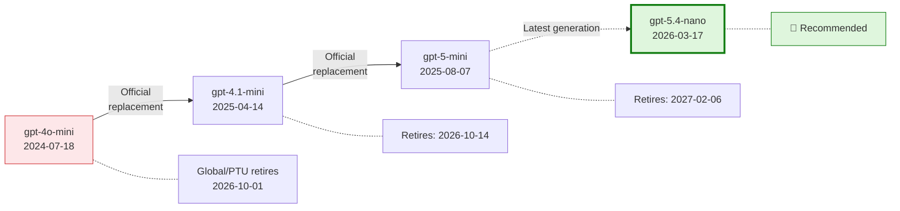
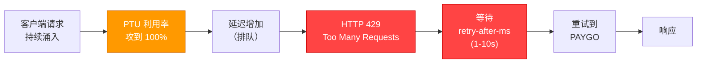
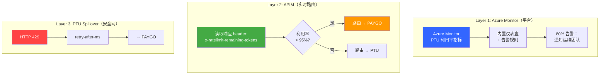
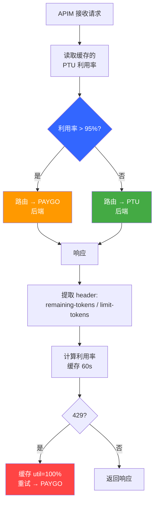

# Azure OpenAI 模型迁移 Benchmark 与 PTU 流量管理
## gpt-4o-mini → gpt-5.4-nano | Web Search Grounding + PTU 流量管理


面向低延迟 AI assistant 的生产级 benchmark 与流量管理工具集，用于从 gpt-4o-mini 迁移到更新的 Azure OpenAI / OpenAI 模型家族。所有 web grounding 路径都同时测试内置 search 方案和 WebIQ 显式 retrieval 对照。

> **Author**: Xinyu Wei (魏新宇), Microsoft AI and Apps Global Black Belt (GBB) Senior System Engineer | **Date**: 2026-03-28

中文版 | [English](README.md)

---

## Running on Azure

| 维度 | 配置 |
|------|------|
| Azure service | Azure OpenAI Service + Azure API Management + Azure Monitor / Application Insights |
| 主 API 路径 | Responses API + `stream=True`；所有 web-search 场景都同时测试 `web_search_preview` 和 WebIQ 显式 retrieval |
| 测试模型 | gpt-4o-mini, gpt-5.4-nano, gpt-5.4-mini, gpt-5-nano, gpt-5-mini；知识型直连补充测试（Section 3.5）覆盖 gpt-5.6-luna / gpt-5.6-sol / gpt-5.6-terra、gpt-5.4，以及一个同场 gpt-4o-mini 基线 |
| 流量管理 | PTU 优先，高利用率时 APIM 主动路由到 PAYGO，429 retry 作为安全网 |
| Runtime | Python benchmark scripts + 可选 Node.js PTU monitor proxy |
| 认证方式 | Benchmark scripts 使用 API key（Section 3.5 脚本同时支持通过 Azure CLI 的 Microsoft Entra ID）；APIM routing PoC 使用 named values / backends |

## Executive Summary

**gpt-5.4-nano** 是 gpt-4o-mini 在 AI 助手中的推荐替代模型。

使用**客户实际架构**（Responses API + `web_search_preview` + streaming）、WebIQ 显式 retrieval 路径和备选路径（Foundry Agent + BingGroundingAgentTool）对 5 个候选模型进行测试。gpt-5.4-nano 在两种 Bing 架构下均实现**等效的 Bing 延迟**（~2s），而 WebIQ 在同一批原始迁移场景中将 search-grounded TTFT 降到 **0.99s**。

| 指标 | gpt-4o-mini（当前） | gpt-5.4-nano（推荐） | 测试条件 |
|------|:-------------------:|:--------------------:|----------|
| **web_search TTFT** (P50) | **1.57s** | 2.08s | Responses API, `stream=True`, `web_search_preview`, `search_context_size=low`, `reasoning_effort=none`, GUARDRAILS prompt (~1066 tokens) |
| **WebIQ E2E TTFT** (P50) | 1.10s | **0.99s** | WebIQ `web.search()` 显式 retrieval + Responses API 生成，同 3 个迁移 query，`max_results=5`，GUARDRAILS prompt (~1066 tokens) |
| **Foundry+Bing TTFT** (P50) | 1.99s | **1.85s** | Responses API, `stream=True`, Foundry Agent V2, `BingGroundingAgentTool`, `tool_choice=required`, `reasoning_effort=none` |
| **Direct TTFT** (P50) | 0.57s | **0.59s** | Responses API, `stream=True`, `reasoning_effort=none`, 无 tools |
| **Input 单价** (每 1M tokens) | $0.15 | $0.20 | — |
| **Output 单价** (每 1M tokens) | $0.60 | $1.25 | — |
| **缓存 Input** (每 1M tokens) | $0.075 | $0.02 | — |

### WebIQ 补充测试：显式 Retrieval 路径（2026-06）

Microsoft 对 WebIQ 的官方描述是："a suite of AI-native APIs that gives applications access to fresh, real-world intelligence from across the web - including web pages, news, images, and videos"（来源：[Microsoft WebIQ](https://www.microsoft.com/en-us/webiq)，访问日期 2026-06-16）。本 repo 现在将 WebIQ 作为一条显式 retrieval 路径加入测试，和内置 `web_search_preview` tool orchestration 路径分开对比。

#### WebIQ 公开资源与客户激活路径

下表只保留可公开引用的 WebIQ 资源。内部 enablement 细节不会写入这个 public repo。

| 资源 | 链接 | 价值 |
|------|------|------|
| WebIQ 产品页 | [aka.ms/WebIQ](https://aka.ms/WebIQ) | 官方公开介绍；说明 WebIQ 为 AI agents 提供 fresh web、news、image、video intelligence |
| WebIQ portal | [webiq.microsoft.ai](https://webiq.microsoft.ai/) | 公开 gated portal，用于 access、profile 和 key management |
| 公告博客 | [aka.ms/nextgengrounding](https://aka.ms/nextgengrounding) | 架构与设计原则：Bing foundation、passage-level evidence、latency、quality、token efficiency |
| Customer waitlist | [aka.ms/webiq-waitlist](https://aka.ms/webiq-waitlist) | 客户 limited-access WebIQ onboarding 的公开激活路径 |
| Workload calculator | [aka.ms/webiq-calculator](https://aka.ms/webiq-calculator) | 用于 workload / capacity planning 的 sizing aid；访问可能需要 Microsoft account 权限 |
| Grounding Arena demo | [WebIQ Grounding Arena](https://groundingarenawebapp-hmb0fvfqd4ggh2g4.westus2-01.azurewebsites.net/) | 对比 no-grounding vs Microsoft WebIQ response 的公开 demo |
| Grounding API Explorer | [Grounding API Explorer](https://salmon-water-00ce88d10.1.azurestaticapps.net/) | 覆盖 Web、News、Video、Image、Browse API surfaces 的公开 explorer |

测试分两层：

| 层级 | 测什么 | 用途 |
|------|--------|------|
| **Search-only** | 只测 WebIQ 检索延迟，不包含模型生成 | 看搜索服务自身延迟和 retrieval sanity check |
| **End-to-end** | WebIQ 检索 + AOAI Responses API 生成，对比 `web_search_preview` E2E | 看用户体感的 AI 助手延迟 |

在原始迁移 benchmark 场景（`pricing`、`news`、`weather`）下，WebIQ 单独检索为 **183 ms P50 / 194 ms P95**，retrieval sanity check **24/24** 通过。在 7 轮端到端 benchmark 中（每模型 15 个 S1/S5 有效样本，排除 warmup；S4 从 search-verified success records 计算），同一 endpoint、同一 query set 下，WebIQ 相比 `web_search_preview` 将用户体感 TTFT 降低 **36–60%**，覆盖全部 5 个候选模型。详见 **Section 3.4**。

| 模型 | WebIQ E2E P50 | `web_search_preview` P50 | 降幅 | WebIQ Search P50 |
|------|--------------:|-------------------------:|-----:|-----------------:|
| **gpt-4o-mini** | **1.10s** | 1.83s | **快 40.0%** | 195 ms |
| **gpt-5.4-mini** | **0.84s** | 1.75s | **快 52.3%** | 184 ms |
| **gpt-5.4-nano** | **0.99s** | 2.45s | **快 59.8%** | 186 ms |
| gpt-5-nano | **2.02s** | 4.70s | **快 57.0%** | 184 ms |
| gpt-5-mini | **3.02s** | 4.70s | **快 35.8%** | 188 ms |

> 范围说明：这里的 WebIQ 路径是 **显式 retrieval + context injection**，`web_search_preview` 是 **内置 tool orchestration**。`quality_pass` 和 `source_used` 只是轻量 sanity check，不是人工答案质量评测。`web_search_preview` 不暴露内部搜索延迟，所以 search-layer latency 只对 WebIQ 单独报告。

#### Capability Matrix：6 个 WebIQ API

WebIQ 不只是单一 web-search endpoint。Python SDK 暴露了 web、news、videos、images、browse 和 classic search 六类能力。下表是基于 Lenovo/Qira 风格场景的快速能力探索；这些是单轮 smoke test，不是第 3 节里的统计型 latency benchmark。

| API | Lenovo/Qira 风格场景 | 实测延迟 | 返回结果 | 适合用途 |
|-----|----------------------|---------:|----------|----------|
| `web.search()` | ThinkPad X1 Carbon 2026 price | 454 ms | 3 个产品页，含产品名/规格/价格 | 产品问答、规格、价格 |
| `news.search()` | 当前 AI 新闻 | 276 ms | 5 条新闻结果，含 source media | 新闻简报、市场动态 |
| `videos.search()` | How to set up Lenovo AI PC | 159 ms | 3 个 YouTube 视频，含时长/播放量 | 教程/帮助推荐 |
| `images.search()` | Lenovo ThinkPad X1 Carbon 产品图 | 192 ms | 5 张图片，含尺寸/来源页 | 产品图片检索 |
| `browse.fetch()` | Lenovo ThinkPad 页面 | 536 ms | `result is dropped` | URL 读取；受保护站点可能失败 |
| `classic.search()` | Seattle weather today | 513 ms | Web results + 结构化 weather JSON | 天气/金融/体育等结构化答案 |

> 输入限制：WebIQ search API 接收文本 query。这个 SDK 不提供 image-to-image 或 video-to-search 输入。`images.search()` / `videos.search()` 对应的是 text-to-image 和 text-to-video search。

#### Token Efficiency：`passage` vs `html`

SDK 对 web/news/classic search 支持 `ContentFormat.passage`、`text`、`html` 和 `markdown`。其中 `passage` 最接近 LLM grounding 场景，因为它返回精选文本段落，而不是 HTML markup。

| 场景 | HTML 估算 tokens | Passage 估算 tokens | 降低 |
|------|-----------------:|--------------------:|-----:|
| pricing | 11,397 | 11,274 | 1% |
| news | 6,118 | 4,738 | 23% |
| weather | 3,242 | 2,340 | 28% |

这次测试里，`passage` 对 news/weather 明显减少 token；pricing 页面信息密度高，passage 和 HTML 大小接近。搜索延迟仍在 ~180 ms 级别。

#### Sampled Answer Quality

回答质量并排检查使用原始 migration 场景和 gpt-5.4-mini。以下是定性观察，不是完整人工评测。

| 场景 | WebIQ 回答 | `web_search_preview` 回答 | 判断 |
|------|------------|--------------------------|------|
| pricing | 具体产品 + 价格（`ASUS ExpertBook Ultra`, USD 3,600）+ source URL | 泛化 USD 1,500-2,500+ 区间，并提示没有搜索结果 | WebIQ 更具体 |
| news | 多条具体 AI 新闻 + source URL | 也有具体 AI 新闻 + source URL，但内容不同 | 相当 |
| weather | NOAA/AccuWeather 风格当前天气 + source URL | AccuWeather 当前天气与 forecast | 相当 |

#### When WebIQ Fits

| 场景 | 推荐 WebIQ API | 原因 |
|------|----------------|------|
| AI assistant grounding | `web.search(content_format=passage)` | 快、紧凑、可溯源，适合塞进 model prompt |
| 新闻/动态简报 | `news.search()` | 专门的 news results 和媒体来源 |
| 教程/帮助推荐 | `videos.search()` | 返回视频时长、播放量等 metadata |
| 产品图片检索 | `images.search()` | 返回图片 URL、尺寸和 host page |
| 结构化实时事实 | `classic.search()` | 可返回天气等结构化 answer types |
| 读取指定 URL | `browse.fetch()` | 适合单页抽取，但站点兼容性不稳定 |

不适合的场景：不需要搜索的任务、需要零代码平台编排的任务、image-to-image search、以及带 bot protection 的站点。

> 原始 benchmark 说明：上方 web_search、Foundry+Bing 和 Direct 行的 TTFT 为 P50（中位数），基于**每模型每场景 120 个样本**（5 轮独立测试）。WebIQ E2E 对比（Section 3.4）使用 7 轮独立运行，每模型 15 个有效样本。测试环境：东亚 → East US 2（PAYGO GlobalStandard）。客户 PTU 环境 TTFT 将更低。

### gpt-5.6 Luna 补充测试：知识型直连延迟（2026-09）

客户用一个不带任何工具的问题循环调用 `gpt-5.6-luna`，中位数约 2 s，但相当一部分请求落在 15–60 s。Section 3.5 用 `scripts/benchmark_luna_knowledge_qa.py` 复现该场景（Responses API、无工具、`max_retries=0`、逐请求记录 request id 和 token 用量），覆盖 `gpt-5.6-luna` / `sol` / `terra`、`gpt-5.4` 与 `gpt-5.4-nano`。结论一句话，证据在对应小节：

| 问题 | 答案 | 位置 |
|------|------|------|
| Luna 慢吗？ | 不慢——25 次 streaming 请求尾部不超过 4 s，decode 五个模型中最快。 | 3.5.1 |
| 有哪些 effort 值？指标是否做了 1 对 1？ | 4o-mini effort 为 N/A；5.4-nano 有五档；Luna 有六档。21-cell 平衡矩阵跑了两遍——热缓存前缀与永不缓存（所有 cell 0/20 命中）——同时报告配置 effort、实际 reasoning、可见输出长度、cache hits、TTFT、Derived T2T / TPOT、E2E P50；只声称两轮都复现的结论。 | 3.5.8 |
| 15–60 s 长尾从哪来？ | 一次真实的 `429 no_capacity` 峰值负载事件叠加 SDK 默认重试，把被拒的尝试变成 15–26 s 的"成功"。 | 3.5.2、3.5.3 |
| >1,024-token 的 system prompt（prompt caching）有帮助吗？ | 会命中（59 次中 58 次）并省钱；四个模型上命中都没有降低 TTFT。token 数以 `usage` 为准，不要离线估算。 | 3.5.6 |
| 与 gpt-4o-mini 相比如何？`datazone` 是问题所在吗？ | 两个 DataZone 平衡矩阵中 4o-mini 首 token 都略早（中位数 0.05–0.10 s，不稳健），而 Luna `none` 每个可见 token 更快、自然回答完成更早（E2E 两轮都稳健），并由与分词器无关的每秒字符数确认。同模型 SKU 检查未见系统性的 DataZone 劣势：两轮中方向都随 effort 翻转。 | 3.5.8 |
| 客户端应该改什么？ | 排查期间 `max_retries=0`；记录 request id / 状态码 / `retries_taken` / usage / token provider 耗时；显式固定 `reasoning.effort`；被比较的模型和条件交错运行。 | 结论与建议 |

**web_search 路径生产配置**（客户实际架构）：

| # | 设置 | 值 | 用途 |
|:-:|------|-----|------|
| 1 | **API** | `responses.create()` + `stream=True` | TTFT 比 Chat Completions API 快 ~2x |
| 2 | **搜索工具** | `tools=[{"type": "web_search_preview", "search_context_size": "low"}]` | 内置 Bing 搜索，最小化 token 注入 |
| 3 | **推理强度** | `reasoning={"effort": "none"}` | 非推理任务的最低推理开销 |
| 4 | **搜索触发** | System prompt: `"Search the web for current information"` | 确保 100% 触发 web_search（通过 streaming events 验证） |

**PTU 流量管理建议**：

| 方案 | 机制 | 额外延迟 | 建议 |
|------|------|:---:|---|
| PTU Spillover（内置） | HTTP 429 触发 — 请求必须先失败 | +1-10s/溢出请求 | ⚠️ 仅作安全网 |
| **APIM 主动路由** | 读取 `x-ratelimit-remaining-tokens` header，>95% 利用率时路由 | **零** | ✅ **推荐** — 保持一致的 P50/P99 延迟 |

> PTU spillover 是被动的（失败后重试）。对于 AI 助手的实时功能（P50 TTFT 目标 1-2s），APIM 主动路由消除了 429 引发的尾延迟。详见第 7 节压测验证结果。

---

## 1. 背景

### 产品概述

该 AI 助手是**系统级跨设备 AI 产品**，嵌入 PC、平板和手机，将 多个 AI 功能统一为一个体验。

**6 大功能**：Next Move（意图分类）、Chat Mode（问答）、Write For Me（内容生成）、Live Mode（实时对话）、Catch Me Up（活动摘要）、Pay Attention（会议记录）。另加 **Bing Grounding** 用于网络搜索。

所有功能均为**非 reasoning 任务**。Reasoning 模型只增加延迟而不提高质量。

**关键：各模型系列的 `reasoning_effort` 差异**：

| 模型系列 | 最低 `reasoning_effort` | 对 AI 助手的影响 |
|---------|:-------------------------:|----------------|
| gpt-4o-mini | N/A（非推理模型） | 无推理开销 |
| **gpt-5.4-mini / nano** | **`none`** | 零推理开销 — 非推理任务的理想选择 |
| gpt-5-mini / nano | `minimal`（无 tools）/`low`（有 `web_search`） | 即使最低仍有推理开销 — **gpt-5 系列高延迟的根因** |

> gpt-5.4 系列支持 `reasoning_effort=none`，完全禁用内部推理，延迟与非推理模型等效。gpt-5 系列最低只能到 `minimal`/`low`，导致搜索场景下 TTFT 高 3-9 倍。

### gpt-4o-mini 退役时间线

来源：[Azure OpenAI Model Retirements](https://learn.microsoft.com/en-us/azure/foundry/openai/concepts/model-retirements)



### 候选模型与价格

| 模型 | Input $/1M | Cached | Output $/1M | 类型 | 来源 |
|------|:---------:|:------:|:-----------:|------|------|
| **gpt-4o-mini**（当前） | $0.15 | $0.075 | $0.60 | Non-reasoning | [Azure](https://azure.microsoft.com/en-us/pricing/details/cognitive-services/openai-service/) |
| **gpt-5-mini** | $0.25 | $0.03 | $2.00 | Reasoning | [Azure](https://azure.microsoft.com/en-us/pricing/details/cognitive-services/openai-service/) |
| **gpt-5-nano** | $0.05 | $0.01 | $0.40 | Reasoning | [Azure](https://azure.microsoft.com/en-us/pricing/details/cognitive-services/openai-service/) |
| **gpt-5.4-mini** | $0.75 | $0.08 | $4.50 | Reasoning | [Azure](https://azure.microsoft.com/en-us/pricing/details/cognitive-services/openai-service/) |
| **gpt-5.4-nano** | $0.20 | $0.02 | $1.25 | Reasoning | [OpenAI](https://openai.com/api/pricing/) |

### Region 可用性

团队需要：East US 2 / Sweden Central / Southeast Asia

| 模型 | East US 2 | Sweden Central | Southeast Asia |
|------|:---------:|:-------------:|:--------------:|
| gpt-4o-mini | ✅ | ✅ | ✅ |
| gpt-5.4-mini | ✅ | ✅ | ⏳ Rollout pending |
| gpt-5.4-nano | ✅ | ✅ | ⏳ Rollout pending |

---

## 2. 测试方法

### 五场景延迟分层

所有模型生成相关场景均使用 **Responses API + streaming**，确保公平对比。所有 web grounding 场景都同时报告内置 search 路径和 WebIQ 显式 retrieval 路径。

| 场景 | 测量内容 | API | Bing |
|------|----------|-----|:----:|
| **S1** Direct AOAI | 模型推理延迟 | `responses.create(model=...)` | No |
| **S2** Foundry Agent | 模型 + 编排开销 | `responses.create(agent_reference=...)` | No |
| **S3** Foundry + Bing | 完整生产链路延迟 | `responses.create(agent_reference=..., tool_choice="required")` | Yes |
| **S4** Direct AOAI + `web_search_preview` | 客户生产中的内置 web-search 路径 | `responses.create(model=..., tools=[{"type":"web_search_preview"}])` | Yes |
| **S5** WebIQ + Direct AOAI | 显式 retrieval + context injection + 模型生成 | WebIQ `web.search()` 后接 `responses.create(model=...)` | WebIQ |

逐层延迟通过减法隔离：

```
Total TTFT = [模型推理] + [Foundry 编排] + [Bing 搜索]
                S1          S2 - S1         S3 - S2

内置 search overhead = S4 - S1
WebIQ 显式 retrieval overhead = S5 - S1
```

### 测试参数

- **5 模型**，3 个 query，10 轮/query（2 轮 warmup 丢弃）= **24 有效样本/模型/场景/轮**
- **5 轮独立测试** = **120 有效样本/模型/场景**（2,250 次 API 调用）
- **WebIQ S5 对比运行**：7 轮/query（2 轮 warmup 丢弃）= **15 个 S1/S5 有效样本/模型/场景**；S4 只统计同一运行中的 search-verified success records，并排除终端编码导致的 error records
- `reasoning_effort` 设到模型最低：gpt-5.4 用 `none`，gpt-5 用 `minimal`
- S3 系统指令：`"Perform exactly ONE search. Do NOT refine or repeat searches."`
- S4 系统指令：`"Search the web for current information"` + GUARDRAILS，并通过 web_search streaming events 验证 search trigger
- S5 retrieval：WebIQ `web.search(max_results=5)` 后接 Responses API 生成，使用同一 GUARDRAILS prompt，并将 WebIQ context 注入 user message
- SDK：`openai==2.14.0`，`azure-ai-projects==2.0.0b2`
- **测试环境**：Windows VM（东亚）→ East US 2 部署。跨太平洋网络增加 ~100-200ms RTT。客户生产环境（美国客户端 → East US 2）RTT ~30-50ms，TTFT 将比本报告低 ~70-170ms。

### TTFT 组成

测量的 TTFT 包含网络往返、请求排队、模型预填充和首 token 生成：

| 组件 | 估算 | 说明 |
|------|:------:|------|
| 网络往返 | ~100-200ms | 测试机（东亚）→ East US 2 |
| 请求排队 | ~50-300ms | GlobalStandard 共享池（非 PTU） |
| 模型预填充 | ~200-400ms | 处理 system prompt + user prompt |
| 首 token 生成 | ~50-100ms | 生成第一个输出 token |
| **总计（观测 P50）** | **~0.57-0.69s** | 与组件估算一致 |

> **注**：本测试使用 **GlobalStandard (PAYGO)** 部署。PTU（Provisioned Throughput）部署消除排队延迟，TTFT 会更低。客户生产环境的 PTU 部署预计延迟更优。

### 为什么使用 Responses API？

直连 AOAI 同时支持两种 API。Responses API 的 TTFT 快约 2 倍：

| 模型 | Responses API (P50) | Chat Completions (P50) |
|------|:-------------------:|:----------------------:|
| gpt-4o-mini | 0.44~0.72s | 1.13~1.34s |
| gpt-5.4-nano | 0.56~0.58s | 1.20~1.53s |
| gpt-5.4-mini | 0.60~0.62s | 1.23~1.35s |

---

## 3. 测试结果

### 测试 Query

三个场景使用相同的 3 条 query（系统指令：`"You are a helpful AI assistant. Answer concisely."`）：

| Query | Prompt | max_tokens |
|-------|--------|:----------:|
| **Pricing** | "What is the latest retail price for a flagship laptop?" | 300 |
| **News** | "What are the top AI news stories this week?" | 300 |
| **Weather** | "What is the current weather in Seattle, Washington?" | 200 |

Bing 场景的系统指令追加：`"CRITICAL: Perform exactly ONE search. Do NOT refine or repeat searches. Use first results immediately."`

### 3.1 直连 AOAI — Responses API（无 Agent，无 Bing）

API：`responses.create(model=..., stream=True)` | 40 样本/格（5 轮合并）

| 模型 | Pricing TTFT/E2E | News TTFT/E2E | Weather TTFT/E2E | Avg TTFT |
|------|:-:|:-:|:-:|:-:|
| **gpt-4o-mini** | 0.70/1.47s | 0.60/1.36s | 0.78/1.30s | **0.69s** |
| **gpt-5.4-nano** | 0.79/1.49s | 0.63/2.14s | 0.64/1.32s | **0.69s** |
| **gpt-5.4-mini** | 0.75/1.58s | 0.75/2.18s | 0.63/1.16s | **0.71s** |
| gpt-5-nano | 1.25/2.31s | 1.05/3.20s | 1.11/2.09s | 1.14s |
| gpt-5-mini | 1.33/4.23s | 1.29/5.21s | 1.15/2.95s | 1.26s |

### 3.2 web_search_preview + GUARDRAILS — 客户生产路径

> **这是主要 benchmark** — 测试团队实际使用的架构。

团队确认 AI 助手使用 `web_search_preview`（Responses API 内置工具）而非 Foundry Agent + BingGroundingAgentTool。本节测试客户实际架构。

**与 Section 3.3（Foundry+Bing）的关键差异**：
- 无 Foundry Agent 编排层 — 直连 AOAI + `tools=[{"type": "web_search_preview"}]`
- `tool_choice` 使用默认值 `auto`（非 `required` — 见 Appendix F）
- `search_context_size="low"` 控制 token 消耗
- GUARDRAILS 系统提示词（~1066 tokens，触发 Prompt Caching）
- 通过 `response.web_search_call.searching` 事件确认搜索触发（100% 触发，120 样本/模型，0 跳过）
- gpt-5 系列需 `reasoning_effort="low"`（`minimal` + web_search = 400 error）

**5 轮合并结果**（120 有效样本/模型/场景）：

| 模型 | effort | S1 Direct P50 | S4 web_search P50 | web_search OH | σ | N |
|------|:------:|:------:|:------:|:------:|:----:|:-:|
| **gpt-4o-mini** | N/A | 0.45s | **1.57s** | +1.12s | 0.53s | 120 |
| **gpt-5.4-mini** | none | 0.60s | **1.90s** | +1.30s | 2.80s | 120 |
| **gpt-5.4-nano** | none | 0.62s | **2.08s** | +1.46s | 2.12s | 120 |
| gpt-5-nano | low | 1.42s | 8.93s | +7.51s | 4.11s | 119 |
| gpt-5-mini | low | 1.14s | 6.75s | +5.61s | 2.76s | 119 |

> gpt-5-nano 和 gpt-5-mini 的 N=119，是因为 web_search run 中各有 1 个有效样本失败，未纳入 search-verified 子集。当前 public scripts 已保留失败记录到 JSON 输出，便于复现排查。

**跨架构对比** — 每条 web grounding 路径都有 WebIQ 对照：

| 模型 | S3: Foundry+Bing | S4: `web_search_preview` | S5: WebIQ E2E | 一致？ |
|------|:-:|:-:|:-:|:-:|
| gpt-4o-mini | 1.99s | **1.57s** | 1.10s | ✅ Bing 路径同级；WebIQ 更快 |
| **gpt-5.4-mini** | 1.96s | **1.90s** | **0.84s** | ✅ Bing 路径同级；WebIQ 最快 |
| **gpt-5.4-nano** | **1.85s** | 2.08s | 0.99s | ✅ Bing 路径同级；WebIQ sub-second |
| gpt-5-nano | 3.56s | 8.93s | 2.02s | ❌ 内置 web_search 更慢；WebIQ 降低开销 |
| gpt-5-mini | 3.80s | 6.75s | 3.02s | ❌ 内置 web_search 更慢；WebIQ 降低开销 |

> **说明**：gpt-5.4-nano 在 web_search 场景下比 gpt-5.4-mini 慢 0.18s。这与 [OpenAI 官方评测](https://openai.com/index/introducing-gpt-5-4-mini-and-nano/)一致，nano 在 tool calling 基准测试中得分低于 mini（Toolathlon: nano 35.5% vs mini 42.9%）。0.18s 差距在测量噪声范围内（σ > 2s），用户无感。nano 的优势是 **Input 价格便宜 73%**（$0.20 vs $0.75/1M tokens）。

> **WebIQ 数据集说明**：S5 来自 Section 3.4 的 7 轮 WebIQ E2E 专项运行，不是旧的 S3/S4 5 轮合并数据。这里把它放进同一张决策表，是为了让 web grounding 的取舍更直观。

> **结论**：三个模型（gpt-4o-mini、gpt-5.4-mini、gpt-5.4-nano）在内置 Bing 路径下都能达到 ~2s TTFT。WebIQ 是同类 web-grounded workload 的更快显式 retrieval 选项，gpt-5.4-nano + WebIQ 达到 0.99s E2E。gpt-5 系列仍不适合内置 web_search 路径，但 WebIQ 通过把 retrieval 移出模型 tool loop 显著降低了惩罚。

---

### 3.3 Foundry Agent V2 + Bing Grounding（备选路径）

> 以下章节测试通过 Foundry Agent 集成 Bing 的备选路径。团队当前未使用此路径，但包含在内用于交叉验证。

#### 3.3.1 Foundry Agent — 无 Bing（Agent 编排开销）

API：`responses.create(agent_reference=..., stream=True)` — `reasoning_effort` 在 `PromptAgentDefinition` 中设置 | 40 样本/格

| 模型 | Pricing TTFT/E2E | News TTFT/E2E | Weather TTFT/E2E | Avg TTFT |
|------|:-:|:-:|:-:|:-:|
| **gpt-4o-mini** | 0.80/1.60s | 0.83/1.56s | 0.74/1.41s | **0.79s** |
| **gpt-5.4-nano** | 1.05/2.04s | 1.10/4.97s | 1.77/2.79s | **1.31s** |
| **gpt-5.4-mini** | 1.09/1.95s | 1.05/2.80s | 0.93/1.51s | **1.02s** |
| gpt-5-nano | 1.68/2.80s | 1.75/4.76s | 1.63/2.53s | 1.69s |
| gpt-5-mini | 1.69/4.50s | 1.97/9.21s | 1.83/3.71s | 1.83s |

> 注：S2 平均 TTFT 与 P50 存在差异，原因是偶发异常值（如 gpt-5.4-nano Weather 查询 TTFT=1.77s）。3.3.3 节的 P50 是更稳健的指标。

#### 3.3.2 Foundry Agent + Bing Grounding

API：`responses.create(agent_reference=..., tool_choice="required", stream=True)` + `BingGroundingAgentTool` | 40 样本/格

| 模型 | Pricing TTFT/E2E | News TTFT/E2E | Weather TTFT/E2E | Avg TTFT |
|------|:-:|:-:|:-:|:-:|
| **gpt-4o-mini** | 2.15/3.35s | 2.20/5.47s | 2.30/3.25s | **2.21s** |
| **gpt-5.4-nano** | 2.19/3.02s | 1.92/5.70s | 2.19/2.91s | **2.10s** |
| **gpt-5.4-mini** | 2.25/3.02s | 2.06/5.35s | 2.15/2.84s | **2.15s** |
| gpt-5-nano | 3.85/5.42s | 3.41/5.64s | 3.47/4.93s | 3.58s |
| gpt-5-mini | 4.06/8.33s | 3.62/11.81s | 5.40/7.36s | 4.36s |

> 5 轮合并，每 query 每模型 40 有效样本。

#### TTFT 总览（Foundry+Bing + web_search + WebIQ）


> 这张图将 5 轮 Foundry Agent 数据集（S1/S2/S3）和 WebIQ E2E 对比运行（S4/S5）放在同一视图里，确保所有 web-grounded 路径都可见。S5 使用 Section 3.4 的 7 轮 WebIQ run。

#### 3.3.3 汇总（Foundry+Bing，5 轮合并，120 样本/模型/场景）

| 模型 | effort | 直连 AOAI P50 | Foundry（无Bing）P50 | Foundry+Bing P50 | Bing σ | N |
|------|:------:|:------:|:------:|:------:|:----:|:---:|
| **gpt-4o-mini** | N/A | 0.57s | 0.69s | 1.99s | 0.73s | 120 |
| **gpt-5.4-nano** | none | **0.59s** | 0.81s | **1.85s** | 0.73s | 120 |
| **gpt-5.4-mini** | none | 0.62s | **0.87s** | 1.95s | **0.60s** | 120 |
| gpt-5-nano | minimal | 1.01s | 1.64s | 3.56s | 1.05s | 120 |
| gpt-5-mini | minimal | 1.09s | 1.73s | 3.80s | 6.27s | 120 |

#### 3.3.4 延迟分层（5 轮合并）

| 层 | gpt-4o-mini | gpt-5.4-nano | gpt-5.4-mini | gpt-5-nano | gpt-5-mini |
|----|:----------:|:----------:|:----------:|:----------:|:----------:|
| **直连 AOAI** (P50) | 0.57s | **0.59s** | 0.62s | 1.01s | 1.09s |
| **Foundry 编排开销** | +0.12s | +0.22s | +0.24s | +0.62s | +0.64s |
| **Bing 搜索开销** | +1.30s | **+1.04s** | +1.08s | +1.93s | +2.07s |
| **Foundry+Bing 总计** (P50) | 1.99s | **1.85s** | 1.95s | 3.56s | 3.80s |

#### 延迟分层图 — Foundry+Bing vs web_search vs WebIQ


> 分组堆叠条分别对比 S3 Foundry+Bing、S4 内置 `web_search_preview` 和 S5 WebIQ 显式 retrieval。S4/S5 overhead 来自 Section 3.4 的 S1/S4/S5 run；S3 使用 Section 3.3 的 5 轮 Foundry 数据集。

#### 主要结论（Foundry+Bing）

1. **Foundry Agent V2 编排开销 +0.12~0.64s** — 开销低
2. **Bing 搜索开销 +1.04~2.07s**，包含 Bing API 调用 + 结果注入 + 模型处理
3. **gpt-5.4-nano Bing 开销最低 (+1.04s)** — 比 gpt-4o-mini (+1.30s) 低 20%
4. **gpt-5 系列不适合 Bing** — 即使全部优化配置后 TTFT 仍 3.6~4.4s
5. **WebIQ 是显式 retrieval 对照路径** — Section 3.4 将同一类 web-grounded 问题从模型 tool loop 中移出 retrieval，再做 E2E 对比

### 3.4 WebIQ 显式 Retrieval vs `web_search_preview` — E2E 对比

> **S5（WebIQ）**：应用调用 WebIQ `web.search()` → 去除 HTML → 将搜索上下文注入 AOAI Responses API prompt → 流式生成。两跳显式 retrieval 路径。
>
> **S4（`web_search_preview`）**：应用调用 AOAI Responses API 并指定 `web_search_preview` tool → 模型内部触发 Bing 搜索 → 流式生成。单次调用 tool orchestration 路径。

7 轮 benchmark，2 轮 warmup 丢弃 → **每模型 15 个 S1/S5 有效样本**。S4 只统计同一次运行中的 search-verified success records；旧版 Windows 终端使用非 UTF-8 code page，因此终端编码失败记录不纳入 S4 统计。WebIQ 凭据通过 `WEBIQ_API_KEY` / `--webiq-key` 提供，文档中不发布明文 key；每 query 最多 5 个结果。

#### 视觉总览 — S1 vs S4 vs S5


> S5 **不是** WebIQ 搜索本身的延迟，而是 WebIQ retrieval + AOAI 生成的端到端延迟。WebIQ search-layer 本身只有 ~184–195 ms P50；剩余时间来自模型生成。因此 gpt-5-mini / gpt-5-nano 仍然显得慢，而 gpt-5.4-mini 和 gpt-5.4-nano 接近直连层级。

#### 3.4.1 总汇表 — S1 vs S4 vs S5

| 模型 | effort | S1 直连 P50 / N | S4 `web_search` P50 / N | S5 WebIQ P50 / N | WS 开销 | WebIQ 开销 | S5 比 S4 快 |
|------|:------:|:------:|:------:|:------:|:------:|:------:|:------:|
| **gpt-4o-mini** | N/A | 0.66s / 15 | 1.83s / 15 | **1.10s / 15** | +1.17s | +0.44s | **40.0%** |
| **gpt-5.4-mini** | none | 0.68s / 15 | 1.75s / 15 | **0.84s / 15** | +1.08s | +0.16s | **52.3%** |
| **gpt-5.4-nano** | none | 0.75s / 15 | 2.45s / 15 | **0.99s / 15** | +1.71s | +0.24s | **59.8%** |
| gpt-5-nano | minimal | 0.69s / 15 | 4.70s / 13 | **2.02s / 15** | +4.01s | +1.33s | **57.0%** |
| gpt-5-mini | minimal | 0.81s / 15 | 4.70s / 10 | **3.02s / 15** | +3.89s | +2.21s | **35.8%** |

> **WS 开销** = S4 P50 − S1 P50（内置 `web_search_preview` orchestration 的代价）。**WebIQ 开销** = S5 P50 − S1 P50（显式 WebIQ 检索 + context injection 的代价）。**S5 比 S4 快** = (S4 P50 − S5 P50) / S4 P50。

#### 3.4.2 WebIQ Search-Layer 延迟

| 模型 | Search P50 | N |
|------|:----------:|:---:|
| gpt-4o-mini | 195 ms | 15 |
| gpt-5.4-mini | 184 ms | 15 |
| gpt-5.4-nano | 186 ms | 15 |
| gpt-5-nano | 184 ms | 15 |
| gpt-5-mini | 188 ms | 15 |

> Search 延迟与模型无关（~185–195 ms P50）。S5 总延迟的差异来自 AOAI 模型生成时间，而非 WebIQ 搜索。

#### 主要结论（WebIQ vs `web_search_preview`）

1. **WebIQ 比 `web_search_preview` 快 36–60%** — 覆盖全部 5 个模型的 E2E TTFT
2. **Search-layer 延迟 ~185 ms P50** — 与模型无关
3. **gpt-5.4-mini + WebIQ 实现 0.84s E2E** — 本次测试中最快的搜索增强配置
4. **gpt-5.4-nano + WebIQ 0.99s** — 亚秒级搜索增强 TTFT，适合实时 AI 助手
5. **取舍**：WebIQ 需要应用层搜索编排代码；`web_search_preview` 零代码但更慢

> 数据来源：`outputs/benchmark_websearch_guardrails_20260617_103004.json`（7 轮迭代，2 轮 warmup）。上表 S4 只使用 search-verified success records。当前 public script 已改为 ASCII 状态标签和显式 `success` 字段，后续运行不会再追加终端编码导致的重复 failure records。

### 3.5 gpt-5.6 Luna / Sol / Terra — 知识型直连延迟（补充测试，2026-09）

> **为什么有这一节。** 一位评估 `gpt-5.6-luna` 的客户跑了一个最简单的请求循环——不带工具、不带 web search，prompt 只是 *"What are the seven wonders of the world?"*——结果中位数约 2 s，但大量请求落在 15–60 s。三种解释互相竞争：Luna 本身慢；客户端循环隐藏了什么（SDK 自动重试、每次新建 TLS 连接）；或者服务侧发生了容量事件。本节用单变量测量把它们分开。所有测试都属于场景 **S1-KQ**：直连 AOAI Responses API + 知识型 prompt，除了模型和服务路径本身，什么都不测。

#### 测试设置

| 项目 | 取值 |
|------|------|
| 脚本 | `scripts/benchmark_luna_knowledge_qa.py`（新增；见 Section 9.3） |
| API | Responses API v1（`<endpoint>/openai/v1/responses`），`openai==2.14.0`，Microsoft Entra ID 认证 |
| 部署 | `gpt-5.6-luna`、`gpt-5.6-sol`、`gpt-5.6-terra`（model version 均为 `2026-07-09`）、`gpt-5.4`、`gpt-5.4-nano` —— 同一资源、GlobalStandard、Sweden Central |
| 客户端 | 东亚 Windows 工作站 → Sweden Central（所有数字都包含跨洲 RTT） |
| Prompt | `What are the seven wonders of the world?`，无 system prompt，`max_output_tokens=1024`，除特别说明外 **不设置** `reasoning`（模型默认） |
| 采样 | 每个 cell 27 轮，丢弃前 2 轮 warmup → **每模型每模式 25 个样本**；模型轮询交错；`stream=True` 与 `stream=False` 并排测量 |
| 客户端纪律 | `max_retries=0`（SDK 默认为 2），共享一条 HTTPS 连接，`timeout=120s`；每个请求记录 HTTP 状态、`x-request-id` / `apim-request-id`、`retries_taken`、token 用量与 `response.status` |

#### 3.5.1 默认设置 — 每个 cell 25 个样本

Streaming（`stream=True`）：TTFT = 首个 `response.output_text.delta`；tok/s = 可见输出 tokens ÷（E2E − TTFT）。

| 模型 | N ok/total | TTFT p50 / p95 | E2E mean / p50 / p95 / max | >5s | 输出 tokens（其中 reasoning） | tok/s p50 |
|------|:-:|:-:|:-:|:-:|:-:|:-:|
| **gpt-5.6-luna** | 25/25 | 2.04s / 2.35s | 3.17s / 3.14s / 3.55s / **3.89s** | 0 | 300 (102) | **175** |
| gpt-5.6-sol | **8/25** —— 容量事件（见 3.5.2），N=8 的统计与其他行不可比 | 2.57s / 12.11s | 7.17s / 5.14s / 15.27s / 19.45s | 4 | 245 (50) | 65 |
| gpt-5.6-terra | 25/25 | 1.22s / 3.89s | 3.31s / 3.01s / 6.00s / 6.65s | 2 | 224 (24) | 111 |
| gpt-5.4 | 25/25 | 1.38s / 1.61s | 4.59s / 4.29s / 6.74s / 8.10s | 6 | 213 (0) | 77 |
| gpt-5.4-nano | 25/25 | **0.97s** / 1.48s | 2.62s / **2.44s** / 3.56s / 4.12s | 0 | 151 (0) | 98 |

Non-streaming（`stream=False`，也就是一个朴素 `time.time()` 循环看到的形态）：

| 模型 | N ok/total | E2E mean / p50 / p95 / max | >5s | 输出 tokens（其中 reasoning） |
|------|:-:|:-:|:-:|:-:|
| **gpt-5.6-luna** | 25/25 | 3.55s / 3.29s / 5.17s / 8.78s | 2 | 287 (91) |
| gpt-5.6-sol | **8/25** —— 容量事件，N=8 不可比 | 5.50s / 5.44s / 6.29s / 6.36s | 7 | 265 (75) |
| gpt-5.6-terra | 25/25 | 3.47s / 3.28s / 4.86s / 5.38s | 2 | 223 (28) |
| gpt-5.4 | 25/25 | 4.22s / 4.21s / 5.00s / 6.36s | 2 | 217 (0) |
| gpt-5.4-nano | 25/25 | 2.89s / 2.86s / 3.70s / 4.04s | 0 | 162 (0) |

怎么读这两张表：

- **Luna 不慢。** 它的可见 decode 速度是五个模型里最快的（175 tok/s p50），25 次 streaming 请求的 E2E 最大值只有 3.89 s。在 `max_retries=0` 下 **没有出现任何 15–60 s 的异常值**。
- **Luna 默认 TTFT 比 Terra 高约 0.8 s，是因为它默认想得更多。** 同一问题 Luna 每次约 100 个 reasoning tokens，Sol 约 50，Terra 约 24，gpt-5.4 为 0。请求其它部分完全相同；Section 3.5.4 会把这个变量拿掉。
- **`gpt-5.6-sol` 在测试期间撞上了一次真实的容量事件。** 04:04–04:20 UTC 期间 54 个 Sol 请求中 34 个以 `429 too_many_requests` / `code: no_capacity` 失败，而同一资源上的 Luna、Terra、gpt-5.4、gpt-5.4-nano 在同一时段全部正常。容量按模型池划分，不按资源划分。
- 236 个成功回答（含 warmup）全部通过 sanity check（至少点名 5 个奇迹）；270 个请求中 269 个带有唯一 request id——唯一的例外是撞到 120 s 客户端超时的那个请求。

#### 3.5.2 从客户端看，容量事件长什么样

服务返回的错误体（原文）：

```text
429 too_many_requests, code: no_capacity
"The system is currently experiencing high demand and cannot process your request.
 Your request exceeds the maximum usage size allowed during peak load.
 For improved capacity reliability, consider switching to Provisioned Throughput."
```

| 观察 | 取值 |
|------|------|
| Non-streaming 失败 | 多数在 2.1–3.0 s 后返回 HTTP 429，但也有 5.6 s、6.4 s、11.4 s、30.8 s 才返回的；一个请求撞到 120 s 客户端超时 |
| Streaming 失败 | 先返回 HTTP **200** 和响应头，然后 SSE 流以错误结束 → SDK 在请求开始后 1.1–34.5 s 抛出 `APIError`。只看状态码的客户端根本看不到 429 |
| 服务端排队 | 失败开始前，一个 Sol 请求 **19.45 s 后成功**、0 次重试（第 5 轮，streaming）：响应头 0.5 s 到达，首 token 16.2 s 才到。Luna 仅有的两个 >5 s 的 non-streaming 请求（5.5 s 与 8.8 s）也落在 Sol 事件窗口内（04:18–04:20 UTC） |
| 不是配额限制 | 请求只有 15 个输入 tokens、`max_output_tokens=1024`；`no_capacity` 的含义是该模型的 GlobalStandard 共享池饱和了。提高 TPM 配额没有用；PTU、换 SKU/region 池，或主动路由（Section 7）才有用 |

#### 3.5.3 单变量：SDK 自动重试（`max_retries=2`，SDK 默认值）

在同一次容量事件期间向 Sol 发送 10 个 non-streaming 请求，唯一改动是 `max_retries` 从 `0` 改为 `2`：

| # | 结果 | E2E | 隐藏重试 | # | 结果 | E2E | 隐藏重试 |
|:-:|------|:---:|:-:|:-:|------|:---:|:-:|
| 1 | 429 | 7.3s | 2（推断） | 6 | **200** | **20.8s** | 2 |
| 2 | 429 | 6.0s | 2（推断） | 7 | **200** | **15.2s** | 1 |
| 3 | **200** | **25.7s** | 2 | 8 | 429 | 5.5s | 2（推断） |
| 4 | **200** | **16.7s** | 0（服务端排队） | 9 | 429 | 5.2s | 2（推断） |
| 5 | 429 | 5.4s | 2（推断） | 10 | 429 | 5.3s | 2（推断） |

成功请求的重试次数直接读自 SDK 响应（`retries_taken`）；失败请求的 429 是 SDK 耗尽重试后才抛出的，"2（推断）"由 `max_retries=2` 与 5–7 s 的总耗时推得，不是响应字段（JSON 中标为 `retries_taken_inferred=true`）。

使用默认重试策略时，四个请求分别在 **15.2 s、16.7 s、20.8 s、25.7 s** 后"成功"。其中三个包含一到两次不可见的重试，第四个被服务端持有了 16.7 s。仍然失败的六个请求要 5.2–7.3 s（三次尝试加退避）才暴露出来，而不是约 2 s。这正是客户报告的形态：**低中位数 + 只在峰值负载期间出现的 15–60 s 长尾，再被朴素计时循环看不见的自动重试放大。** 脚本逐请求记录 `retries_taken`，以后不再有歧义。

#### 3.5.4 单变量：5.6 系列的 `reasoning.effort`（streaming，每个 cell 15 个样本）

| 模型 | `effort` | TTFT p50 / p95 | E2E mean / p50 / p95 / max | 输出 tokens（reasoning） | tok/s p50 |
|------|:-:|:-:|:-:|:-:|:-:|
| gpt-5.6-luna | 默认（≈medium） | 2.04s / 2.35s | 3.17s / 3.14s / 3.55s / 3.89s | 300 (102) | 175 |
| gpt-5.6-luna | `low` | 1.36s / 1.79s | 2.84s / 2.64s / 3.85s / 5.10s | 237 (42) | 156 |
| **gpt-5.6-luna** | **`none`** | **0.92s / 1.22s** | 2.48s / **2.24s** / 3.49s / 4.75s | 226 (0) | **169** |
| gpt-5.6-sol | `low` | 1.60s / 2.64s | 4.90s / 4.70s / 6.50s / 7.33s | 227 (21) | 70 |
| gpt-5.6-sol | `none` | 1.00s / 1.46s | 4.31s / 4.26s / 4.94s / 5.25s | 224 (0) | 69 |
| gpt-5.6-terra | `low` | 1.09s / 1.36s | 3.06s / 2.77s / 4.34s / 6.15s | 216 (21) | 115 |
| gpt-5.6-terra | `none` | 0.90s / 2.12s | 2.89s / 2.72s / 3.62s / 5.06s | 222 (0) | 122 |

- 这一遍初步测试只覆盖 `none` / `low` 加 default 和一个 `medium` canary。API 的完整支持列表是 `none`、`low`、`medium`、`high`、`xhigh`、`max`；`minimal` 不支持。Section 3.5.8 用同一时间窗的完整矩阵替代本节口径；另一个对齐控制轮证明 default 与显式 `medium` 统计上不可区分。
- **effort 相同时，三个变体的 TTFT 一致（p50 0.90–1.00 s），而 Luna 的 E2E 最快**（p50 2.24 s），因为它的 decode 约 169 tok/s，Terra 122，Sol 69。
- 在 Luna 上，默认 → `low` → `none` 每一步大约减少 0.7 s TTFT（2.04 → 1.36 → 0.92 s；中位数置换检验，`none` vs `low` p = 0.0006，`none` vs 默认 p < 0.0001）。对延迟敏感的知识问答，请显式设置 `reasoning={"effort": "none"}`（或 `low`），不要依赖默认值。

#### 3.5.5 知识型能力横向对比（streaming，每个 cell 5 个样本）

另外四个不需要工具的 prompt——技术解释、小型编码任务、带单位换算的算术、严格 JSON 输出——在同样五个部署上运行（7 轮，2 轮 warmup）。单元格为 TTFT p50 / E2E p50（平均 reasoning tokens）。

| 模型 | TCP vs UDP（5 条要点） | Python `is_palindrome` | 150 km / 1 h 40 min → km/h, mph | JSON 首都（仅输出 JSON） | Sanity |
|------|:-:|:-:|:-:|:-:|:-:|
| gpt-5.6-luna | **0.91s / 1.96s** (0) | 1.48s / 2.17s (12) | 1.55s / **2.85s** (59) | 1.73s / 2.02s (65) | 20/20 |
| gpt-5.6-sol | 0.98s / 2.24s (0) | 1.37s / 2.09s (0) | 1.95s / 3.39s (53) | 2.07s / 2.65s (17) | 20/20 |
| gpt-5.6-terra | **0.87s** / 2.28s (0) | **0.85s / 1.44s** (0) | **1.39s** / **2.85s** (47) | **0.92s / 1.33s** (8) | 20/20 |
| gpt-5.4 | 1.35s / 3.68s (0) | 1.32s / 2.25s (0) | 1.42s / 3.53s (0) | 1.36s / 1.95s (0) | 20/20 |
| gpt-5.4-nano | 0.93s / 2.53s (0) | 1.03s / 1.90s (0) | 1.03s / 3.28s (0) | 1.05s / 2.08s (0) | 20/20 |

- 140 个回答全部通过 sanity check；在这么简单的 prompt 上，五个模型无法用正确性区分，只能用延迟和啰嗦程度区分。
- **Luna 的默认 reasoning 是自适应的。** TCP/UDP 解释题上 0 个 reasoning tokens（TTFT 0.91 s，该行 E2E 最快），算术和 JSON 约 60 个，七大奇迹约 100 个。因此单一的"Luna TTFT"数字取决于 prompt；比较模型时请固定 `reasoning.effort`。
- Terra 在四个 prompt 中的三个 TTFT 最低；gpt-5.4-nano 仍是最便宜的低延迟选项。Sol 在其最后一次 429 约十分钟后出现一个 8.8 s 异常值（palindrome：响应头 0.4 s，首 token 8.1 s），其余 Sol 请求都在 1–3.4 s。

#### 3.5.6 单变量：1,200-token system prompt，缓存命中 vs 永不命中（streaming，每个 cell 15 个样本）

客户的助手每次请求都带一个超过 1,024 tokens 的 system prompt，所以上面各轮（15 个输入 token）低估了他们的 prefill，也没有覆盖 prompt caching。`guardrails-long` 预设（含问题共 1,202 个输入 token）把这个变量拆成三个条件：

| 条件 | 参数 | 服务端看到的 |
|------|------|--------------|
| **A. 缓存命中** | `guardrails-long` | 每次请求都是同一个 1,187-token 前缀 → `cached_tokens` = 1,199（gpt-5.6）/ 1,024（gpt-5.4-nano） |
| **B. 永不命中** | `guardrails-long+bust` | prompt 开头加一个每次不同的 nonce → `cached_tokens` = 0（每次完整 prefill；等价于生产环境把动态内容放在前缀开头） |
| **C. 无 system prompt** | `none` | 15 个输入 token（前面几轮的口径） |

三个条件**在每一轮迭代内交错执行**（`--conditions guardrails-long,guardrails-long+bust,none`，07:30–07:45 UTC），任何条件都不会与它所处的时间窗混淆。每个请求记录了 token provider 耗时（`auth_seconds`）；有一个 Luna 请求的计时里包含 6.3 s 的 Entra token 刷新，已从统计中排除（见下文）。

| 模型 | 条件 | TTFT p50 / p95 | E2E mean / p50 / p95 / max | 输入 tokens（cached） | 输出 tokens（reasoning） | 命中 vs B，p 值 |
|------|------|:-:|:-:|:-:|:-:|:-:|
| **gpt-5.6-luna** | A. 缓存命中 | 1.95s / 2.82s | 3.14s / 3.07s / 4.57s / 4.66s | 1202 (1198) | 211 (69) | 0.31 |
| gpt-5.6-luna | B. 永不命中 | 1.62s / 4.58s | 3.13s / 2.77s / 5.53s / 6.67s | 1228 (0) | 205 (63) | |
| gpt-5.6-luna | C. 无 system prompt | 2.01s / 3.81s | 3.65s / 3.25s / 5.60s / 8.18s | 15 (0) | 298 (98) | |
| gpt-5.6-terra | A. 缓存命中 | 1.40s / 2.71s | 3.88s / 3.10s / 8.31s / 9.99s | 1202 (1199) | 197 (28) | 0.14 |
| gpt-5.6-terra | B. 永不命中 | 1.22s / 2.73s | 3.00s / 2.80s / 4.79s / 6.36s | 1229 (0) | 151 (20) | |
| gpt-5.6-terra | C. 无 system prompt | 1.22s / 1.46s | 3.48s / 3.35s / 4.78s / 6.32s | 15 (0) | 224 (25) | |
| gpt-5.4-nano | A. 缓存命中 | 1.11s / 2.62s | 2.95s / 2.67s / 4.94s / 5.11s | 1202 (956) | 129 (0) | 0.06 |
| gpt-5.4-nano | B. 永不命中 | 0.98s / 1.68s | 2.26s / 2.02s / 3.47s / 3.68s | 1229 (0) | 125 (0) | |
| gpt-5.4-nano | C. 无 system prompt | 1.03s / 2.35s | 3.03s / 2.61s / 4.69s / 5.22s | 15 (0) | 157 (0) | |
| gpt-5.6-sol | A. 缓存命中 | 1.90s / 4.34s | 5.22s / 4.77s / 7.89s / 8.81s | 1202 (1198) | 198 (40) | 0.85 |
| gpt-5.6-sol | B. 永不命中 | 1.94s / 7.09s | 5.58s / 4.66s / 10.21s / 16.65s | 1229 (0) | 205 (47) | |
| gpt-5.6-sol | C. 无 system prompt | 2.92s / 22.12s | 10.31s / 6.77s / 25.01s / **66.54s** | 15 (0) | 275 (76) | |

*p* 为命中与永不命中两组 TTFT 中位数差的双侧置换检验（20,000 次重排）。

数据说明了什么：

- **前缀 ≥1,024 tokens 后 prompt caching 生效，但命中不是保证的。** 缓存条件下 59 个请求中 58 个返回了 `cached_tokens`（gpt-5.6 ≈ 整个 1,199-token 前缀；gpt-5.4-nano 报告 1,024——粒度因模型族而异）；有一个 gpt-5.4-nano 请求用完全相同的前缀、在上一次命中约 50 s 后返回了 0。这就是客户想要的计费收益，脚本逐请求打印 `cached_tokens`，生产环境的循环可以直接核对真实命中率。
- **四个模型上，缓存命中都没有降低 TTFT。** 凡是中位数有差别的地方，命中一侧反而更慢（Luna 1.95 s vs 1.62 s，Terra 1.40 vs 1.22，nano 1.11 vs 0.98），且没有一处显著（p = 0.06–0.85）。1,200-token 的 prefill 是百毫秒量级；有没有 system prompt，Luna 的首 token 都由它约 60–100 个 reasoning tokens 决定。结论与 Section 4.1 相同，但这次是单变量设计（同一 prompt 长度、缓存开/关、同一时段），而不是长 prompt 对短 prompt 两轮比较。
- **一条"简明回答"的 system prompt 会让 Luna 少想、少说**（reasoning 98 → 69，输出 298 → 211）。带来这个收益的是指令内容，不是缓存。
- **一个零重试的 62 s 异常值。** Sol 的 66.54 s 请求（条件 C，07:35 UTC）响应头 0.57 s 就到了，首 token 却在 **62.5 s** 后，HTTP 200，`retries_taken` 0——服务接下了请求，然后持有了一分钟。加上 3.5.2–3.5.3 里 16.7 s、19.5 s 的零重试持有，这直接证明：一个 60 秒的"成功"请求可以完全来自服务端、不需要任何客户端重试；而同一资源上的 Luna、Terra、gpt-5.4-nano 在同一时段都在 10 s 以内。
- **第二个客户端侧假象：token 刷新。** 有一个 Luna 请求的计时里包含 6.34 s 的同步 Entra ID token 刷新（`az account get-access-token`）——TTFB 7.86 s、E2E 11.42 s，`auth_seconds` = 6.34 被记录下来。朴素计时循环会把这 6 s 算在模型头上。脚本现在逐请求记录 `auth_seconds`，并把这类记录排除在延迟统计之外；本轮其余所有超过 3 s 的响应头前等待（四个模型池共七个请求）`auth_seconds` 均为 0，因此是服务端排队。
- **用部署自己的 tokenizer 核对 token 数。** 本 repo 一直标注为"~1066 tokens"的 12 节 GUARDRAILS，在 gpt-5.4、gpt-5.4-nano、gpt-5.6-luna 上被 usage 报告为 **536 个输入 token**（含 15-token 问题），因此用那个 prompt `cached_tokens` 永远是 0。自认为"超过 1,024 tokens"的 prompt，应以 `usage.input_tokens_details.cached_tokens` 为准，而不是离线估算。

<details>
<summary>第一遍（06:20–06:33 UTC）：同样三个条件作为三次连续运行——留档</summary>

在 `--conditions` 存在之前，三个条件是一个接一个跑的（A 06:20–06:24，B 06:24–06:28，C 06:28–06:33）。那一遍里 Terra 的命中 TTFT 比永不命中*低* 0.24 s（1.11 s vs 1.35 s，p = 0.002）；到了上面的交错运行，符号反转（1.40 s vs 1.22 s）。顺序设计把条件和时间窗混在了一起，所以应当引用的是交错运行。

| 模型 | 条件 | TTFT p50 / p95 | E2E mean / p50 / p95 / max | 输入 tokens（cached） | 输出 tokens（reasoning） |
|------|------|:-:|:-:|:-:|:-:|
| gpt-5.6-luna | A. 缓存命中 | 1.88s / 2.36s | 2.95s / 2.77s / 3.96s / 5.17s | 1202 (1199) | 224 (81) |
| gpt-5.6-luna | B. 永不命中 | 1.72s / 4.52s | 3.18s / 2.80s / 6.43s / 6.77s | 1228 (0) | 209 (69) |
| gpt-5.6-luna | C. 无 system prompt | 1.96s / 2.13s | 3.06s / 3.09s / 3.44s / 3.46s | 15 (0) | 288 (95) |
| gpt-5.6-sol | A. 缓存命中 | 1.71s / 3.13s | 4.48s / 4.35s / 6.30s / 7.73s | 1202 (1199) | 198 (46) |
| gpt-5.6-sol | B. 永不命中 | 1.82s / 2.80s | 4.38s / 4.41s / 5.11s / 5.20s | 1229 (0) | 215 (57) |
| gpt-5.6-sol | C. 无 system prompt | 2.18s / 2.98s | 4.99s / 4.95s / 5.78s / 5.96s | 15 (0) | 270 (66) |
| gpt-5.6-terra | A. 缓存命中 | 1.11s / 1.24s | 2.48s / 2.43s / 3.07s / 3.15s | 1202 (1199) | 161 (19) |
| gpt-5.6-terra | B. 永不命中 | 1.35s / 2.72s | 2.95s / 2.58s / 4.34s / 5.97s | 1229 (0) | 140 (22) |
| gpt-5.6-terra | C. 无 system prompt | 1.36s / 2.48s | 3.76s / 3.25s / 6.46s / 6.55s | 15 (0) | 222 (26) |
| gpt-5.4-nano | A. 缓存命中 | 0.96s / 1.24s | 2.46s / 2.30s / 3.13s / 3.32s | 1202 (1024) | 137 (0) |
| gpt-5.4-nano | B. 永不命中 | 0.95s / 3.88s | 2.89s / 2.05s / 6.70s / 10.99s | 1227 (0) | 128 (0) |
| gpt-5.4-nano | C. 无 system prompt | 1.01s / 1.62s | 3.00s / 2.78s / 4.54s / 5.69s | 15 (0) | 158 (0) |

B 轮里有六个请求在响应头到达前等了 2.7–4.3 s，横跨三个池、集中在 3 分钟内；那一遍没有记录 token provider 耗时，因此无法排除客户端刷新——这正是 `auth_seconds` 字段补上的缺口。

</details>

#### 3.5.7 补上缺失的基线：同场 gpt-4o-mini，以及 DataZone vs GlobalStandard

> **历史基线说明：** 本节固定顺序的 4o-mini/Luna 点估计已由 3.5.8 的平衡位置结果替代，不再用于对外判断胜负。同模型 SKU 测试与 ~62 秒持有证据仍有效。

3.5.6 之后还剩两个缺口。其一，前面所有对比都发生在新模型之间——**本 repo 整个迁移主题的起点 gpt-4o-mini 从未进入同一轮测试**，与 Section 3.1 之间只有跨基准估算。其二，客户的部署名叫 `gpt-5.6-luna-datazone`，而 Section 3.5 只能说"部署名不等于 SKU 证据"。

在与上文完全相同的资源和区域上新增两个部署，两个缺口一起闭合：

| 部署 | 模型 | SKU | 说明 |
|---|---|---|---|
| `gpt-4o-mini` | gpt-4o-mini 2024-07-18 | **DataZoneStandard** | GlobalStandard 拒绝新建 gpt-4o-mini 部署（`ServiceModelDeprecating: the model ... is in deprecating state and cannot be used for new deployments`，Sweden Central 与 East US 2 报同一错误）。DataZoneStandard 仍可创建。 |
| `gpt-5.6-luna-datazone` | gpt-5.6-luna 2026-07-09 | **DataZoneStandard** | 与既有的 GlobalStandard `gpt-5.6-luna` 同模型、同版本、同资源，**只有 SKU 不同**，SKU 问题因此可判。 |

第二个部署同时消除了第一个带来的混淆：gpt-4o-mini 只能测在 DataZoneStandard 上，而 Luna 的 Global-vs-DataZone 对照正是用来证明 SKU 没有在起作用的那一组。

##### SKU 问题：DataZoneStandard 并不比 GlobalStandard 慢

`gpt-5.6-luna` 两个 SKU，逐请求在同一分钟内交错，每格 25 样本，`max_retries=0`：

| 模式 | 指标 | GlobalStandard | DataZoneStandard | p |
|---|---|:-:|:-:|:-:|
| stream | TTFT p50 | 2.51s | 2.85s | 0.36 |
| stream | E2E p50 | 4.63s | 5.24s | 0.44 |
| stream | E2E p95 / max | 12.28s / 14.26s | 9.98s / 13.15s | — |
| non-stream | E2E p50 | 4.07s | 4.36s | 0.58 |
| non-stream | E2E p95 / max | 8.18s / 9.88s | 9.56s / 11.16s | — |

没有任何指标能把两个 SKU 分开（中位数差的置换检验，20,000 次重排），且尾部互有高低。**部署名里的 `datazone` 本身不解释延迟问题。** 如果客户的 DataZone 部署表现与这个不同，原因在它的区域、容量或该池的负载，而不在 SKU 本身。

##### 基线问题：gpt-4o-mini 首 token 最快，完整答案最慢

三个部署在同一个干净窗口内交错（无容量事件、无整体劣化；`stream=True`，每格 20 样本）：

| 模型 | TTFT p50 / p95 | E2E p50 / max | decode | 输出 tokens | >5s 请求 |
|---|:-:|:-:|:-:|:-:|:-:|
| **gpt-4o-mini**（DataZone） | **0.69s** / 1.02s | 5.63s / 10.86s | 59 tok/s | 321 | **14/20** |
| gpt-5.6-luna（Global） | 2.01s / 2.48s | **3.24s** / **4.63s** | **147 tok/s** | 288 | **0/20** |
| gpt-5.6-terra（Global） | 1.45s / 61.93s | 3.56s / 64.66s | 101 tok/s | 224 | 5/20 |

- **gpt-4o-mini 的 0.69 s TTFT 精确复现了 Section 3.1**（3 月从东亚到 East US 2 实测 p50 0.57–0.69 s）。一个五个月前的数字，换了区域、换了 prompt，落在同一个值上——正是这个锚点让本补充测试中的跨基准比较成立，而不只是估算。
- **首 token 上 gpt-4o-mini 仍然领先**：0.69 s vs Luna 的 2.01 s，差 1.32 s（p < 0.0001）。Luna 在开口前花掉约 90 个 reasoning tokens，gpt-4o-mini 一个都不花。
- **完整答案上 Luna 反超更多**：E2E p50 3.24 s vs 5.63 s，反向差 2.39 s（p < 0.0001），因为 Luna 的 decode 快 **2.5 倍**（147 vs 59 tok/s，p < 0.0001），而答案长度相当。gpt-4o-mini 20 次里有 14 次端到端超过 5 秒，Luna 一次也没有。
- **"谁更快"取决于产品呈现哪个指标。** 对逐 token 流式渲染的 UI，gpt-4o-mini 起步更快；对必须展示完整答案的助手——也就是客户的知识问答场景——Luna 才是更快的模型，再按 3.5.4 把 `reasoning.effort` 钉到 `none`，它连 TTFT 劣势也基本消掉。

##### 一个可复现的 ~62 秒服务端持有，只发生在一个模型池上

同样这两轮测出了一个再多客户端埋点也找不到的东西：

| 观察 | 取值 |
|---|---|
| 受影响部署 | 仅 `gpt-5.6-terra`（GlobalStandard） |
| 频率 | **75 次成功请求中 21 次**（28%），跨两个相隔 80 分钟的独立时间窗 |
| 响应头 | 正常到达：TTFB 0.54–4.95 s |
| 首个输出 token | 61.42–65.02 s，中位 **62.16 s**，**标准差 0.96 s** |
| HTTP 状态 / 重试 | 每一次都是 200，每一次 `retries_taken` = 0 |
| 同两轮里其余五个部署 | 超过 60 s 的请求 **0** 次 |

21 个事件的标准差不到 1 秒，这不是排队——排队是重尾且分散的。这是一个**确定性的 ~62 秒边界**，符合"后端停止响应、网关在 60 秒超时后故障转移"的形态：连接和响应头都正常，然后整整一分钟什么都没有，接着一个完整正确的答案到达。

这一条直接关系到客户的截图：**它的最大值是 61.918 s**，正落在这里测到的 61.42–65.02 s 区间内。结合 3.5.6 里 `gpt-5.6-sol` 的 62.5 s 零重试持有，以及 3.5.2–3.5.3 的 16.7 s / 19.5 s 持有，结论是：单次 ~60 秒的"成功"请求是一种已知的服务端行为，不需要客户端重试、不需要特殊 prompt、也不需要客户端 bug 就会出现；而且它一次只落在一个模型池上，同资源上的邻居仍然稳定在 5 秒以内。

> 数据文件：`outputs/benchmark_luna_knowledge_qa_20260902_130423_4omini-vs-56-datazone-vs-global.json`（324 条，6 个部署 × stream + non-stream × 25 样本；含一条 1,775 s 的客户端 `APIConnectionError`——本机网络断连，记为失败并排除在统计外）与 `outputs/benchmark_luna_knowledge_qa_20260902_142457_terra-62s-confirm.json`（66 条，干净窗口确认）。第一轮落在劣化窗口内：因为所有部署逐请求交错，轮内比较仍然成立，但它的绝对值高于干净窗口，不应单独引用。

#### 3.5.8 独孤九剑终审矩阵：推理强度、TTFT、Derived T2T / TPOT 与 E2E

独孤九剑终审发现前一版表格有四个实质风险：调用顺序固定、E2E 混入自然输出长度差异、cache hit 并非 100%、以及把推导出的每输出 token 时间直接叫作原始 T2T。下面是修正后的最终平衡矩阵。

##### 模型档位与统一合同

| 模型 | 支持的 `reasoning.effort` |
|---|---|
| gpt-4o-mini | **N/A**——传该参数返回 HTTP 400 `unsupported_parameter` |
| gpt-5.4-nano | `none`、`low`、`medium`、`high`、`xhigh`；`minimal` 不支持 |
| gpt-5.6-luna | `none`、`low`、`medium`、`high`、`xhigh`、`max`；`minimal` 不支持 |

| 变量 | 固定值 |
|---|---|
| Prompt / system prefix | `What are the seven wonders of the world?`；相同且可命中 prompt cache 的 `guardrails-long` 前缀 |
| API / streaming | Responses API v1；**420 个有效请求全部 `stream=True`** |
| 输出 / 重试 / 连接 | `max_output_tokens=2048`；`max_retries=0`；一个共享 HTTPS client |
| 顺序控制 | `balanced`，seed `20260903`：先按 seed 打乱基础顺序，每轮循环位移；每个 cell 覆盖 21 个调用位置中的 20 个 |
| 样本量 | 每 cell 22 轮，丢弃前 2 warmup -> 21 cells x 20 = **420 个有效请求**；0 失败/incomplete/auth artifact；420 个唯一 request ID；420/420 sanity 通过 |
| 对比执行面 | DataZone：4o-mini vs Luna 全档/default；GlobalStandard：5.4-nano 全档/default vs Luna 全档/default |

**指标定义和边界**

- **配置的推理强度**只是参数标签；跨模型相同标签不代表相同 reasoning 预算。
- **每请求平均 API-reported 非可见 reasoning tokens** = `sum(usage.output_tokens_details.reasoning_tokens) / 20`。它是 usage metadata，不是可见答案、时间或暴露的 reasoning 内容。
- **每请求平均可见输出 tokens** 必须同时报告，因为自然回答的 E2E 受答案长度影响。
- **TTFT P50**：请求开始到首个可见 text delta。
- **Derived T2T / TPOT P50**：先对每个请求算 `(E2E - TTFT) / (visible_output_tokens - 1)`，再对 20 个请求取 P50。它是推导的“每个可见输出 token 平均时间”，不是对每个 token 单独打时间戳后得到的事件间隔中位数；还包含末 token 到 stream completion 的少量尾部开销。
- **E2E P50**：该 prompt 下自然回答的完整流耗时。它对产品体验有意义，但不是输出长度归一化的纯速度指标。
- 本表只比较中心趋势，**不能**证明 P95/P99 或 SLA；长尾证据在 3.5.2、3.5.6、3.5.7 单独报告。

##### DataZoneStandard（P50，每行 20 个请求）

| 模型 | 配置的推理强度 | 平均非可见 reasoning tokens | 平均可见输出 tokens | Cache Hits | TTFT P50 | Derived T2T / TPOT P50 | E2E P50 |
|---|---:|---:|---:|---:|---:|---:|---:|
| gpt-4o-mini | **N/A** | 0.0 | 183.2 | 18/20 | 0.760s | 13.84ms | 3.456s |
| gpt-5.6-luna | `none` | 0.0 | 142.1 | 20/20 | 0.805s | **7.61ms** | **1.984s** |
| gpt-5.6-luna | `low` | 30.4 | 158.7 | 20/20 | 1.332s | 9.73ms | 2.901s |
| gpt-5.6-luna | `medium` | 78.5 | 150.2 | 20/20 | 2.159s | 8.20ms | 3.300s |
| gpt-5.6-luna | `high` | 125.2 | 132.0 | 20/20 | 2.367s | 8.34ms | 3.713s |
| gpt-5.6-luna | `xhigh` | 159.8 | 133.5 | 20/20 | 2.793s | 8.95ms | 4.243s |
| gpt-5.6-luna | `max` | 261.9 | 143.8 | 20/20 | 4.095s | 9.00ms | 5.350s |
| gpt-5.6-luna | `default`（控制） | 76.1 | 154.6 | 20/20 | 2.005s | 8.41ms | 3.112s |

对 4o-mini 与 Luna `none`：TTFT **没有稳健胜者**（0.760 vs 0.805s；raw p=0.139，paired p=0.263）。只取 4o-mini 的 18 个缓存命中请求时为 0.733 vs 0.805s，raw p = 0.031，但过不了 Holm 校正，且与 13/20 的 iteration 配对结果相悖，因此不判 TTFT 胜者；点估计偏向 4o-mini 约 45 ms，且 4o-mini 在本轮的 TTFT 尾部最紧（最大 1.491s，Luna `none` 最大 2.580s）。Luna `none` 的 derived TPOT（13.84 vs 7.61ms）和自然回答 E2E（3.456 vs 1.984s）都稳健更低。E2E 差异部分来自答案长度（183 vs 142 个可见 token）；两项与分词器无关的检查确认了 decode 方向：每秒可见字符数为 241 vs 479（p < 0.0001），每个可见 token 分别为 3.29 vs 3.61 个字符；按长度归一化的估计（TTFT P50 + token 数 x derived TPOT P50）为 Luna 在 4o-mini 的 183 token 长度下 2.198s，对比 4o-mini 在 Luna 的 142 token 长度下 2.726s。

##### GlobalStandard（P50，每行 20 个请求）

| 模型 | 配置的推理强度 | 平均非可见 reasoning tokens | 平均可见输出 tokens | Cache Hits | TTFT P50 | Derived T2T / TPOT P50 | E2E P50 |
|---|---:|---:|---:|---:|---:|---:|---:|
| gpt-5.4-nano | `none` | 0.0 | 132.1 | 19/20 | 0.887s | 9.94ms | 2.525s |
| gpt-5.6-luna | `none` | 0.0 | 141.8 | 20/20 | 1.011s | **7.71ms** | 2.158s |
| gpt-5.4-nano | `low` | 0.0 | 135.8 | 20/20 | **1.022s** | 14.37ms | 3.010s |
| gpt-5.6-luna | `low` | 22.6 | 151.2 | 20/20 | 1.353s | **7.09ms** | **2.478s** |
| gpt-5.4-nano | `medium` | 0.0 | 131.1 | 20/20 | **1.019s** | 10.47ms | 2.506s |
| gpt-5.6-luna | `medium` | 53.6 | 133.9 | 20/20 | 1.736s | 7.84ms | 2.917s |
| gpt-5.4-nano | `high` | 1.6 | 123.5 | 19/20 | **0.828s** | 8.97ms | **2.009s** |
| gpt-5.6-luna | `high` | 124.5 | 140.2 | 20/20 | 2.170s | 7.21ms | 3.233s |
| gpt-5.4-nano | `xhigh` | 205.6 | 136.2 | 19/20 | 2.405s | 8.62ms | 3.645s |
| gpt-5.6-luna | `xhigh` | 168.3 | 134.2 | 20/20 | 2.586s | 6.45ms | 3.595s |
| gpt-5.6-luna | `max` | 241.8 | 145.2 | 20/20 | 3.079s | 6.45ms | 4.079s |
| gpt-5.4-nano | `default`（控制） | 0.0 | 126.0 | 20/20 | 0.879s | 9.20ms | 2.039s |
| gpt-5.6-luna | `default`（控制） | 66.7 | 144.2 | 20/20 | 1.895s | 6.91ms | 2.965s |

**本轮内的同模型 SKU 交叉检验。** 同 effort 下 Luna DataZone 与 Luna GlobalStandard 的排序并不一致：DataZone 在 `none` TTFT 更快（0.805 vs 1.011s，p = 0.001），而 GlobalStandard 在 `medium` TTFT（1.736 vs 2.159s，p = 0.016）、`max` TTFT（3.079 vs 4.095s，p = 0.009）以及 `low` / `xhigh` / `max` 的 E2E（p = 0.002 / 0.006 / 0.003）更快；`low`、`high`、`default` 的 TTFT 不显著（p = 0.697 / 0.169 / 0.451）。以上为 14 组比较的原始中位数置换 p 值；两个部署位于不同容量池，出现双向的小幅时变差异是正常的。不存在系统性的 DataZone 劣势。

**本轮内的尾部（描述性，相同设置，每 cell n = 20）。** 本轮没有任何请求超过 15s。最大 TTFT 与最大 E2E 都属于 5.4-nano `xhigh`（10.562s，484 个 reasoning token；13.838s）；Luna 最大 TTFT 是 DataZone `high` 的 6.996s，4o-mini 是 1.491s。因此本窗口内的多秒级离群值并非 Luna 独有，但每 cell 只有 20 个样本，这些最大值只是个案，不是尾部估计。

##### 缓存未命中敏感性：同一提示词，有缓存 vs 永不缓存

上表中低于 20/20 的缓存命中不是"第一次提问"效应。两次 warmup 之后，平衡轮 420 个请求里有 5 个在第 3、10、12、13 轮未命中（4o-mini 两次，5.4-nano 三次），Luna 则 280 次全部命中。Azure prompt caching 是尽力而为的：[文档](https://learn.microsoft.com/azure/foundry/openai/how-to/prompt-caching)明确写到同一前缀的请求也可能未命中；而且未命中本身在这里并不昂贵（下方这一轮的 4 个非 warmup 未命中请求 TTFT 为 0.74–1.50s，对应命中中位数 0.87–0.98s）。为证明命中率不驱动比较结论，把四个 `none` 类 cell 在每一轮内交错两种条件重跑：完全相同的可缓存前缀，以及在同一前缀前加唯一 nonce、使其永远无法命中缓存（`--conditions guardrails-long,guardrails-long+bust`）。22 轮、2 次 warmup、balanced seed `20260903`，160 个有效 stream 请求，0 失败，160 个唯一 request id。

| 模型 | 配置 Effort | 缓存命中 有缓存 / 永不缓存 | TTFT P50 有缓存 | TTFT P50 永不缓存 | TTFT p（有缓存 vs 永不缓存） | 有缓存更快（轮数） | Derived TPOT P50 有缓存 / 永不缓存 | E2E P50 有缓存 / 永不缓存 |
|---|---:|---:|---:|---:|---:|---:|---:|---:|
| gpt-4o-mini（DataZone） | **N/A** | 17/20 / 0/20 | 0.891s | 0.889s | 0.991 | 12/20 | 15.04 / 15.27ms | 4.096 / 4.009s |
| gpt-5.6-luna（DataZone） | `none` | 20/20 / 0/20 | 0.974s | 1.031s | 0.399 | 12/20 | 11.08 / 11.02ms | 2.486 / 2.387s |
| gpt-5.4-nano（Global） | `none` | 19/20 / 0/20 | 0.970s | 1.031s | 0.207 | 12/20 | 14.04 / 11.36ms | 2.679 / 2.394s |
| gpt-5.6-luna（Global） | `none` | 20/20 / 0/20 | 1.528s | 1.348s | 0.283 | 9/20 | 10.44 / 9.91ms | 2.633 / 2.627s |

每个模型内部，有缓存与永不缓存的 TTFT P50 差异为 0.002–0.180s、方向不一，且均不显著（p = 0.207–0.991；有缓存更快的轮数为 20 轮中的 9–12 轮）；derived TPOT 与 E2E 也没有变化。在永不缓存条件下，跨模型格局不变：4o-mini vs Luna `none` TTFT 0.889 vs 1.031s（p = 0.119，无稳健胜者），derived TPOT 15.27 vs 11.02ms（p = 0.006）与 E2E 4.009 vs 2.387s（p = 0.005）均利于 Luna；GlobalStandard 上 5.4-nano `none` vs Luna `none` TTFT 1.031 vs 1.348s（p < 0.001，nano 更早），derived TPOT 11.36 vs 9.91ms（p = 0.246），E2E 2.394 vs 2.627s（p = 0.339）。这 11 分钟窗口（12:57–13:08 UTC）对所有模型都比 11:30 UTC 窗口更慢——160 个请求中 26 个 E2E 超过 5s（4o-mini 9/40，Luna DataZone 7/40，5.4-nano 4/40，Luna GlobalStandard 6/40），最大 E2E 为 Luna GlobalStandard 的 12.16s（decode 仅 17 tok/s），4o-mini 也达到 8.02s——因此其绝对值不可单独引用，表格支持的是轮内比较。对这四个模型、这个提示词而言，prompt caching 是成本杠杆而不是延迟杠杆，上文的胜负不依赖命中率。

> 数据：`outputs/benchmark_luna_knowledge_qa_20260903_125706_cache-bust-none-4omini.json`（176 条，含 warmup；8 cells x 20 有效样本）。

##### 对齐缓存状态：21 个 cell 全部禁用 prompt caching 的完整矩阵

上表混合了缓存状态（18/20、19/20、20/20 命中）。混合的缓存状态本身就是一个未对齐的变量，因此把整个 21-cell 矩阵在**每个请求**都禁用缓存的条件下重跑一遍（在同一 `guardrails-long` 前缀前加唯一 nonce），其余设置完全相同：同一提示词、Responses API v1、`stream=True`、`max_output_tokens=2048`、`max_retries=0`、单一共享客户端、balanced seed `20260903`、22 轮含 2 次 warmup。结果：420 个有效请求，0 失败，420 个唯一 request id，**21 个 cell 全部 0/20 命中**（9 月 3 日 13:34–14:03 UTC）。这是对齐后的参考表；上面的有缓存表保留为"热前缀"视角。

**DataZoneStandard，永不缓存（P50，每行 20 个请求）**

| 模型 | 配置 Effort | 平均非可见 reasoning tokens | 平均可见输出 tokens | 缓存命中 | TTFT P50 | Derived T2T / TPOT P50 | E2E P50 |
|---|---:|---:|---:|---:|---:|---:|---:|
| gpt-4o-mini | **N/A** | 0.0 | 191.9 | 0/20 | 0.808s | 16.52ms | 3.741s |
| gpt-5.6-luna | `none` | 0.0 | 117.6 | 0/20 | 0.908s | 12.34ms | **2.354s** |
| gpt-5.6-luna | `low` | 16.9 | 134.4 | 0/20 | 1.270s | 10.36ms | 2.532s |
| gpt-5.6-luna | `medium` | 67.6 | 145.6 | 0/20 | 1.960s | 8.50ms | 3.248s |
| gpt-5.6-luna | `high` | 123.3 | 140.8 | 0/20 | 2.554s | 8.89ms | 3.761s |
| gpt-5.6-luna | `xhigh` | 163.2 | 137.3 | 0/20 | 2.816s | 8.03ms | 3.873s |
| gpt-5.6-luna | `max` | 231.8 | 140.6 | 0/20 | 3.963s | 8.21ms | 5.319s |
| gpt-5.6-luna | `default`（控制） | 62.4 | 146.2 | 0/20 | 1.907s | 8.77ms | 3.134s |

**GlobalStandard，永不缓存（P50，每行 20 个请求）**

| 模型 | 配置 Effort | 平均非可见 reasoning tokens | 平均可见输出 tokens | 缓存命中 | TTFT P50 | Derived T2T / TPOT P50 | E2E P50 |
|---|---:|---:|---:|---:|---:|---:|---:|
| gpt-5.4-nano | `none` | 0.0 | 121.5 | 0/20 | 0.998s | 11.11ms | 2.316s |
| gpt-5.6-luna | `none` | 0.0 | 124.7 | 0/20 | 1.061s | **8.06ms** | 2.236s |
| gpt-5.4-nano | `low` | 0.0 | 128.9 | 0/20 | **1.047s** | 10.82ms | 2.473s |
| gpt-5.6-luna | `low` | 13.7 | 131.6 | 0/20 | 1.358s | 7.84ms | 2.393s |
| gpt-5.4-nano | `medium` | 0.0 | 122.7 | 0/20 | **1.033s** | 10.34ms | 2.264s |
| gpt-5.6-luna | `medium` | 60.4 | 148.8 | 0/20 | 1.785s | **7.12ms** | 2.816s |
| gpt-5.4-nano | `high` | 4.0 | 128.8 | 0/20 | **1.015s** | 10.98ms | 2.476s |
| gpt-5.6-luna | `high` | 128.1 | 129.4 | 0/20 | 2.319s | **7.07ms** | 3.321s |
| gpt-5.4-nano | `xhigh` | 161.1 | 135.6 | 0/20 | 2.468s | 10.06ms | 3.997s |
| gpt-5.6-luna | `xhigh` | 153.5 | 122.8 | 0/20 | 2.522s | **6.96ms** | 3.329s |
| gpt-5.6-luna | `max` | 239.4 | 140.2 | 0/20 | 3.237s | 7.06ms | 4.252s |
| gpt-5.4-nano | `default`（控制） | 0.0 | 124.9 | 0/20 | 0.949s | 9.95ms | 2.358s |
| gpt-5.6-luna | `default`（控制） | 70.5 | 150.3 | 0/20 | 1.876s | 7.39ms | 3.032s |

**同标签结论，永不缓存**（只有 Holm 校正的中位数置换检验与 Holm 校正的 iteration 配对检验一致时才判胜出）：

| 相同配置标签 | TTFT 稳健结论 | Derived TPOT 稳健结论 | E2E 稳健结论 |
|---|---|---|---|
| `none` | 不确定 | **Luna** | 不确定 |
| `low` | **5.4-nano** | 不确定（Luna P50 更低） | 不确定 |
| `medium` | **5.4-nano** | **Luna** | 不确定（nano P50 更低） |
| `high` | **5.4-nano** | **Luna** | 不确定（nano P50 更低） |
| `xhigh` | 不确定 | **Luna** | 不确定（Luna P50 更低） |

**在有缓存与永不缓存两个矩阵中都复现的结论。** 两轮里 5.4-nano 在 `low`、`medium`、`high` 都比 Luna 更早到首 token；`none` 与 `xhigh` 的 TTFT 两轮都不确定。Luna 的 derived TPOT P50 在两轮的全部五个标签都低于 nano；有缓存轮在 `low` 通过双检验门，永不缓存轮在 `none`、`medium`、`high`、`xhigh` 通过。E2E 不复现：有缓存轮判 `low` 归 Luna、`high` 归 nano，永不缓存轮两者都不判，因此不再声称任何同标签 E2E 胜者。Luna 的 reasoning 阶梯复现（报告的 reasoning tokens 0 → 13.7 → 60.4 → 128.1 → 153.5 → 239.4；TTFT 1.061 → 3.237s），`default` 再次落在 `medium` 旁边。

**4o-mini vs Luna `none`，永不缓存。** TTFT 0.808 vs 0.908s：20 轮中 4o-mini 有 16 轮更早（配对 p = 0.012，Holm 0.024），原始置换 p = 0.033，在该配对的三个指标上做 Holm 校正后为 0.062——两轮都一致地偏向 4o-mini 约 0.05–0.10s，但未完全通过预先设定的双检验门，因此表述为"4o-mini 略早、不稳健"。Derived TPOT 16.52 vs 12.34ms（原始 p = 0.031，Holm 0.062；20 轮中 Luna 15 轮更快）同样是偏向 Luna 的非稳健结果；E2E 3.741 vs 2.354s 稳健归 Luna（原始 p = 0.0003，20 轮中 18 轮）。每秒可见字符数为 204 vs 302（p = 0.003）。该窗口 DataZone Luna 池的 decode 比 11:30 UTC 慢（每 token 12.34 vs 7.61ms），而 GlobalStandard Luna `none` 保持 8.06ms，这是池/时段效应，不是缓存效应。

**同模型 SKU 交叉检验，永不缓存。** DataZone 再次在 `none` TTFT 更快（0.908 vs 1.061s，p = 0.002），GlobalStandard 再次在 `high` / `xhigh` / `max` 更快（TTFT p = 0.018 / 0.004 / 0.003；E2E p = 0.013 / 0.002 / 0.001）；`low`、`medium`、`default` 的 TTFT 不显著（p = 0.693 / 0.396 / 0.864）。与有缓存轮相同的翻转模式：没有系统性的 SKU 劣势。

**披露：一次约 30 秒的挂起落在了 Luna 自己身上。** 请求 `a31b6605-9999-4a8d-bf5c-7063d083958d`（GlobalStandard Luna，`high`，第 4 轮，调用位置 11）在 22.98s 后才返回 HTTP 头，29.48s 才出首 token，之后正常完成（E2E 29.91s，HTTP 200，零重试，125 个 reasoning token，答案正确）；紧邻其前后在其他部署上的请求耗时 2–4s。这是 1,422 次 Luna 记录请求中第一次在 Luna 部署上观察到 15–60s 这一类挂起，其签名与 `terra` 的约 62s 挂起以及客户的 61.9s 样本一致：服务侧、非 effort 驱动（125 个 reasoning token 无法解释头部之前的 23s）、非客户端重试。它被计入上文所有统计（它改变 Luna `high` 的 E2E 最大值，不改变 P50）。窗口其余部分对四个模型都正常：420 个请求中 40 个 E2E 超过 5s（4o-mini 3/20，Luna DataZone 19/140，其中 13 个来自 P50 本身就是 5.3s 的 `max` cell，5.4-nano 9/120，Luna GlobalStandard 9/140），其余最大 E2E 为 10.47s（5.4-nano `xhigh`）与 8.19s（4o-mini）。

> 数据：`outputs/benchmark_luna_knowledge_qa_20260903_133419_final-balanced-nocache.json`（462 条，含 warmup；21 cells x 20 有效样本；balanced seed `20260903`；`--cache-bust`）。

##### 多重检验与 iteration 配对后的保守 1 对 1 结论（有缓存矩阵）

只有当 (a) Holm 校正后的中位数置换检验，及 (b) Holm 校正后的 iteration 配对方向检验支持同一方向时，才判“胜出”；否则标不确定。本表针对有缓存（热前缀）矩阵；上文的永不缓存表是对齐后的参考，只有两者都成立的结论才进入最终解释。

| 相同配置标签 | TTFT 稳健结论 | Derived TPOT 稳健结论 | E2E 稳健结论 |
|---|---|---|---|
| `none` | 不确定 | 不确定（Luna P50 更低） | 不确定 |
| `low` | **5.4-nano** | **Luna** | **Luna** |
| `medium` | **5.4-nano** | 不确定（Luna P50 更低） | 不确定 / 对检验方法敏感 |
| `high` | **5.4-nano** | 不确定（Luna P50 更低） | **5.4-nano** |
| `xhigh` | 不确定 | 不确定（Luna P50 更低） | 不确定 |

**最终解释**

1. **DataZone 4o-mini vs Luna `none`，在有缓存与永不缓存两个矩阵中一致：4o-mini 首 token 略早（中位数约 0.05–0.10s；两轮都未通过双检验门，不稳健），Luna 每个可见 token 更快（有缓存轮稳健、永不缓存轮偏向），Luna 自然回答完成更早（两轮都稳健）。** 既不说"4o-mini 首 token 明显更快"，也不说 Luna 更快。
2. **GlobalStandard 上可复现的同标签结论是：5.4-nano 在 `low`、`medium`、`high` 更早到首 token；Luna 的 derived TPOT 在每个标签都更低（有缓存轮 `low` 稳健；永不缓存轮 `none`、`medium`、`high`、`xhigh` 稳健）；没有任何同标签 E2E 胜者可复现。** 有缓存轮中 `low` 的三指标故事没有通过永不缓存复测，不再声称。
3. **Luna 的 reasoning 阶梯真实存在且可复现：** 两轮中 API-reported 非可见 reasoning 都从 0 增至约 240 tokens，新增延迟主要发生在首 token 前；两轮中 Luna default 都与 `medium` 实用对齐。
4. **5.4-nano 同 effort 标签不是同 reasoning 预算：** `none/low/medium` 都报告 0 reasoning token；`high` 很少；`xhigh` 才大量 reasoning。跨模型“同档”只代表同参数标签。
5. **缓存状态不是区分这些模型的因素。** Cache-hit-only 敏感性不会翻转有缓存矩阵的任何胜负（P50 最多移动 0.233s TTFT、0.59ms derived TPOT、0.184s E2E），交错的有缓存-vs-永不缓存实验显示任何模型内部的 TTFT、TPOT、E2E 都没有显著变化，而全部永不缓存的矩阵（所有 cell 0/20 命中）复现了同样的可复现结论。命中数仍然展示，以便每一行的缓存状态可见。
6. **永不缓存轮中有一次约 30s 的服务侧挂起落在 Luna 上**（22.98s 出头部、29.48s 出首 token、HTTP 200、零重试、request id 已记录）。它是 1,422 次 Luna 记录请求中的 1 次，计入所有统计，并证实客户的 15–60s 这一类是可以触及任何 gpt-5.6 部署的池级服务行为，不是 effort 设置或客户端 bug。
7. **这是简单知识问答的延迟结果，不是模型质量排名。** higher effort 的推荐必须来自另一套困难推理数据集和答案评分。

> 最终数据：`outputs/benchmark_luna_knowledge_qa_20260903_113007_final-balanced-effort-t2t.json`（有缓存矩阵；462 条，含 warmup；21 cells x 20 有效样本；balanced seed `20260903`；运行时脚本 SHA-256 `fc3b7b87222ad1d396966dad2bfbe3b1b3a3152682856b96c93e87aa972c7c43`）与 `outputs/benchmark_luna_knowledge_qa_20260903_133419_final-balanced-nocache.json`（永不缓存矩阵；相同设计加 `--cache-bust`）。

#### 结论与建议

1. **Luna 本身不慢。** 25+25 次 `max_retries=0` 请求中，Luna 的 E2E 在 streaming 下不超过 3.9 s、non-streaming 下不超过 8.8 s，decode 是五个模型中最快的。它较高的默认 TTFT 来自 reasoning effort——一个请求参数，不是模型速度。全部 15 个数据文件（2,976 条）中，两个 Luna 部署共 1,422 次请求完成 1,421 次；唯一的失败是 3.5.6 中记录的那条 1,775 s 客户端连接错误。成功请求里 Luna 最大 TTFT 为 29.48 s、最大 E2E 为 29.91 s——即 3.5.8 中披露的那次约 30 s 服务侧挂起（`high` 档、HTTP 200、零重试）；其次是 9 月 2 日劣化窗口的 10.65 s TTFT 与 14.26 s E2E（同窗 4o-mini 也出现 7.61 s TTFT 与 15.18 s E2E）。显式 `none` 档的 291 次 Luna 请求从未超过 6.26 s TTFT 或 12.16 s E2E，这两个极值都落在 12:57 UTC 那个偏慢的缓存敏感性窗口里，同窗 4o-mini 也达到 8.02 s E2E。
2. **简单循环里的 15–60 s 长尾是"服务端持有 + 重试"的签名。** 负载高时服务会把请求持有或拒绝数秒到一分钟（观测到 16.7 s、19.5 s、62.5 s 的零重试"成功"），SDK 默认的两次退避重试再把被拒的尝试变成 15–26 s 的"成功"调用。前六轮里这些事件都没有触及同一资源上的其他模型池；9 月 3 日有一次 29.5 s 的首 token 挂起（23.0 s 才出头部、HTTP 200、零重试）落在 Luna GlobalStandard 部署上，为 1,422 次 Luna 请求中的 1 次。
3. **先度量再下结论。** 设置 `max_retries=0`；对每次调用记录 `x-request-id`、HTTP 状态、`retries_taken`、`retry-after`、usage 与 `response.status`；用 `stream=True` 分别度量 TTFT 与 E2E；给 token provider 计时（`auth_seconds`），凭据刷新永远不要记在模型延迟上；被比较的模型*和条件*在同一时段交错运行；部署的 SKU、region、model version 从 ARM 读取，不要从部署名称推断。
4. **容量手段。** `no_capacity` 不是 TPM 配额限制。可选项是 PTU（错误文本本身就在推荐）加 PAYGO spillover、换 SKU/region 池，以及 APIM 主动路由（Section 7），让峰值负载拒绝永远到不了用户路径。
5. **Prompt caching 在这里是成本杠杆，不是延迟杠杆。** 前缀 ≥1,024 tokens 且稳定时，59 个请求中 58 个返回了 `cached_tokens`；但没有任何模型在缓存命中时 TTFT 更低（p ≥ 0.06）。保持静态前缀完全一致（动态内容放在它之后，绝不放在前面）以拿到计费折扣；不要指望它解决延迟长尾。
6. **`gpt-4o-mini` 首 token 略早、完整答案最慢。** 与 5.6 系列同窗实测：TTFT p50 0.69 s（与 3 月测量一致），但 E2E p50 5.63 s，Luna 是 3.24 s，因为它的 decode 只有 59 tok/s 而 Luna 是 147。在两个平衡矩阵（3.5.8）中，它对 Luna `none` 的 TTFT 领先为中位数 0.05–0.10 s 且未通过双检验门，而 Luna 的 E2E 优势两轮都稳健。按产品真正呈现给用户的那个指标来选型。
7. **部署名不是 SKU 诊断，而且 SKU 不是问题所在。** `gpt-5.6-luna` 在 GlobalStandard 与 DataZoneStandard 上同分钟交错实测，default 档下 TTFT 与 E2E 均无显著差异（p ≥ 0.36）；最终平衡轮中同模型差异随 effort 翻转方向（DataZone 在 `none` TTFT 更快，GlobalStandard 在 `medium` / `xhigh` / `max` 更快），因此不存在需要修复的系统性 SKU 劣势。从 ARM 读出部署真实的 SKU、区域和容量，然后去看该池的负载，而不是去看名字里的那个词。
8. **警惕 ~62 秒的服务端持有。** 在一个模型池上，28% 的请求在 5 秒内返回响应头、首 token 出现在 62.16 s ± 0.96 s——HTTP 200、零重试、答案正确——而同资源上另外五个部署全程不超过 60 秒。随后一次同类的 29.5 s 挂起（23.0 s 出头部）在 1,422 次请求中有 1 次落到了 Luna GlobalStandard 部署上。因此客户 trace 里接近 62 秒的异常值是一个应当带着 request id 上报的服务端签名，不是客户端 bug 的证据。
9. **使用可复现且有边界的比较。** 配置 effort、实际 reasoning、可见输出长度、cache hits、TTFT P50、Derived T2T / TPOT P50、E2E P50 必须一起报告，并对齐缓存状态（永不缓存矩阵每个 cell 都是 0/20 命中）。在有缓存与永不缓存两个矩阵中都复现的结论是：nano 在 `low`/`medium`/`high` 更早到首 token；Luna 在每个标签的 derived TPOT 都更低；没有同标签的 E2E 胜者。未复现的单轮胜者（Luna 的 `low` E2E、nano 的 `high` E2E）不再声称。

> 数据文件（git-ignored，可追溯 ledger）：`outputs/benchmark_luna_knowledge_qa_20260902_040020_seven-wonders-5models.json`（270 条）、`outputs/benchmark_luna_knowledge_qa_20260902_042339_sol-sdk-default-retries.json`（10 条）、`outputs/benchmark_luna_knowledge_qa_20260902_042728_effort-ladder-5.6.json`（102 条）、`outputs/benchmark_luna_knowledge_qa_20260902_043401_capability-spread.json`（140 条）、`outputs/benchmark_luna_knowledge_qa_20260902_0620*_sysprompt-*.json`（3 × 68 条，顺序第一遍）、`outputs/benchmark_luna_knowledge_qa_20260902_072950_sysprompt-interleaved.json`（204 条），以及 3.5.7–3.5.8 各自列出的文件。所有数字都包含跨洲网络 RTT；同 region 客户端的绝对 TTFT 会更低，但相对关系不变。


## 4. Prompt Caching：降本分析

Azure OpenAI 在输入前缀 ≥1024 tokens 且跨请求重复相同前缀时，自动触发 [Prompt Caching](https://learn.microsoft.com/en-us/azure/ai-services/openai/how-to/prompt-caching)。**Cached input 的价格因模型而异**：Azure 原生 gpt-4o-mini 按标准 input 价格的 50% 计费，gpt-5.4 系列则采用下表中的 OpenAI cached-input 价格。

AI 助手生产场景中，GUARDRAILS 系统提示词（12 个行为规范章节，~1066 tokens）持续超过缓存阈值，每次 AI 助手请求均可触发 Prompt Caching。

> **勘误（2026-09）。** Responses API 的 `usage` 在 gpt-5.4、gpt-5.4-nano、gpt-5.6-luna 上把这个 12 节 GUARDRAILS 报告为 **536 个输入 token**（含 15-token 问题），下方 4.3 节用更长的用户 query 也独立测到 596——低于 1,024 阈值，因此该 prompt 在这些模型上 `cached_tokens` 为 0。"~1066 tokens" 是一个过时的估算标签。前缀一旦跨过 1,024 tokens，prompt caching 立即生效：用 1,200-token 版本的 prompt，59 个请求中 58 个返回了 `cached_tokens`（gpt-5.6 为 1,199，gpt-5.4-nano 为 1,024）。测量见 Section 3.5.6，复现用 `scripts/benchmark_luna_knowledge_qa.py --conditions guardrails-long,guardrails-long+bust,none`。4.2–4.3 的成本算式对任何在部署 tokenizer 下确实超过阈值的 prompt 仍然成立。

### 4.1 TTFT 影响：无


Prompt Caching 降低**计费成本**，不影响**延迟**。TTFT 主要由网络 RTT、KV-cache 查找、首 token 生成决定，与 input tokens 是否按缓存价计费无关。

WebIQ 路径中的 AOAI 生成步骤也遵循同样的 Prompt Caching 规则：保持 GUARDRAILS 为稳定前缀，再把 WebIQ context 放在静态块之后。WebIQ retrieval 本身不属于 AOAI Prompt Caching；其检索延迟已在 Section 3.4 单独报告。

2 轮 Cached Benchmark 验证（1066-token 系统提示词，120 samples/model/scenario = 60/cell）：

| 模型 | S1 未缓存 P50 | S1 已缓存 P50 | Δ TTFT | S3 未缓存 P50 | S3 已缓存 P50 | Δ TTFT |
|------|:-:|:-:|:-:|:-:|:-:|:-:|
| gpt-4o-mini | 0.57s | 0.48s | −0.09s | 2.02s | 2.00s | −0.02s |
| gpt-5.4-mini | 0.62s | 0.64s | +0.02s | 1.96s | 1.89s | −0.07s |
| **gpt-5.4-nano** | 0.59s | 0.65s | +0.06s | **1.85s** | **1.84s** | **−0.01s** |
| gpt-5-mini | 1.10s | 1.27s | +0.17s | 3.78s | 3.96s | +0.18s |
| gpt-5-nano | 1.05s | 1.35s | +0.30s | 3.50s | 4.79s | +1.29s |

> 所有 Δ 值均在测量噪声范围内（多数 cell σ > 0.5s），统计上无显著 TTFT 变化。

> WebIQ 范围说明：S5 没有单独重跑 cached vs uncached 实验。缓存计费影响的是 S5 中 AOAI 生成部分的 tokens；WebIQ API 定价和 retrieval latency 需要与 AOAI cached input 计费分开跟踪。

### 4.2 Prompt Caching 节省成本估算

假设 1066-token GUARDRAILS 前缀在每次生产请求中均被缓存：

| 模型 | Input（标准） | Input（缓存） | Output | 来源 |
|------|:---:|:---:|:---:|:---:|
| gpt-4o-mini | $0.150/1M | $0.075/1M | $0.600/1M | [Azure](https://azure.microsoft.com/en-us/pricing/details/cognitive-services/openai-service/) |
| gpt-5.4-mini | $0.750/1M | $0.080/1M | $4.500/1M | [Azure](https://azure.microsoft.com/en-us/pricing/details/cognitive-services/openai-service/) |
| **gpt-5.4-nano** | **$0.200/1M** | **$0.020/1M** | **$1.250/1M** | [OpenAI](https://developers.openai.com/api/docs/pricing) |

**完整 TCO 估算** — 每月 1 亿 input tokens + 2000 万 output tokens（生产估算规模）：

| 模型 | Input（缓存） | Output | **月总成本** | vs 4o-mini |
|------|:---:|:---:|:---:|:---:|
| gpt-4o-mini | $7,500 | $12,000 | **$19,500** | 基准 |
| gpt-5.4-mini | $8,000 | $90,000 | **$98,000** | +403% |
| **gpt-5.4-nano** | **$2,000** | **$25,000** | **$27,000** | **+38%** |

> gpt-5.4-nano 月度 TCO 比 gpt-4o-mini 高约 38%，主要因为 output 单价贵 2 倍（$1.25 vs $0.60）。但它 **Bing TTFT 低 7%**（1.85s vs 1.99s），且是 gpt-4o-mini 退役（2026-10-01）后**唯一可用的继任者**。缓存 input 单价（$0.02/1M）比 gpt-4o-mini 缓存（$0.075/1M）便宜 73%，部分抵消 output 溢价。

**WebIQ TCO 追加项** — WebIQ 会改变成本模型，因为 retrieval 发生在 AOAI 生成之前：

| 组件 | 适用路径 | 建模方式 |
|------|----------|----------|
| AOAI 生成 | S5 WebIQ E2E | 与 S1/S4 使用相同模型 token 定价；GUARDRAILS 静态前缀仍可享受 Prompt Caching |
| 注入的 WebIQ context | S5 WebIQ E2E | 会增加静态前缀之后的 prompt tokens；生产 sizing 前应按 query 实测 context tokens |
| WebIQ API 调用 | S5 retrieval | WebIQ public page 说明该 API limited access，但未公开价目表；最终 TCO 需和 Microsoft account team 确认 commercial terms |

> 公开来源：Microsoft WebIQ 页面强调 limited access / waitlist、164 ms p95 speed 和 token efficiency，但没有公开 pricing table（[Microsoft WebIQ](https://www.microsoft.com/en-us/webiq)，访问日期 2026-06-17）。因此本 README 不编写 WebIQ 单价。

### 4.3 短输出场景：意图分类（gpt-5.4-nano 便宜 48%）

上述 TCO 假设每月 2000 万 output tokens（~200 tokens/响应）。但 AI 助手的 **Next Move** 功能（意图分类）输出极短（~4-7 tokens/响应，只返回一个标签如 "ChatMode" 或 "BingSearch"）。

Benchmark：10 个意图查询 × 10 轮，GUARDRAILS 系统提示词（596 input tokens），`max_output_tokens=30`：

| 指标 | gpt-4o-mini | gpt-5.4-nano |
|------|:-----------:|:------------:|
| 平均 input tokens | 596 | 595 |
| 平均 output tokens | **4** | **7** |
| 平均 TTFT | 0.49s | 0.67s |
| 成本/千次请求（未缓存） | $0.092 | $0.127 |
| **成本/千次请求（缓存）** | **$0.049** | **$0.025** |
| **月成本（1 亿次请求，缓存）** | **$4,912** | **$2,533 (−48%)** |

**Breakeven 分析** — 当 output < ~50 tokens 时 gpt-5.4-nano 更便宜：

| Output tokens | gpt-5.4-nano vs gpt-4o-mini |
|:---:|:---:|
| 2 | **−60%** |
| 7（实测） | **−48%** |
| 15 | −37% |
| 20 | −29% |
| ~50 | Breakeven |
| 100+ | 4o-mini 更便宜 |

> **建议**：对短输出功能（Next Move、情感分析、实体提取）优先部署 gpt-5.4-nano，全量迁移前建议按功能评估 TCO。

### 4.4 启用建议

确保 GUARDRAILS 系统提示词**在所有请求中完全一致**（不在前缀中动态插入 per-request 内容）。将用户历史、设备信息等动态内容放在静态 GUARDRAILS 块**之后**，即可稳定触发 Prompt Caching。

---

## 5. Bing Grounding 配置

Bing 场景必须设置以下两项（在 `stream=True` 和 `reasoning_effort` 之外）：

| 设置 | 不设时的问题 |
|------|------------|
| **系统指令**：`"Perform exactly ONE search..."` | 多步搜索 spike，最高 38s |
| **`tool_choice="required"`** | 67% 请求跳过搜索（22 字符空回答） |

### reasoning_effort 在 Foundry Agent 中的设置

来源：[Microsoft Learn](https://learn.microsoft.com/en-us/azure/ai-services/openai/how-to/reasoning)

| 模型家族 | 最低值 | 设置方式 |
|---------|:------:|:-------:|
| gpt-5 / 5-mini / 5-nano | `minimal` | `Reasoning(effort="minimal")` in `PromptAgentDefinition` |
| gpt-5.4-mini / 5.4-nano | `none` | `Reasoning(effort="none")` in `PromptAgentDefinition` |

> `reasoning_effort` 必须在 agent definition 中设置，不能在 `responses.create()` 中传递。

### WebIQ 显式 Retrieval 配置

本 repo 中每个内置 web-search benchmark 都有 WebIQ 对照。WebIQ 路径将 retrieval 放在模型 tool loop 之外，再把精简搜索上下文传入同一个 Responses API 生成步骤。

| 设置 | 值 | 目的 |
|------|----|------|
| WebIQ credential | `WEBIQ_API_KEY` 或 `--webiq-key` | API key 不进入 README 和 git history |
| Retrieval API | `WebIQClient(...).web.search(query=..., max_results=5)` | 在 AOAI 生成前做快速显式 web retrieval |
| Context 位置 | 将 WebIQ 结果放在稳定 GUARDRAILS 前缀之后 | 保留 AOAI Prompt Caching 对静态前缀的适用性 |
| Source 处理 | 在 prompt 中保留 WebIQ 结果 URL | 维持 source-grounded answer 行为 |
| 失败策略 | 不静默 fallback 到假数据 | Retrieval/API 失败记录为 failed benchmark record |

> 取舍：本次 E2E 测试中 WebIQ 更快，但需要应用层 retrieval orchestration；`web_search_preview` 更慢，但 orchestration 留在 Responses API 单次调用内部。

---

## 6. 迁移路径

```
Phase 1（现在 → go-live）：   gpt-4o-mini（当前方案）
Phase 2（SEA 可用后）：       部署 gpt-5.4-nano + 4 项生产配置，A/B 测试
Phase 3：                    全量迁移到 gpt-5.4-nano
```

Search grounding 迁移应和模型迁移并行评估：

| 阶段 | 模型路径 | Search-grounding 路径 |
|------|----------|-----------------------|
| Phase 1 | 在迁移方案批准前保留 gpt-4o-mini | 保留 `web_search_preview` 作为零代码生产路径；对同类 query 做 WebIQ shadow test |
| Phase 2 | 将 gpt-5.4-nano 作为继任模型做 A/B test | 对延迟敏感的 web-grounded 功能加入 WebIQ 显式 retrieval 选项 |
| Phase 3 | 区域就绪后全量迁移到 gpt-5.4-nano | 按功能决策：WebIQ 用于最快显式 grounding，`web_search_preview` 用于最低应用编排复杂度 |

> 决策规则：任何依赖实时 web grounding 的生产功能，sign-off 前都必须同时有 S4（`web_search_preview`）和 S5（WebIQ 显式 retrieval）数据。不能只有 web_search 结论而没有 WebIQ 对照。

---

## 7. PTU 流量管理：监控、路由与 Spillover

### 7.1 问题：PTU Spillover 是被动的

Azure OpenAI PTU 提供内置 **spillover（溢出）** 功能，当 PTU 部署饱和时将多余流量路由到 PAYGO。但对[官方文档](https://learn.microsoft.com/en-us/azure/ai-services/openai/how-to/provisioned-throughput-onboarding)的调查发现一个关键限制：

- **触发机制**：Spillover 在**单请求级别收到 HTTP 429** 时激活 — 请求必须先在 PTU 上**失败**，然后才重试到 PAYGO
- **非预测式**：没有利用率阈值（如 90%）来主动重路由流量
- **延迟影响**：每次溢出事件在正常延迟之上增加 `retry-after-ms` 延迟（通常 1-10s）



> 请求必须先**失败**（429）才会触发 spillover。每个溢出请求都要付出 `retry-after-ms` 惩罚（通常 1-10s）。

对于 AI 助手的实时功能（Live Mode、Chat Mode），P50 TTFT 目标为 1-2s，即使一次 429 重试也会带来不可接受的延迟。

### 7.2 三层 PTU 监控架构

我们推荐**三层**方案 — 每层有不同的用途：



| 层级 | 用途 | 触发条件 | 延迟影响 | 实现方式 |
|:---:|------|---------|:--------:|---------|
| **1. Azure Monitor** | 容量规划 + 告警 | 指标阈值（80%） | 无 — 仅可观测性 | Portal 仪表盘 + 告警规则 |
| **2. APIM 路由** | 实时流量管理 | 响应 header（95%） | **零** | APIM policy（见 7.4） |
| **3. Spillover** | 最后的安全网 | HTTP 429 | +1-10s/请求 | Portal 开关（保持启用） |

### 7.3 Layer 1: Azure Monitor PTU 指标

Azure OpenAI 提供**内置平台指标**，无需任何代码即可通过 Azure Monitor 访问：

**设置**（[官方文档](https://learn.microsoft.com/en-us/azure/ai-services/openai/how-to/monitoring)）：
1. Azure Portal → AOAI 资源 → **Monitoring** → **Diagnostic settings**
2. 启用 `AllMetrics` → 发送到 Log Analytics workspace
3. **PTU Utilization** 仪表盘自动出现在资源概览中

**可用指标**：

| 指标 | 描述 | 用途 |
|------|------|------|
| `ProvisionedManagedUtilization` | PTU 容量利用率（%） | 仪表盘 + 告警 |
| `TokenTransaction` | 每请求 token 计数 | 成本追踪 |
| `ProcessedPromptTokens` | 处理的输入 token | 用量分析 |
| `GeneratedTokens` | 生成的输出 token | 用量分析 |

**建议告警规则**：

```
告警 1: PTU 利用率 > 80% 持续 5 分钟 → 通知运维团队（邮件/Teams）
告警 2: PTU 利用率 > 95% 持续 1 分钟  → 严重 — 确认 APIM 路由激活
告警 3: HTTP 429 次数 > 0              → Spillover 触发 — 需调查
```

**KQL 查询（需 Diagnostic Settings → Log Analytics）**：

```kql
AzureMetrics
| where MetricName == "ProvisionedManagedUtilizationV2"
| summarize avg(Average), max(Maximum), percentile(Average, 95) by bin(TimeGenerated, 5m)
| render timechart
```

### 7.4 Layer 2: APIM 主动路由

Azure OpenAI 流式响应包含实时容量 header：

| Header | 描述 | 示例值 |
|--------|------|:---:|
| `x-ratelimit-remaining-tokens` | 当前窗口内剩余 TPM 容量 | `935175` |
| `x-ratelimit-limit-tokens` | 部署的 TPM 总限额 | `950000` |
| `x-ratelimit-remaining-requests` | 剩余 RPM 容量 | `941` |
| `x-ratelimit-limit-requests` | 部署的 RPM 总限额 | `950` |

> **已在 PAYGO 验证**（300 请求，50 并发，100% header 可用）。客户需在 PTU 上运行 `scripts/stress_test_tpm_utilization.py` 确认。

**APIM Policy**（生产就绪，见本 repo `apim-policy-ptu-routing.xml`）：



**APIM 设置步骤**：
1. 创建两个后端：`ptu-backend`（PTU endpoint）和 `paygo-backend`（PAYGO endpoint）
2. 创建 Named Values：`ptu-routing-threshold` = `95`，`ptu-deployment` = 部署名称
3. 应用 `apim-policy-ptu-routing.xml` 到 API

**APIM Policy 核心功能**：
- 从每个 PTU 响应中读取 `x-ratelimit-remaining-tokens`
- 计算利用率并缓存（60s TTL），用于下次路由决策
- HTTP 429 时：backend retry policy 切到 PAYGO，缓存 `utilization=100%`，并通过 `buffer-response="false"` 保持 streaming 行为
- 通过 `emit-metric` 将 `PTU Utilization` 自定义指标发送到 Application Insights

### 7.5 Layer 3: PTU Spillover（安全网）

在 Azure Portal 中保持 PTU spillover **启用**作为最后的兜底。如果 APIM 计算错误或缓存过期，spillover 承接溢出请求。

### 7.6 验证工具

本 repo 包含两个工具用于验证和测试 PTU 监控方案：

#### 工具 1: `stress_test_tpm_utilization.py`（Python）

并发流式压测，从每个响应中捕获 rate-limit header。

```bash
python scripts/stress_test_tpm_utilization.py \
  --endpoint https://<your-resource>.openai.azure.com \
  --api-key YOUR_KEY \
  --deployment gpt-5.4-nano \
  --concurrency 50 --total 300 \
  --output results.json
```

**用途**：对 PTU 运行压测，确认 header 可用性、实际 TPM/RPM 限额，校准 APIM 路由阈值。

**压测结果**（PAYGO，300 请求，50 并发）：

| 指标 | 值 |
|------|:---:|
| 成功率 | 100%（0 个 HTTP 429） |
| Header 可用性 | 100% |
| 吞吐量 | 5.7 req/s |

#### 工具 2: `ptu-monitor-server/`（Node.js）

基于 [Xuebing Bai 的 App Insights + OTel demo](https://github.com/henrynn/monitor/tree/main/appinsight-zavademo) 改造的 AOAI 代理服务器，实现完整路由逻辑 + Application Insights 集成。

说明：该 proxy 使用 Chat Completions 验证 PTU/PAYGO 路由逻辑；本 repo 的主 benchmark 路径仍是 Responses API + `web_search_preview`。

```bash
cd ptu-monitor-server
npm install
PTU_ENDPOINT=https://<your-resource>.openai.azure.com PTU_API_KEY=xxx \
PAYGO_ENDPOINT=https://<your-resource>.openai.azure.com PAYGO_API_KEY=xxx \
ROUTING_THRESHOLD=95 \
APPLICATIONINSIGHTS_CONNECTION_STRING="InstrumentationKey=xxx;..." \
npm start
```

**端点**：

| 方法 | 路径 | 用途 |
|------|------|------|
| `POST` | `/api/chat` | 代理 AOAI 请求 + 监控 + 主动路由 |
| `GET` | `/api/status` | 当前 PTU 利用率 + 路由决策 |
| `POST` | `/api/stress` | 内置并发压测 |
| `POST` | `/api/simulate` | 手动设置利用率（测试路由逻辑） |
| `GET` | `/healthz` | 健康检查 + 当前配置 |

**发送到 Application Insights 的自定义指标**：

| 指标 | 类型 | 描述 |
|------|------|------|
| `ptu.utilization_pct` | Histogram | TPM 利用率百分比 |
| `ptu.ttft_ms` | Histogram | 首 token 时间 |
| `ptu.e2e_ms` | Histogram | 端到端延迟 |
| `ptu.http429_count` | Counter | 被限流的请求 |
| `ptu.routing_decision` | Counter | PTU vs PAYGO 路由决策 |

**App Insights KQL 查询**：

```kql
-- PTU 利用率趋势
customMetrics
| where name == "ptu.utilization_pct"
| summarize avg(value), max(value), percentile(value, 95) by bin(timestamp, 1m)
| render timechart

-- 路由决策分布
customMetrics
| where name == "ptu.routing_decision"
| extend backend = tostring(customDimensions["backend"])
| summarize count = sum(value) by bin(timestamp, 5m), backend
| render piechart
```

**已验证**：所有端点已在 Azure VM 上验证通过 — 路由逻辑确认（PTU 利用率超阈值时切换到 PAYGO，利用率下降后自动切回）。

### 7.7 验证结果（真实数据）

所有监控组件均在真实 Azure OpenAI 部署上验证（`<your-aoai-resource>`，gpt-5.4-nano，East US 2 PAYGO）。

#### Azure Monitor 平台指标（已验证）

通过 `az monitor metrics list` 确认 8 个指标可用：

| 指标 | 聚合 | 样本数据 | 状态 |
|------|:----:|---------|:---:|
| `AzureOpenAIRequests` | Sum | 测试窗口 85 请求 | ✅ |
| `TokenTransaction` | Sum | 64,425 tokens（峰值 5 分钟） | ✅ |
| `Ratelimit` | Sum | 消耗 1,125 限流单元 | ✅ |
| `ProcessedPromptTokens` | Sum | 5,900 prompt tokens（100 请求） | ✅ |
| `GeneratedTokens` | Sum | 78,000 output tokens | ✅ |
| `AzureOpenAINormalizedTTFTInMS` | Average | 0.51-0.55 ms（归一化） | ✅ |
| `Latency` | Average | 300-380 ms | ✅ |
| `ProvisionedManagedUtilizationV2` | Average | 无数据（PTU-only，PAYGO 无此指标） | ⚠️ 符合预期 |

**TPM 利用率**（通过 TokenTransaction / TPM Limit 计算）：

| 时间 (UTC) | Token 消耗 | TPM 利用率 |
|-----------|:----------:|:----------:|
| 06:06 | 64,425 | **6.78%**（of 950K） |
| 06:11 | 12,885 | **1.36%**（of 950K） |

> PTU 部署 TPM 限额更小，同样流量利用率百分比会显著更高。


#### KQL Log Analytics（已验证）

诊断设置已部署（`AllMetrics` + `allLogs` → Log Analytics workspace）。`AzureDiagnostics` 表可查询：

```
KQL: AzureDiagnostics | where Category == 'RequestResponse'
     | summarize reqs=count(), avg_ms=avg(DurationMs), p95_ms=percentile(DurationMs,95) by bin(TimeGenerated,5m)

结果：
  2026-03-30T06:05:00  74 请求  avg=307ms  P95=476ms
  2026-03-30T06:10:00  16 请求  avg=418ms  P95=1413ms
```

#### 告警规则（已部署）

| 告警 | 指标 | 阈值 | 严重级别 | 状态 |
|------|------|:----:|:-------:|:---:|
| `alert-aoai-request-volume` | AzureOpenAIRequests | > 5（5 分钟） | 3（信息） | ✅ 已部署 |
| Action Group: `ag-ptu-alerts` | — | — | — | ✅ 邮件已配置 |

#### Application Insights Live Metrics（已验证）

创建了 `ptu-monitor-ai` Application Insights 实例，通过 OpenTelemetry（`@azure/monitor-opentelemetry` + `enableLiveMetrics: true`）连接 ptu-monitor-server。

**Live Metrics 验证**（实时，< 1 秒延迟）：
- 入站请求速率：压测期间峰值 ~20/s
- 请求延迟：~2s（AOAI E2E）
- 依赖调用速率：峰值 ~40/s（出站 AOAI 调用）
- 请求/依赖失败率：0/s
- Sample Telemetry：实时 "AOAI request completed" traces 带 trace_id
- 1 台服务器在线，141 MB 内存，0% CPU


#### 路由逻辑 E2E 测试（6/6 通过）

| # | 测试 | 预期 | 实际 | 状态 |
|:-:|------|------|------|:---:|
| 1 | `GET /healthz` | PTU+PAYGO configured | ✅ | ✅ |
| 2 | `POST /api/chat`（util=0%） | backend=ptu, status=200 | backend=ptu, TTFT=1226ms | ✅ |
| 3 | `GET /api/status` | utilization=0%, KEEP_ON_PTU | ✅ | ✅ |
| 4 | 模拟 96% → `/api/chat` | backend=paygo | backend=paygo | ✅ |
| 5 | 模拟 50% → `/api/chat` | backend=ptu | backend=ptu | ✅ |
| 6 | `POST /api/stress`（5×10） | 10/10 成功，0 HTTP 429 | 10/10，0 429 | ✅ |

### 7.8 建议总结

| 行动 | 优先级 | 工作量 |
|------|:------:|:------:|
| 启用 Azure Monitor 告警（80% / 95% / 429） | **P0** | 低 — Portal 配置 |
| 部署 APIM 主动路由策略 | **P1** | 中 — APIM policy XML |
| 保持 PTU spillover 启用 | **P0** | 无 — 已有功能 |
| 对 PTU 运行压测确认 header | **P0** | 低 — 一条命令 |
| 部署 ptu-monitor-server 做 demo/PoC | **P2** | 低 — npm install + 环境变量 |

---

## 8. Priority Processing：Standard vs Priority PAYGO（Preview）

Priority Processing 的完整多维度基准测试（性能分析、并发负载测试、成本收益指南）请参见独立 Repo：

👉 **[AOAI-Priority-Processing-Benchmark](../AOAI-Priority-Processing-Benchmark/)**

核心发现（216 条记录，IQR 去噪）：输出 ≥50 Token 时 **TPS +30~43%**、**E2E -16~30%**、**TTFT P50 -6%，σ ±81→±34ms**。≤30 Token 短输出无收益。

---

## 9. 复现 Benchmark

### 9.1 前置条件

- Python 3.10+
- Azure OpenAI 部署 + API key（Section 3.5 脚本也可以直接使用 `az login` 会话的 Microsoft Entra ID；`azure-identity` 已在 `requirements.txt` 中）
- web_search 测试需要：Responses API 访问权限（`2025-04-01-preview`）
- WebIQ 测试需要：`WEBIQ_API_KEY` 或 `--webiq-key`，以及 `requirements.txt` 中的 `webiq==0.1.0`

### 9.2 环境搭建

```bash
git clone https://github.com/david-xinyuwei/david-share.git
cd david-share/Agents/AOAI-Model-Migration-Benchmark
pip install -r requirements.txt
```

### 9.3 运行 Benchmark

**web_search + GUARDRAILS benchmark**（客户生产路径）：

```bash
python scripts/benchmark_websearch_guardrails.py \
  --endpoint https://<your-resource>.openai.azure.com \
  --api-key YOUR_API_KEY

# 加上 WebIQ S5 场景（显式 retrieval + AOAI 生成）：
python scripts/benchmark_websearch_guardrails.py \
  --endpoint https://<your-resource>.openai.azure.com \
  --api-key YOUR_API_KEY \
  --webiq-key YOUR_WEBIQ_API_KEY \
  --iterations 7 --warmup 2
```

**WebIQ personal-search benchmark**（显式 grounding 路径）：

```bash
export WEBIQ_API_KEY="YOUR_WEBIQ_API_KEY"

# Search-only：只测 WebIQ 检索延迟和结果质量
python scripts/benchmark_webiq_personal_search.py \
  --mode search --iterations 5 --warmup 1

# End-to-end：WebIQ 检索 + AOAI Responses API 生成
export AZURE_OPENAI_ENDPOINT="https://<your-resource>.openai.azure.com"
export AZURE_OPENAI_API_KEY="YOUR_AOAI_API_KEY"
python scripts/benchmark_webiq_personal_search.py \
  --mode e2e --iterations 5 --warmup 1 \
  --models gpt-4o-mini,gpt-5.4-nano,gpt-5.4-mini
```

如需复现原始 `pricing` / `news` / `weather` 迁移场景，可使用 `--scenario-file <local-json>`。客户相关 scenario 文件建议放在 `outputs/` 或其他 ignored 本地路径下，不提交。

**使用同一 scenario schema 跑 `web_search_preview`：**

```bash
export AZURE_OPENAI_ENDPOINT="https://<your-resource>.openai.azure.com"
export AZURE_OPENAI_API_KEY="YOUR_AOAI_API_KEY"
python scripts/benchmark_websearch_personal_search.py \
  --iterations 5 --warmup 1 \
  --models gpt-4o-mini,gpt-5.4-nano,gpt-5.4-mini
```

**Foundry Agent + Bing Grounding benchmark**（替代路径）：

```bash
export AZURE_OPENAI_API_KEY="YOUR_API_KEY"
export AZURE_OPENAI_ENDPOINT="https://<your-resource>.openai.azure.com"
export AZURE_AI_PROJECT_ENDPOINT="https://<your-ai-services-resource>.services.ai.azure.com/api/projects/<project-name>"
export BING_CONNECTION_NAME="<your-bing-grounding-connection-name>"
python scripts/benchmark_3s_detective.py
```

**PTU/PAYGO TPM 利用率压测**：

```bash
python scripts/stress_test_tpm_utilization.py \
  --endpoint https://<your-resource>.openai.azure.com \
  --api-key YOUR_API_KEY \
  --deployment gpt-5.4-nano \
  --concurrency 50 --total 300 \
  --output results.json
```

**gpt-5.6 Luna / Sol / Terra 知识型直连 benchmark**（Section 3.5；无工具，Responses API v1，逐请求 request id）：

```bash
# Entra ID（az login）或 --api-key；endpoint 可以是 *.openai.azure.com 或 *.services.ai.azure.com
python scripts/benchmark_luna_knowledge_qa.py \
  --endpoint https://<your-resource>.openai.azure.com \
  --models gpt-5.6-luna,gpt-5.6-sol,gpt-5.6-terra,gpt-5.4,gpt-5.4-nano \
  --queries seven_wonders --mode both --iterations 27 --warmup 2 --max-retries 0

# 单变量检查
python scripts/benchmark_luna_knowledge_qa.py --endpoint ... --models gpt-5.6-luna --mode nonstream --iterations 10 --warmup 0 --max-retries 2   # SDK 默认重试
python scripts/benchmark_luna_knowledge_qa.py --endpoint ... --models gpt-5.6-luna:none,gpt-5.6-luna:low,gpt-5.6-luna --iterations 17 --warmup 2  # reasoning effort 阶梯
python scripts/benchmark_luna_knowledge_qa.py --endpoint ... --models gpt-5.6-luna --new-client-per-request --iterations 27 --warmup 2            # 每次新建 TLS 连接
python scripts/benchmark_luna_knowledge_qa.py --endpoint ... --queries all --iterations 7 --warmup 2                                               # 能力横向对比
python scripts/benchmark_luna_knowledge_qa.py --endpoint ... --conditions guardrails-long,guardrails-long+bust,none --iterations 17 --warmup 2   # 1,200-token system prompt：缓存命中 / 永不命中 / 无，逐轮交错
python scripts/benchmark_luna_knowledge_qa.py --endpoint ... --custom-query "客户的原始 prompt"

# 从已保存的运行重新生成汇总表
python scripts/benchmark_luna_knowledge_qa.py --report-from outputs/benchmark_luna_knowledge_qa_<timestamp>.json
```

每条记录保存 HTTP 状态、`x-request-id` / `apim-request-id`、`retries_taken`（失败请求上标 `retries_taken_inferred`）、`retry-after`、`auth_seconds`（token provider 内耗时，凭据刷新不会被记成模型延迟）、TTFB / TTFT / E2E、输入 / 输出 / reasoning / **cached** token 用量、`response.status` 和一个轻量 sanity 标记，慢请求的 request id 可以直接交给服务团队，无需重跑。

### 9.4 数据文件

Public repo 不包含逐请求 raw JSON 文件；这些文件保留在 private source repo 中，避免发布客户相关 trace。下面的文件名作为可追溯 ledger 保留；public scripts 会在 `outputs/` 下重新生成等价 JSON 输出。

5 轮 web_search 数据集（`data/benchmark_websearch_guardrails_*.json`）包含 1,199 条记录，覆盖 5 个模型 × 4 个场景 × ~120 样本。WebIQ E2E 数据集（`outputs/benchmark_websearch_guardrails_20260617_103004.json`）包含同一批原始迁移 query 的 S1/S4/S5 records；S4 统计必须只使用 search-verified success records。

后续数据完整性规则：任何 web-grounded benchmark 表只要报告 S4，就必须同时报告匹配的 S5 WebIQ 结果，或者明确说明为什么没有运行 WebIQ。当前 public script 使用 ASCII 状态标签和显式 `success` 字段，避免终端编码导致重复 failure records。

Section 3.5 的知识型直连运行（`outputs/benchmark_luna_knowledge_qa_2026090*.json`，15 个文件共 2,976 条记录）遵循同样的规则：统计只用 `success=true` 的记录，失败记录连同 HTTP 状态、错误体和 request id 一起保留，计时中包含客户端 token 刷新的记录（`auth_seconds` > 0.5 s）保留但不进入延迟分布，每个文件都带有生成它的脚本 SHA-256。`scripts/verify_luna_readme_numbers.py` 从这些文件重算每一个被引用的单元格，任一不符即 fail closed。

### 9.5 脚本清单

| 脚本 | 用途 | 参数 |
|------|------|------|
| `benchmark_websearch_guardrails.py` | S1 直连 + S4 web_search + S5 WebIQ E2E，GUARDRAILS 1066-token prompt | `--endpoint`, `--api-key`，可选 `--webiq-key` 启用 S5 |
| `benchmark_webiq_personal_search.py` | WebIQ personal-search grounding benchmark；支持 search-only 或 WebIQ + AOAI E2E | `WEBIQ_API_KEY`，可选 `AZURE_OPENAI_ENDPOINT`, `AZURE_OPENAI_API_KEY`, `--mode` |
| `benchmark_websearch_personal_search.py` | 使用与 WebIQ 脚本相同的 scenario schema 和 sanity check 跑 `web_search_preview` | `AZURE_OPENAI_ENDPOINT`, `AZURE_OPENAI_API_KEY`，可选 `--scenario-file` |
| `benchmark_3s_detective.py` | Foundry Agent + Bing，3 场景 × 5 模型 | `AZURE_OPENAI_ENDPOINT`, `AZURE_OPENAI_API_KEY`, `AZURE_AI_PROJECT_ENDPOINT`, `BING_CONNECTION_NAME` |
| `benchmark_3s_cached.py` | Prompt Caching 版本（1066-token 系统提示词） | `AZURE_OPENAI_ENDPOINT`, `AZURE_OPENAI_API_KEY`, `AZURE_AI_PROJECT_ENDPOINT`, `BING_CONNECTION_NAME` |
| `benchmark_intent_classification.py` | 短输出意图分类成本分析 | `AZURE_OPENAI_ENDPOINT`, `AZURE_OPENAI_API_KEY` |
| `benchmark_luna_knowledge_qa.py` | gpt-5.6 Luna / Sol / Terra vs gpt-5.4 系列，知识型 prompt、无工具；stream + non-stream，`max_retries`、完整 `reasoning.effort`、连接模式与逐轮交错的 prompt cache 条件；逐请求 request id、`cached_tokens`、token provider 耗时、TTFT、T2T 与 E2E | `--endpoint`，`--api-key` 或 Entra ID（`az login`），`--models`, `--queries`, `--mode`, `--max-retries`, `--conditions`, `--report-from` |
| `verify_luna_readme_numbers.py` | Section 3.5 的原生 gate：从原始 `outputs/*.json` 重算每个延迟 / token 单元格，核对两位小数值出现在 README EN/CN 对应表格行上，并对缓存与 effort 结论做置换检验；任一不符即非零退出 | `outputs/ README.md [README-CN.md]` |
| `stress_test_tpm_utilization.py` | 并发 TPM 利用率压测 | `--endpoint`, `--api-key`, `--concurrency`, `--total` |

---

联想 Qira 芝加哥 Workshop 的模型性能与 Model Router 工作现已独立归档至
[Model-And-Router-Benchmark](../Model-And-Router-Benchmark/README-CN.md)。
研究报告、留存证据、可执行门禁与在线控制台不再混放在本迁移 Benchmark 中。

---

## Appendix

### A. 功能级 Benchmark（3 模型，Chat Completions API）

| 功能 | 场景 | 4o-mini TTFT/E2E | 5.4-mini TTFT/E2E | 5.4-nano TTFT/E2E |
|------|------|:---:|:---:|:---:|
| Next Move | Intent Classification | **1.07/1.09s** | 1.18/1.24s | 1.04/1.10s |
| Chat Mode | Device Q&A | 1.74/2.16s | 1.93/2.97s | **1.46/1.89s** |
| Write For Me | Email Draft | 1.27/1.86s | 1.75/2.22s | **1.29/1.91s** |
| Live Mode ⚡ | Quick Response | **1.27/1.32s** | 1.70/1.73s | 1.35/1.40s |
| Catch Me Up | Activity Summary | 1.67/1.87s | 1.76/1.89s | **1.47/1.79s** |
| Pay Attention | Meeting Summary | **1.38/2.31s** | 1.99/3.70s | 1.91/4.62s |
| Bing Grounding | Web Q&A | **1.29/1.65s** | 1.88/2.82s | 2.54/3.54s |

> **重要说明**：此表使用旧版 **Chat Completions API**，TTFT 比 Section 3 使用的 Responses API 高约 2 倍。绝对 TTFT 值不可与 Section 3 直接比较，但模型间的**相对排名**仍可参考。特别是，gpt-5.4-nano 在此表中 Bing TTFT 较高（2.54s），但使用 Responses API + streaming + `tool_choice="required"` 后改善为 1.85s (P50)。

> WebIQ 对照：此历史功能表中与 WebIQ 相关的是 `Bing Grounding` 行。当前 Responses API 对比请看 Section 3.4：同一批原始迁移 query 中，gpt-5.4-nano 的 WebIQ E2E 为 0.99s，而 `web_search_preview` 为 2.45s。

### B. Non-Streaming 行为

`reasoning_effort=none` 在非 streaming 模式下仍产生 30-150 reasoning tokens/请求。Streaming 模式下为 0。**生产必须使用 `stream=True`。**

### C. 数据文件

| 文件 | 说明 |
|------|------|
| `data/benchmark_detective_3s_20260324_183409.json` | Run 1 未缓存（24 samples/cell） |
| `data/benchmark_detective_3s_20260324_195227.json` | Run 2 未缓存（24 samples/cell） |
| `data/benchmark_detective_3s_20260324_231002.json` | Run 3 未缓存（24 samples/cell） |
| `data/benchmark_detective_3s_20260324_234050.json` | Run 4 未缓存（24 samples/cell） |
| `data/benchmark_detective_3s_20260325_001027.json` | Run 5 未缓存（24 samples/cell） |
| `data/benchmark_cached_3s_20260325_092023.json` | Cached Run 1 — 1066-token 系统提示词（24 samples/cell） |
| `data/benchmark_cached_3s_20260325_095451.json` | Cached Run 2 — 1066-token 系统提示词（24 samples/cell） |
| `scripts/benchmark_3s_detective.py` | Benchmark 脚本（Foundry Agent，未缓存版本） |
| `scripts/benchmark_3s_cached.py` | Benchmark 脚本（Prompt Caching 版本） |
| `scripts/benchmark_websearch.py` | Benchmark 脚本（web_search_preview — 客户路径） |
| `scripts/benchmark_intent_classification.py` | 意图分类成本 Benchmark |
| `data/benchmark_websearch_20260327_230815.json` | web_search Run（短 prompt，24 样本/cell） |
| `data/benchmark_websearch_guardrails_*.json` | web_search + GUARDRAILS 5 轮（120 样本/cell，搜索已验证） |
| `scripts/benchmark_websearch_guardrails.py` | web_search + GUARDRAILS benchmark（客户路径，argparse） |
| `outputs/benchmark_websearch_guardrails_20260617_103004.json` | S1/S4/S5 WebIQ E2E 对比运行；S4 只从 search-verified success records 计算 |
| `outputs/benchmark_webiq_personal_search_search_*.json` | WebIQ search-only retrieval latency 和 sanity-check runs |
| `outputs/benchmark_webiq_personal_search_e2e_*.json` | WebIQ 显式 retrieval + AOAI 生成 E2E runs |
| `scripts/benchmark_webiq_personal_search.py` | WebIQ search-only 与 WebIQ + AOAI E2E benchmark 脚本 |
| `scripts/benchmark_websearch_personal_search.py` | 使用与 WebIQ 脚本相同 scenario schema 的 `web_search_preview` 对照脚本 |
| `scripts/stress_test_tpm_utilization.py` | PTU/PAYGO TPM 利用率压测（并发流式，header 捕获） |

### D. Prompt Caching 自洽性分析

Cached benchmark 使用了 **70 倍长的 system prompt**（1066 tokens vs 15 tokens）。观测到的 TTFT 行为：

- **S1/S2（非 Bing）**：系统性上升 +0.02~0.21s — **符合预期且自洽**。即使 cache 命中，1066 token 的 KV-cache 查找和内存传输有非零开销。此外每轮首次请求必为 cache miss（冷启动），拉高均值。
- **S3（Bing）**：差异可忽略 — Bing API 延迟（~1-2s）占主导，50-100ms 的 prompt 开销被完全淹没。
- **S4/S5（web_search/WebIQ）**：同一原则适用于 AOAI 生成 tokens。S4 内置搜索和 S5 WebIQ retrieval 应按 E2E latency 对比；Prompt Caching 只作为模型生成部分的计费优化处理。
- **模型排名不变**：Cached 排名（5.4-nano < 5.4-mini < 4o-mini < 5-nano < 5-mini）与 uncached 在全部 3 个场景中**完全一致**，确认缓存不影响模型选型结论。
- **gpt-5-nano S3 异常**（4.79s cached vs 3.50s uncached）：σ=7.19 显示存在极端异常值（多步 Bing 搜索）。60 样本（vs 120 uncached）对异常值更敏感。不影响结论——gpt-5 系列本身不推荐。

### E. gpt-5-mini S3 不稳定性（σ=6.27s）

gpt-5-mini 在 Bing 场景中 σ=6.27s — 比其他模型（σ=0.60-1.05s）高一个数量级。根因：尽管设置了 `tool_choice="required"` 和单次搜索指令，gpt-5-mini 偶尔仍会触发多步 Bing 搜索（TTFT 从 3-4s 飙升到 15-38s）。这是模型层面的行为模式，非平台问题。

### F. web_search_preview + tool_choice="required" 不兼容

`web_search_preview` 配合 `tool_choice="required"` 会导致 gpt-4o-mini（128K context）**context window 溢出**。全部 3 个 query 均报错 "Your input exceeds the context window"。根因：`required` 模式注入搜索结果更激进，超过 4o-mini 上下文限制。gpt-5.4 系列（1M context）不受影响。

客户使用 `tool_choice` 默认值（`auto`）— 通过系统提示词 "Search the web for current information" 引导搜索，经 `response.web_search_call.searching` streaming event 验证，搜索触发率 100%（24 样本/模型，0% 跳过率）。

WebIQ 对照：S5 显式 retrieval 不依赖 `tool_choice="required"`，因此不会触发这类 Responses tool-result injection 失败模式。但应用侧仍需要控制 WebIQ context token budget，再把搜索结果传入 AOAI 生成。

### G. gpt-5 系列 + web_search 兼容性

gpt-5-mini 和 gpt-5-nano 不支持 `web_search_preview` + `reasoning_effort="minimal"`（返回 400 error）。最低需要 `effort="low"`，导致推理开销增大至 7-14s TTFT。gpt-5 系列不适合 web_search 场景。

WebIQ 对照：S5 将 retrieval 移出模型 tool loop，因此不受 `web_search_preview` + `reasoning_effort` 兼容性问题阻断。最终仍应以 Section 3.4 的 E2E 数据判断，因为 WebIQ retrieval 之后仍有 AOAI 生成延迟。

---
