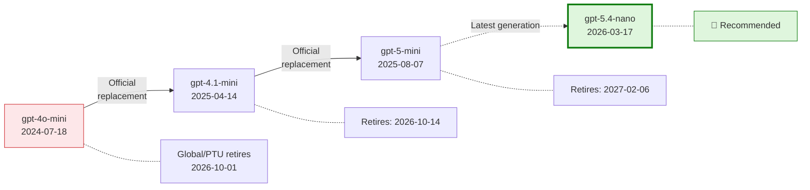
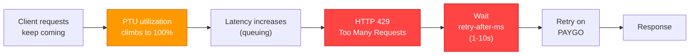
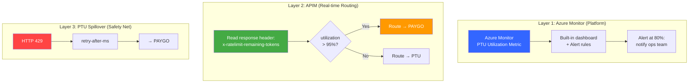
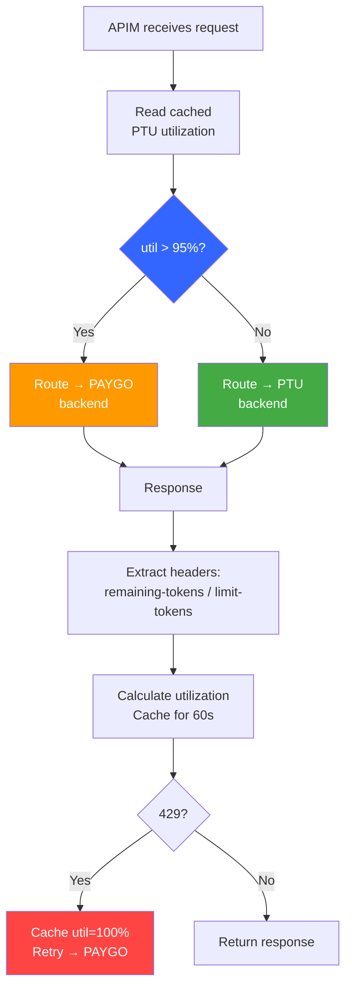

# Azure OpenAI Model Migration Benchmark & PTU Traffic Management
## gpt-4o-mini → gpt-5.4-nano | Web Search Grounding + PTU Traffic Management


Production-grade benchmark and traffic-management toolkit for migrating a low-latency AI assistant from gpt-4o-mini to newer Azure OpenAI / OpenAI model families. Every web-grounded path is measured with both the built-in search option and a WebIQ explicit-retrieval counterpart.

> **Author**: Xinyu Wei (魏新宇), Microsoft AI and Apps Global Black Belt (GBB) Senior System Engineer | **Date**: 2026-03-28

[中文版](README-CN.md) | English

---

## Running on Azure

| Area | Configuration |
|------|---------------|
| Azure service | Azure OpenAI Service + Azure API Management + Azure Monitor / Application Insights |
| Primary API path | Responses API with `stream=True`; `web_search_preview` and WebIQ explicit retrieval are both benchmarked for every web-search scenario |
| Models tested | gpt-4o-mini, gpt-5.4-nano, gpt-5.4-mini, gpt-5-nano, gpt-5-mini; gpt-5.6-luna / gpt-5.6-sol / gpt-5.6-terra, gpt-5.4 and a same-venue gpt-4o-mini baseline in the knowledge-only addendum (Section 3.5) |
| Traffic management | PTU first, APIM proactive routing to PAYGO at high utilization, 429 retry safety net |
| Runtime | Python benchmark scripts + optional Node.js PTU monitor proxy |
| Authentication | API key for benchmark scripts (the Section 3.5 script also supports Microsoft Entra ID via Azure CLI); APIM named values/backends for routing PoC |

## Executive Summary

**gpt-5.4-nano** is the recommended successor for gpt-4o-mini in the AI assistant.

Tested across 5 candidate models using the **customer's actual architecture** (Responses API + `web_search_preview` + streaming), an explicit WebIQ retrieval path, and an alternative path (Foundry Agent + BingGroundingAgentTool). gpt-5.4-nano delivers **equivalent Bing latency** (~2s) in both Bing architectures while WebIQ reduces the user-visible search-grounded TTFT to **0.99s** in the same original migration scenarios.

| Metric | gpt-4o-mini (current) | gpt-5.4-nano (recommended) | Test conditions |
|--------|:---------------------:|:--------------------------:|-----------------|
| **web_search TTFT** (P50) | **1.57s** | 2.08s | Responses API, `stream=True`, `web_search_preview`, `search_context_size=low`, `reasoning_effort=none`, GUARDRAILS prompt (~1066 tokens) |
| **WebIQ E2E TTFT** (P50) | 1.10s | **0.99s** | WebIQ `web.search()` explicit retrieval + Responses API generation, same 3 migration queries, `max_results=5`, GUARDRAILS prompt (~1066 tokens) |
| **Foundry+Bing TTFT** (P50) | 1.99s | **1.85s** | Responses API, `stream=True`, Foundry Agent V2, `BingGroundingAgentTool`, `tool_choice=required`, `reasoning_effort=none` |
| **Direct TTFT** (P50) | 0.57s | **0.59s** | Responses API, `stream=True`, `reasoning_effort=none`, no tools |
| **Input pricing** (per 1M tokens) | $0.15 | $0.20 | — |
| **Output pricing** (per 1M tokens) | $0.60 | $1.25 | — |
| **Cached input** (per 1M tokens) | $0.075 | $0.02 | — |

### WebIQ Addendum: Explicit Retrieval Path (June 2026)

Microsoft describes Web IQ as "a suite of AI-native APIs that gives applications access to fresh, real-world intelligence from across the web - including web pages, news, images, and videos" ([Microsoft WebIQ](https://www.microsoft.com/en-us/webiq), accessed 2026-06-16). This repo now includes WebIQ as an explicit retrieval path, separate from the built-in `web_search_preview` tool orchestration path.

#### Public WebIQ Resources and Activation

The table below keeps only public-safe WebIQ resources. Internal-only enablement details are intentionally omitted from this public repo.

| Resource | Link | Why it matters |
|----------|------|----------------|
| WebIQ product page | [aka.ms/WebIQ](https://aka.ms/WebIQ) | Official public overview; describes WebIQ as fresh web, news, image, and video intelligence for AI agents |
| WebIQ portal | [webiq.microsoft.ai](https://webiq.microsoft.ai/) | Public gated portal for access and profile/key management |
| Announcement blog | [aka.ms/nextgengrounding](https://aka.ms/nextgengrounding) | Architecture and design principles: Bing foundation, passage-level evidence, latency, quality, and token efficiency |
| Customer waitlist | [aka.ms/webiq-waitlist](https://aka.ms/webiq-waitlist) | Public customer activation path for limited-access WebIQ onboarding |
| Workload calculator | [aka.ms/webiq-calculator](https://aka.ms/webiq-calculator) | Sizing aid for workload and capacity planning; access may require Microsoft account permissions |
| Grounding Arena demo | [WebIQ Grounding Arena](https://groundingarenawebapp-hmb0fvfqd4ggh2g4.westus2-01.azurewebsites.net/) | Public demo for comparing no-grounding vs Microsoft WebIQ responses |
| Grounding API Explorer | [Grounding API Explorer](https://salmon-water-00ce88d10.1.azurestaticapps.net/) | Public explorer covering Web, News, Video, Image, and Browse API surfaces |

Two benchmark layers are reported separately:

| Layer | What is measured | Primary use |
|------|------------------|-------------|
| **Search-only** | WebIQ retrieval latency before any model generation | Search service latency and retrieval sanity check |
| **End-to-end** | WebIQ retrieval + AOAI Responses API generation, compared with `web_search_preview` E2E | User-visible assistant latency |

On the original migration benchmark scenarios (`pricing`, `news`, `weather`), WebIQ retrieval alone measured **183 ms P50 / 194 ms P95** with **24/24** retrieval sanity checks passing. In a 7-iteration end-to-end benchmark (15 effective S1/S5 samples per model, warmup excluded; S4 computed from search-verified success records), WebIQ reduced user-visible TTFT by **36–60%** versus `web_search_preview` across all 5 candidate models under the same endpoint and query set. See **Section 3.4** for the full side-by-side comparison.

| Model | WebIQ E2E P50 | `web_search_preview` P50 | Delta | WebIQ Search P50 |
|-------|--------------:|-------------------------:|------:|-----------------:|
| **gpt-4o-mini** | **1.10s** | 1.83s | **40.0% faster** | 195 ms |
| **gpt-5.4-mini** | **0.84s** | 1.75s | **52.3% faster** | 184 ms |
| **gpt-5.4-nano** | **0.99s** | 2.45s | **59.8% faster** | 186 ms |
| gpt-5-nano | **2.02s** | 4.70s | **57.0% faster** | 184 ms |
| gpt-5-mini | **3.02s** | 4.70s | **35.8% faster** | 188 ms |

> Scope note: WebIQ is tested here as **explicit retrieval + context injection**, while `web_search_preview` is tested as a **built-in tool orchestration** path. The `quality_pass` and `source_used` checks are lightweight sanity checks, not a human answer-quality evaluation. `web_search_preview` does not expose internal search latency, so search-layer latency is reported only for WebIQ.

#### Capability Matrix: 6 WebIQ APIs

WebIQ is broader than a single web-search endpoint. The Python SDK exposes web, news, videos, images, browse, and classic search surfaces. The table below summarizes a quick capability exploration using Lenovo/Qira-style scenarios; these are single-run smoke tests, not the statistically robust latency benchmark in Section 3.

| API | Lenovo/Qira-style scenario | Observed latency | Returned result | Fit |
|-----|----------------------------|-----------------:|-----------------|-----|
| `web.search()` | ThinkPad X1 Carbon 2026 price | 454 ms | 3 product pages with product names/specs/prices | Product Q&A, specs, pricing |
| `news.search()` | Current AI news | 276 ms | 5 news results with source media | Briefings, market/news updates |
| `videos.search()` | How to set up Lenovo AI PC | 159 ms | 3 YouTube videos with duration/view counts | Tutorial/help recommendations |
| `images.search()` | Lenovo ThinkPad X1 Carbon product images | 192 ms | 5 image results with dimensions/source pages | Product image retrieval |
| `browse.fetch()` | Lenovo ThinkPad page | 536 ms | `result is dropped` | URL reading; may fail on protected sites |
| `classic.search()` | Seattle weather today | 513 ms | Web results + structured weather JSON | Weather/finance/sports-style structured answers |

> Input limitation: WebIQ search APIs accept text queries. They do not provide image-to-image or video-to-search input in this SDK. Use `images.search()` / `videos.search()` for text-to-image and text-to-video search.

#### Token Efficiency: `passage` vs `html`

The SDK supports `ContentFormat.passage`, `text`, `html`, and `markdown` for web/news/classic search. `passage` is the closest fit for LLM grounding because it returns selected text passages instead of HTML markup.

| Scenario | HTML estimated tokens | Passage estimated tokens | Reduction |
|----------|----------------------:|-------------------------:|----------:|
| pricing | 11,397 | 11,274 | 1% |
| news | 6,118 | 4,738 | 23% |
| weather | 3,242 | 2,340 | 28% |

In this test, `passage` reduced token volume substantially for news/weather, while pricing pages were dense enough that passage and HTML sizes were nearly identical. Search latency stayed in the same ~180 ms tier.

#### Sampled Answer Quality

Side-by-side answer checks used the original migration scenarios and gpt-5.4-mini. These observations are qualitative, not a full human-evaluation suite.

| Scenario | WebIQ answer | `web_search_preview` answer | Assessment |
|----------|--------------|-----------------------------|------------|
| pricing | Specific product + price (`ASUS ExpertBook Ultra`, USD 3,600) with source URL | Generic USD 1,500-2,500+ range and stated no search results | WebIQ more specific |
| news | Multiple concrete AI news stories with source URLs | Concrete but different AI news stories with source URLs | Comparable |
| weather | NOAA/AccuWeather-style current conditions with source URLs | AccuWeather current conditions and forecast | Comparable |

#### When WebIQ Fits

| Scenario | Recommended WebIQ API | Why |
|----------|-----------------------|-----|
| AI assistant grounding | `web.search(content_format=passage)` | Fast, compact, source-grounded context for model prompts |
| News/current-awareness briefing | `news.search()` | Dedicated news results with media attribution |
| Tutorial/help recommendations | `videos.search()` | Returns video metadata such as duration and view count |
| Product image retrieval | `images.search()` | Returns image URLs, dimensions, and host pages |
| Structured real-time facts | `classic.search()` | Can return weather and other structured answer types |
| Reading a specific URL | `browse.fetch()` | Useful for page-level extraction, but site compatibility varies |

Less ideal fits: no-search tasks, zero-code orchestration requirements, image-to-image search, and sites with bot protection.

> Original benchmark note: the web_search, Foundry+Bing, and Direct rows above were measured as P50 (median) across **120 samples per model per scenario** (5 independent runs). The WebIQ E2E comparison (Section 3.4) uses a separate 7-iteration run with 15 effective samples per model. Test environment: East Asia → East US 2 (PAYGO GlobalStandard). Customer PTU environment will have lower TTFT.

### gpt-5.6 Luna Addendum: Knowledge-only Direct Latency (September 2026)

A customer loop asking `gpt-5.6-luna` a tool-free question showed a ~2 s median with a 15–60 s tail. Section 3.5 reproduces the scenario with `scripts/benchmark_luna_knowledge_qa.py` (Responses API, no tools, `max_retries=0`, per-request request ids and token usage) across `gpt-5.6-luna` / `sol` / `terra`, `gpt-5.4` and `gpt-5.4-nano`. Headline answers, with the evidence in the linked subsections:

| Question | Answer | Where |
|----------|--------|-------|
| Is Luna slow? | No — its tail stayed under 4 s over 25 streaming requests and it has the fastest decode of the five. | [3.5.1](#351-default-settings--25-samples-per-cell) |
| Which effort values exist, and were metrics compared 1-to-1? | 4o-mini effort is N/A; 5.4-nano has five explicit levels; Luna has six. The 21-cell balanced matrix was run twice — warm cached prefix and never-cached (0/20 hits everywhere) — and reports configured effort, observed reasoning, visible output length, cache hits, TTFT, Derived T2T / TPOT and E2E P50; only findings that replicate in both are claimed. | [3.5.8](#358-final-audited-1-to-1-matrix-effort-ttft-derived-tpot-and-e2e) |
| Where does a 15–60 s tail come from? | A live `429 no_capacity` peak-load event plus the SDK's default retries, which turn rejected attempts into 15–26 s "successes". | [3.5.2](#352-what-a-capacity-event-looks-like-from-the-client), [3.5.3](#353-single-variable-sdk-automatic-retries-max_retries2-the-sdk-default) |
| Does a >1,024-token system prompt (prompt caching) help? | It caches (58/59 hits) and saves cost; a hit does not lower TTFT on any of the four models. Verify the token count from `usage`, not offline. | [3.5.6](#356-single-variable-a-1200-token-system-prompt-cached-vs-never-cached-streaming-15-samples-per-cell) |
| How does it compare with gpt-4o-mini, and is `datazone` the problem? | In both balanced DataZone runs 4o-mini is slightly sooner to the first token (0.05–0.10 s at the median, not robust), while Luna `none` is faster per visible token and finishes the natural answer sooner (E2E robust in both), confirmed by tokenizer-independent characters-per-second. The same-model SKU check shows no systematic DataZone penalty: the direction flips with effort in both runs. | [3.5.8](#358-final-audited-1-to-1-matrix-effort-ttft-derived-tpot-and-e2e) |
| What to change on the client? | `max_retries=0` while diagnosing, log request id / status / `retries_taken` / usage / token-provider time, pin `reasoning.effort`, interleave compared models and conditions. | [Findings](#findings-and-guidance) |

**Production settings for web_search path** (customer's architecture):

| # | Setting | Value | Purpose |
|:-:|---------|-------|---------|
| 1 | **API** | `responses.create()` + `stream=True` | ~2x faster TTFT than Chat Completions API |
| 2 | **Search tool** | `tools=[{"type": "web_search_preview", "search_context_size": "low"}]` | Built-in Bing search with minimal token injection |
| 3 | **Reasoning** | `reasoning={"effort": "none"}` | Minimum reasoning for non-reasoning tasks |
| 4 | **Search trigger** | System prompt: `"Search the web for current information"` | Ensures 100% web_search trigger (verified via streaming events) |

**PTU traffic management recommendation**:

| Approach | Mechanism | Extra Latency | Recommendation |
|----------|-----------|:---:|---|
| PTU Spillover (built-in) | Triggers on HTTP 429 — request must fail first | +1-10s per spilled request | ⚠️ Safety net only |
| **APIM Proactive Routing** | Reads `x-ratelimit-remaining-tokens` header, routes at >95% utilization | **Zero** | ✅ **Recommended** — maintains consistent P50/P99 latency |

> PTU spillover is reactive (fail-then-retry). For the AI assistant's real-time features with P50 TTFT targets of 1-2s, APIM proactive routing eliminates 429-induced tail latency. See Section 7 for details and validated stress test results.

---

## 1. Background

### Product Overview

The AI assistant is a **system-level, cross-device AI product** embedded across PCs, tablets, and mobile phones. It unifies multiple AI features into one unified experience.

**6 Core Features**: Next Move (intent classification), Chat Mode (Q&A), Write For Me (content generation), Live Mode (real-time conversation), Catch Me Up (activity summary), Pay Attention (meeting transcription). Plus **Bing Grounding** for web search.

All features are **non-reasoning** tasks. Reasoning models add latency without quality benefit.

**Critical: `reasoning_effort` differences across model families**:

| Model Family | Minimum `reasoning_effort` | Impact on AI Assistant |
|-------------|:-------------------------:|----------------|
| gpt-4o-mini | N/A (non-reasoning) | No reasoning overhead |
| **gpt-5.4-mini / nano** | **`none`** | Zero reasoning overhead — ideal for non-reasoning tasks |
| gpt-5-mini / nano | `minimal` (without tools), `low` (with `web_search`) | Forced reasoning overhead even at minimum — **root cause of gpt-5 series high latency** |

> gpt-5.4 series supports `reasoning_effort=none`, which completely disables internal reasoning and delivers latency equivalent to non-reasoning models. gpt-5 series cannot go below `minimal`/`low`, resulting in 3-9x higher TTFT in search scenarios.

### gpt-4o-mini Retirement

Source: [Azure OpenAI Model Retirements](https://learn.microsoft.com/en-us/azure/foundry/openai/concepts/model-retirements)



### Candidate Models & Pricing

| Model | Input $/1M | Cached | Output $/1M | Type | Source |
|-------|:---------:|:------:|:-----------:|------|--------|
| **gpt-4o-mini** (current) | $0.15 | $0.075 | $0.60 | Non-reasoning | [Azure](https://azure.microsoft.com/en-us/pricing/details/cognitive-services/openai-service/) |
| **gpt-5-mini** | $0.25 | $0.03 | $2.00 | Reasoning | [Azure](https://azure.microsoft.com/en-us/pricing/details/cognitive-services/openai-service/) |
| **gpt-5-nano** | $0.05 | $0.01 | $0.40 | Reasoning | [Azure](https://azure.microsoft.com/en-us/pricing/details/cognitive-services/openai-service/) |
| **gpt-5.4-mini** | $0.75 | $0.08 | $4.50 | Reasoning | [Azure](https://azure.microsoft.com/en-us/pricing/details/cognitive-services/openai-service/) |
| **gpt-5.4-nano** | $0.20 | $0.02 | $1.25 | Reasoning | [OpenAI](https://openai.com/api/pricing/) |

### Region Availability

Required regions: East US 2, Sweden Central, Southeast Asia.

| Model | East US 2 | Sweden Central | Southeast Asia |
|-------|:---------:|:-------------:|:--------------:|
| gpt-4o-mini | ✅ | ✅ | ✅ |
| gpt-5.4-mini | ✅ | ✅ | ⏳ Rollout pending |
| gpt-5.4-nano | ✅ | ✅ | ⏳ Rollout pending |

---

## 2. Methodology

### 5-Scenario Latency Decomposition

All model-facing scenarios use **Responses API + streaming** for fair layer-by-layer comparison. Web-grounded scenarios are always reported with both a built-in search path and a WebIQ explicit-retrieval path.

| Scenario | Measures | API | Bing |
|----------|----------|-----|:----:|
| **S1** Direct AOAI | Model inference | `responses.create(model=...)` | No |
| **S2** Foundry Agent | Model + orchestration | `responses.create(agent_reference=...)` | No |
| **S3** Foundry + Bing | Full production stack | `responses.create(agent_reference=..., tool_choice="required")` | Yes |
| **S4** Direct AOAI + `web_search_preview` | Customer's production built-in web-search path | `responses.create(model=..., tools=[{"type":"web_search_preview"}])` | Yes |
| **S5** WebIQ + Direct AOAI | Explicit retrieval + context injection + model generation | WebIQ `web.search()` followed by `responses.create(model=...)` | WebIQ |

Latency at each layer is isolated by subtraction:

```
Total TTFT = [Model Inference] + [Foundry Overhead] + [Bing Overhead]
                  S1                 S2 - S1             S3 - S2

Built-in search overhead = S4 - S1
WebIQ explicit-retrieval overhead = S5 - S1
```

### Test Parameters

- **5 models**, 3 queries, 10 iterations/query (2 warmup discarded) = **24 effective samples/model/scenario/run**
- **5 independent runs** = **120 effective samples per model per scenario** (2,250 total API calls)
- **WebIQ S5 comparison run**: 7 iterations/query (2 warmup discarded) = **15 effective samples/model/scenario** for S1/S5; S4 uses search-verified success records from the same run and excludes terminal-encoding error records
- `reasoning_effort` at model minimum: `none` for gpt-5.4, `minimal` for gpt-5
- S3 system instruction: `"Perform exactly ONE search. Do NOT refine or repeat searches."`
- S4 system instruction: `"Search the web for current information"` + GUARDRAILS, with web_search streaming events used to verify search trigger
- S5 retrieval: WebIQ `web.search(max_results=5)` followed by Responses API generation with the same GUARDRAILS prompt and the WebIQ context injected into the user message
- SDK: `openai==2.14.0`, `azure-ai-projects==2.0.0b2`
- **Test environment**: Windows VM (East Asia) → East US 2 deployment. Cross-Pacific network adds ~100-200ms RTT. Customer's production environment (US-based clients → East US 2) will have ~30-50ms RTT, yielding ~70-170ms lower TTFT than reported here.

### TTFT Composition

Measured TTFT includes network round-trip, request queuing, model prefill, and first token generation:

| Component | Estimated | Note |
|-----------|:---------:|------|
| Network round-trip | ~100-200ms | Test machine (East Asia) → East US 2 |
| Request queuing | ~50-300ms | GlobalStandard shared pool (not PTU) |
| Model prefill | ~200-400ms | Processing system + user prompt |
| First token generation | ~50-100ms | Generating first output token |
| **Total (observed P50)** | **~0.57-0.69s** | Consistent with component estimates |

> **Note**: These benchmarks use **GlobalStandard (PAYGO)** deployments. PTU (Provisioned Throughput) deployments eliminate queuing delay, resulting in lower TTFT. Customer’s production PTU environment is expected to show improved latency.

### Why Responses API?

Direct AOAI supports both APIs. Responses API delivers ~2x faster TTFT:

| Model | Responses API (P50) | Chat Completions (P50) |
|-------|:-------------------:|:----------------------:|
| gpt-4o-mini | 0.44~0.72s | 1.13~1.34s |
| gpt-5.4-nano | 0.56~0.58s | 1.20~1.53s |
| gpt-5.4-mini | 0.60~0.62s | 1.23~1.35s |

---

## 3. Results

### Test Queries

All scenarios use the same 3 queries (system instruction: `"You are a helpful AI assistant. Answer concisely."`):

| Query | Prompt | max_tokens |
|-------|--------|:----------:|
| **Pricing** | "What is the latest retail price for a flagship laptop?" | 300 |
| **News** | "What are the top AI news stories this week?" | 300 |
| **Weather** | "What is the current weather in Seattle, Washington?" | 200 |

For Bing scenarios, the system instruction adds: `"CRITICAL: Perform exactly ONE search. Do NOT refine or repeat searches. Use first results immediately."`

### 3.1 Direct AOAI — Responses API (no Agent, no Bing)

API: `responses.create(model=..., stream=True)` | 40 samples per cell (5 runs merged)

| Model | Pricing TTFT/E2E | News TTFT/E2E | Weather TTFT/E2E | Avg TTFT |
|-------|:-:|:-:|:-:|:-:|
| **gpt-4o-mini** | 0.70/1.47s | 0.60/1.36s | 0.78/1.30s | **0.69s** |
| **gpt-5.4-nano** | 0.79/1.49s | 0.63/2.14s | 0.64/1.32s | **0.69s** |
| **gpt-5.4-mini** | 0.75/1.58s | 0.75/2.18s | 0.63/1.16s | **0.71s** |
| gpt-5-nano | 1.25/2.31s | 1.05/3.20s | 1.11/2.09s | 1.14s |
| gpt-5-mini | 1.33/4.23s | 1.29/5.21s | 1.15/2.95s | 1.26s |

### 3.2 web_search_preview + GUARDRAILS — Customer's Production Path

> **This is the primary benchmark** — testing the exact architecture the customer uses in production.

The customer confirmed their AI assistant uses `web_search_preview` (Responses API built-in tool) instead of Foundry Agent + BingGroundingAgentTool. This section tests the actual customer architecture.

**Key differences from Section 3.3 (Foundry+Bing)**:
- No Foundry Agent orchestration layer — direct AOAI call with `tools=[{"type": "web_search_preview"}]`
- `tool_choice` defaults to `auto` (not `required` — see Appendix F for why)
- `search_context_size="low"` to minimize token consumption
- GUARDRAILS system prompt (~1066 tokens, triggers prompt caching)
- Web search confirmed via `response.web_search_call.searching` event (100% trigger rate, 0 skipped across 120 samples/model)
- gpt-5 series requires `reasoning_effort="low"` (not `minimal` — `minimal` + web_search = 400 error)

**5-run merged results** (120 effective samples per model per scenario):

| Model | effort | S1 Direct P50 | S4 web_search P50 | web_search OH | σ | N |
|-------|:------:|:------:|:------:|:------:|:----:|:-:|
| **gpt-4o-mini** | N/A | 0.45s | **1.57s** | +1.12s | 0.53s | 120 |
| **gpt-5.4-mini** | none | 0.60s | **1.90s** | +1.30s | 2.80s | 120 |
| **gpt-5.4-nano** | none | 0.62s | **2.08s** | +1.46s | 2.12s | 120 |
| gpt-5-nano | low | 1.42s | 8.93s | +7.51s | 4.11s | 119 |
| gpt-5-mini | low | 1.14s | 6.75s | +5.61s | 2.76s | 119 |

> gpt-5-nano and gpt-5-mini have N=119 because one effective sample failed during the web_search run and was excluded from the search-verified subset. The public scripts now preserve failed records in JSON output for reproducibility.

**Cross-architecture comparison** — every web-grounded path has a WebIQ counterpart:

| Model | S3: Foundry+Bing | S4: `web_search_preview` | S5: WebIQ E2E | Consistent? |
|-------|:-:|:-:|:-:|:-:|
| gpt-4o-mini | 1.99s | **1.57s** | 1.10s | ✅ Bing paths same tier; WebIQ faster |
| **gpt-5.4-mini** | 1.96s | **1.90s** | **0.84s** | ✅ Bing paths same tier; WebIQ fastest |
| **gpt-5.4-nano** | **1.85s** | 2.08s | 0.99s | ✅ Bing paths same tier; WebIQ sub-second |
| gpt-5-nano | 3.56s | 8.93s | 2.02s | ❌ built-in web_search worse; WebIQ reduces overhead |
| gpt-5-mini | 3.80s | 6.75s | 3.02s | ❌ built-in web_search worse; WebIQ reduces overhead |

> **Note**: gpt-5.4-nano is 0.18s slower than gpt-5.4-mini in web_search scenarios. This is consistent with [OpenAI's official evaluation](https://openai.com/index/introducing-gpt-5-4-mini-and-nano/) where nano scores lower than mini on tool-calling benchmarks (Toolathlon: nano 35.5% vs mini 42.9%). The 0.18s difference is within measurement noise (σ > 2s) and imperceptible to end users. nano's advantage is **73% lower input pricing** ($0.20 vs $0.75/1M tokens).

> **WebIQ data-set note**: S5 values come from the dedicated 7-iteration WebIQ E2E run in Section 3.4, not the older 5-run S3/S4 merge. They are included here to make the web-grounding trade-off visible in the same decision table.

> **Conclusion**: All three models (gpt-4o-mini, gpt-5.4-mini, gpt-5.4-nano) deliver ~2s TTFT through the built-in Bing paths. WebIQ provides the faster explicit-retrieval option for the same web-grounded workloads, with gpt-5.4-nano reaching 0.99s E2E. gpt-5 series remains unsuitable for built-in web_search paths, but WebIQ reduces the penalty by moving retrieval outside the model tool loop.

---

### 3.3 Foundry Agent V2 + Bing Grounding (Alternative Path)

> The following sections test an alternative Bing integration path via Foundry Agent. the customer does not currently use this path, but it is included for completeness and cross-validation.

#### 3.3.1 Foundry Agent — No Bing (Agent orchestration overhead)

API: `responses.create(agent_reference=..., stream=True)` — `reasoning_effort` set in `PromptAgentDefinition` | 40 samples per cell

| Model | Pricing TTFT/E2E | News TTFT/E2E | Weather TTFT/E2E | Avg TTFT |
|-------|:-:|:-:|:-:|:-:|
| **gpt-4o-mini** | 0.80/1.60s | 0.83/1.56s | 0.74/1.41s | **0.79s** |
| **gpt-5.4-nano** | 1.05/2.04s | 1.10/4.97s | 1.77/2.79s | **1.31s** |
| **gpt-5.4-mini** | 1.09/1.95s | 1.05/2.80s | 0.93/1.51s | **1.02s** |
| gpt-5-nano | 1.68/2.80s | 1.75/4.76s | 1.63/2.53s | 1.69s |
| gpt-5-mini | 1.69/4.50s | 1.97/9.21s | 1.83/3.71s | 1.83s |

> Note: S2 Avg TTFT differs from P50 due to occasional outliers (e.g., gpt-5.4-nano Weather query TTFT=1.77s). P50 in Section 3.3.3 is the more robust metric.

#### 3.3.2 Foundry Agent + Bing Grounding

API: `responses.create(agent_reference=..., tool_choice="required", stream=True)` + `BingGroundingAgentTool` | 40 samples per cell

| Model | Pricing TTFT/E2E | News TTFT/E2E | Weather TTFT/E2E | Avg TTFT |
|-------|:-:|:-:|:-:|:-:|
| **gpt-4o-mini** | 2.15/3.35s | 2.20/5.47s | 2.30/3.25s | **2.21s** |
| **gpt-5.4-nano** | 2.19/3.02s | 1.92/5.70s | 2.19/2.91s | **2.10s** |
| **gpt-5.4-mini** | 2.25/3.02s | 2.06/5.35s | 2.15/2.84s | **2.15s** |
| gpt-5-nano | 3.85/5.42s | 3.41/5.64s | 3.47/4.93s | 3.58s |
| gpt-5-mini | 4.06/8.33s | 3.62/11.81s | 5.40/7.36s | 4.36s |

> 5 runs merged, 40 effective samples per query per model.

#### TTFT Overview (Foundry+Bing + web_search + WebIQ)


> This chart combines the 5-run Foundry Agent dataset (S1/S2/S3) with the WebIQ E2E comparison run (S4/S5), so every web-grounded path is visible in one view. S5 uses the 7-iteration WebIQ run from Section 3.4.

#### 3.3.3 Summary (Foundry+Bing, 5 runs merged, 120 samples/model/scenario)

| Model | effort | Direct AOAI P50 | Foundry (no Bing) P50 | Foundry+Bing P50 | Bing σ | N |
|-------|:------:|:------:|:------:|:------:|:----:|:---:|
| **gpt-4o-mini** | N/A | 0.57s | 0.69s | 1.99s | 0.73s | 120 |
| **gpt-5.4-nano** | none | **0.59s** | 0.81s | **1.85s** | 0.73s | 120 |
| **gpt-5.4-mini** | none | 0.62s | **0.87s** | 1.95s | **0.60s** | 120 |
| gpt-5-nano | minimal | 1.01s | 1.64s | 3.56s | 1.05s | 120 |
| gpt-5-mini | minimal | 1.09s | 1.73s | 3.80s | 6.27s | 120 |

#### 3.3.4 Latency Decomposition (5 runs merged)

| Layer | gpt-4o-mini | gpt-5.4-nano | gpt-5.4-mini | gpt-5-nano | gpt-5-mini |
|-------|:----------:|:----------:|:----------:|:----------:|:----------:|
| **Direct AOAI** (P50) | 0.57s | **0.59s** | 0.62s | 1.01s | 1.09s |
| **Foundry overhead** | +0.12s | +0.22s | +0.24s | +0.62s | +0.64s |
| **Bing overhead** | +1.30s | **+1.04s** | +1.08s | +1.93s | +2.07s |
| **Foundry+Bing total** (P50) | 1.99s | **1.85s** | 1.95s | 3.56s | 3.80s |

#### Latency Decomposition Chart — Foundry+Bing vs web_search vs WebIQ


> The grouped bars compare S3 Foundry+Bing, S4 built-in `web_search_preview`, and S5 WebIQ explicit retrieval. S4/S5 overheads are computed from the Section 3.4 S1/S4/S5 run, while S3 uses the 5-run Foundry dataset in Section 3.3.

#### Key Findings (Foundry+Bing)

1. **Foundry Agent V2 adds +0.12~0.64s** — minimal orchestration overhead
2. **Bing search adds +1.04~2.07s** (includes Bing API + result injection + model processing)
3. **gpt-5.4-nano has lowest Bing overhead (+1.04s)** — 20% less than gpt-4o-mini (+1.30s)
4. **gpt-5 series is unsuitable for Bing** — 3.6~4.4s TTFT even with all optimizations
5. **WebIQ is the explicit-retrieval counterpart** — Section 3.4 tests the same web-grounded question class with retrieval moved out of the model tool loop

### 3.4 WebIQ Explicit Retrieval vs `web_search_preview` — E2E Comparison

> **S5 (WebIQ)**: Application calls WebIQ `web.search()` → strips HTML → injects search context into AOAI Responses API prompt → streaming generation. Two-hop explicit retrieval path.
>
> **S4 (`web_search_preview`)**: Application calls AOAI Responses API with `web_search_preview` tool → model internally triggers Bing search → streaming generation. Single-call tool orchestration path.

7-iteration benchmark, 2 warmup discarded → **15 effective S1/S5 samples per model**. S4 reports search-verified success records from the same run; older Windows terminal output used a non-UTF-8 code page, so terminal-encoding failure records are excluded from S4 statistics. WebIQ credentials were supplied via `WEBIQ_API_KEY` / `--webiq-key` and are intentionally not published; max 5 results per query.

#### Visual Overview — S1 vs S4 vs S5


> S5 is **not** WebIQ search latency alone. It is WebIQ retrieval plus AOAI generation. WebIQ search itself is ~184–195 ms P50; the remaining latency is model generation. That is why gpt-5-mini / gpt-5-nano still look slow, while gpt-5.4-mini and gpt-5.4-nano stay near the direct-call tier.

#### 3.4.1 Grand Summary — S1 vs S4 vs S5

| Model | effort | S1 Direct P50 / N | S4 `web_search` P50 / N | S5 WebIQ P50 / N | WS Overhead | WebIQ Overhead | S5 faster than S4 |
|-------|:------:|:------:|:------:|:------:|:------:|:------:|:------:|
| **gpt-4o-mini** | N/A | 0.66s / 15 | 1.83s / 15 | **1.10s / 15** | +1.17s | +0.44s | **40.0%** |
| **gpt-5.4-mini** | none | 0.68s / 15 | 1.75s / 15 | **0.84s / 15** | +1.08s | +0.16s | **52.3%** |
| **gpt-5.4-nano** | none | 0.75s / 15 | 2.45s / 15 | **0.99s / 15** | +1.71s | +0.24s | **59.8%** |
| gpt-5-nano | minimal | 0.69s / 15 | 4.70s / 13 | **2.02s / 15** | +4.01s | +1.33s | **57.0%** |
| gpt-5-mini | minimal | 0.81s / 15 | 4.70s / 10 | **3.02s / 15** | +3.89s | +2.21s | **35.8%** |

> **WS Overhead** = S4 P50 − S1 P50 (cost of built-in `web_search_preview` orchestration). **WebIQ Overhead** = S5 P50 − S1 P50 (cost of explicit WebIQ retrieval + context injection). **S5 faster** = (S4 P50 − S5 P50) / S4 P50.

#### 3.4.2 WebIQ Search-Layer Latency

| Model | Search P50 | N |
|-------|:----------:|:---:|
| gpt-4o-mini | 195 ms | 15 |
| gpt-5.4-mini | 184 ms | 15 |
| gpt-5.4-nano | 186 ms | 15 |
| gpt-5-nano | 184 ms | 15 |
| gpt-5-mini | 188 ms | 15 |

> Search latency is model-independent (~185–195 ms P50). The variation in S5 total latency is driven by AOAI model generation time, not WebIQ search.

#### Key Findings (WebIQ vs `web_search_preview`)

1. **WebIQ is 36–60% faster than `web_search_preview`** across all 5 models in E2E TTFT
2. **Search-layer latency is ~185 ms P50** — effectively model-independent
3. **gpt-5.4-mini + WebIQ achieves 0.84s E2E** — the fastest search-grounded configuration tested
4. **gpt-5.4-nano + WebIQ at 0.99s** — sub-second search-grounded TTFT, suitable for real-time assistant
5. **Trade-off**: WebIQ requires application-level search orchestration code; `web_search_preview` is zero-code but slower

> Data source: `outputs/benchmark_websearch_guardrails_20260617_103004.json` (7 iterations, 2 warmup). S4 rows above use only search-verified success records. The public script now uses ASCII status labels and explicit `success` flags so future runs do not append duplicate terminal-encoding failure records.

### 3.5 gpt-5.6 Luna / Sol / Terra — Knowledge-only Direct Latency (Addendum, September 2026)

> **Why this addendum exists.** A customer evaluating `gpt-5.6-luna` ran a plain request loop — no tools, no web search, the prompt was simply *"What are the seven wonders of the world?"* — and saw a median around 2 s but a large share of requests at 15–60 s. Three explanations compete: Luna is inherently slow, the client loop hides something (SDK automatic retries, a new TLS connection per call), or the service had a capacity event. This section separates them with single-variable measurements. Everything here is scenario **S1-KQ**: Direct AOAI Responses API with knowledge-only prompts, so nothing but the model and the service path is measured.

#### Test setup

| Item | Value |
|------|-------|
| Script | `scripts/benchmark_luna_knowledge_qa.py` (new; see Section 9.3) |
| API | Responses API v1 (`<endpoint>/openai/v1/responses`), `openai==2.14.0`, Microsoft Entra ID authentication |
| Deployments | `gpt-5.6-luna`, `gpt-5.6-sol`, `gpt-5.6-terra` (all model version `2026-07-09`), `gpt-5.4`, `gpt-5.4-nano` — GlobalStandard, same resource, Sweden Central |
| Client | Windows workstation in East Asia → Sweden Central (cross-continent RTT is included in every number) |
| Prompt | `What are the seven wonders of the world?`, no system prompt, `max_output_tokens=1024`, `reasoning` **unset** (model default) unless stated |
| Sampling | 27 iterations per cell, 2 warmup discarded → **25 samples per model per mode**; models interleaved round-robin; `stream=True` and `stream=False` measured side by side |
| Client hygiene | `max_retries=0` (SDK default is 2), one shared HTTPS connection, `timeout=120s`; every request logs HTTP status, `x-request-id` / `apim-request-id`, `retries_taken`, token usage and `response.status` |

#### 3.5.1 Default settings — 25 samples per cell

Streaming (`stream=True`): TTFT = first `response.output_text.delta`; tok/s = visible output tokens ÷ (E2E − TTFT).

| Model | N ok/total | TTFT p50 / p95 | E2E mean / p50 / p95 / max | >5s | Output tokens (of which reasoning) | tok/s p50 |
|-------|:-:|:-:|:-:|:-:|:-:|:-:|
| **gpt-5.6-luna** | 25/25 | 2.04s / 2.35s | 3.17s / 3.14s / 3.55s / **3.89s** | 0 | 300 (102) | **175** |
| gpt-5.6-sol | **8/25** — capacity event (Section 3.5.2); N=8 statistics are not comparable with the other rows | 2.57s / 12.11s | 7.17s / 5.14s / 15.27s / 19.45s | 4 | 245 (50) | 65 |
| gpt-5.6-terra | 25/25 | 1.22s / 3.89s | 3.31s / 3.01s / 6.00s / 6.65s | 2 | 224 (24) | 111 |
| gpt-5.4 | 25/25 | 1.38s / 1.61s | 4.59s / 4.29s / 6.74s / 8.10s | 6 | 213 (0) | 77 |
| gpt-5.4-nano | 25/25 | **0.97s** / 1.48s | 2.62s / **2.44s** / 3.56s / 4.12s | 0 | 151 (0) | 98 |

Non-streaming (`stream=False`, the shape of a simple `time.time()` loop):

| Model | N ok/total | E2E mean / p50 / p95 / max | >5s | Output tokens (of which reasoning) |
|-------|:-:|:-:|:-:|:-:|
| **gpt-5.6-luna** | 25/25 | 3.55s / 3.29s / 5.17s / 8.78s | 2 | 287 (91) |
| gpt-5.6-sol | **8/25** — capacity event, N=8 not comparable | 5.50s / 5.44s / 6.29s / 6.36s | 7 | 265 (75) |
| gpt-5.6-terra | 25/25 | 3.47s / 3.28s / 4.86s / 5.38s | 2 | 223 (28) |
| gpt-5.4 | 25/25 | 4.22s / 4.21s / 5.00s / 6.36s | 2 | 217 (0) |
| gpt-5.4-nano | 25/25 | 2.89s / 2.86s / 3.70s / 4.04s | 0 | 162 (0) |

Reading the tables:

- **Luna is not slow.** Its visible decode speed is the fastest of the five (175 tok/s p50) and its streaming E2E maximum over 25 requests was 3.89 s. With `max_retries=0` there were **no 15–60 s outliers**.
- **Luna's TTFT is ~0.8 s higher than Terra's because it thinks more by default.** Luna emitted ~100 reasoning tokens per answer, Sol ~50, Terra ~24, gpt-5.4 none. Nothing else in the request differs; Section 3.5.4 removes this variable.
- **`gpt-5.6-sol` hit a live capacity event during the run.** 34 of 54 Sol requests failed with `429 too_many_requests` / `code: no_capacity` between 04:04 and 04:20 UTC, while Luna, Terra, gpt-5.4 and gpt-5.4-nano served every request on the same resource in the same minutes. Capacity is per model pool, not per resource.
- All 236 successful answers (warmup included) passed the sanity check (≥5 of the wonders named); 269 of 270 requests carried a unique request id — the exception is the one request that hit the 120 s client timeout.

#### 3.5.2 What a capacity event looks like from the client

Error body returned by the service (verbatim):

```text
429 too_many_requests, code: no_capacity
"The system is currently experiencing high demand and cannot process your request.
 Your request exceeds the maximum usage size allowed during peak load.
 For improved capacity reliability, consider switching to Provisioned Throughput."
```

| Observation | Value |
|-------------|-------|
| Non-streaming failures | HTTP 429 surfaced after 2.1–3.0 s in most cases, but also after 5.6 s, 6.4 s, 11.4 s and 30.8 s; one request hit the 120 s client timeout |
| Streaming failures | HTTP **200** with headers, then the SSE stream terminates with the error → the SDK raises `APIError` 1.1–34.5 s after the request started. A client that only checks the status code will not see a 429 at all |
| Server-side hold | Just before the failures began, one Sol request **succeeded after 19.45 s** with 0 retries (iteration 5, streaming): response headers arrived in 0.5 s, the first token after 16.2 s. Luna's only two non-streaming requests above 5 s (5.5 s and 8.8 s) also fell inside the Sol event window (04:18–04:20 UTC) |
| Not a quota limit | The request was 15 input tokens with `max_output_tokens=1024`; `no_capacity` means the shared GlobalStandard pool for that model was saturated. Raising TPM quota does not help; PTU, a different SKU/region pool, or proactive routing (Section 7) does |

#### 3.5.3 Single variable: SDK automatic retries (`max_retries=2`, the SDK default)

Ten non-streaming Sol requests were sent during the same capacity event with the only change being `max_retries=2` instead of `0`:

| # | Result | E2E | Hidden retries | # | Result | E2E | Hidden retries |
|:-:|--------|:---:|:-:|:-:|--------|:---:|:-:|
| 1 | 429 | 7.3s | 2 (inferred) | 6 | **200** | **20.8s** | 2 |
| 2 | 429 | 6.0s | 2 (inferred) | 7 | **200** | **15.2s** | 1 |
| 3 | **200** | **25.7s** | 2 | 8 | 429 | 5.5s | 2 (inferred) |
| 4 | **200** | **16.7s** | 0 (server-side hold) | 9 | 429 | 5.2s | 2 (inferred) |
| 5 | 429 | 5.4s | 2 (inferred) | 10 | 429 | 5.3s | 2 (inferred) |

Retry counts on successful requests are read from the SDK response (`retries_taken`); on failed requests the SDK only surfaces a 429 after exhausting its retries, so "2 (inferred)" is derived from `max_retries=2` and the 5–7 s total, not from a response field (the JSON marks these `retries_taken_inferred=true`).

With the default retry policy four requests "succeeded" in **15.2 s, 16.7 s, 20.8 s and 25.7 s**. Three of them contain one or two invisible retries; the fourth was held 16.7 s server-side. The six that still failed took 5.2–7.3 s to surface (three attempts plus back-off) instead of ~2 s. This is exactly the shape reported by the customer: **a low median with a 15–60 s tail that appears only under peak load, inflated by automatic retries that a bare timing loop cannot see.** The script records `retries_taken` per request so that this is never ambiguous again.

#### 3.5.4 Single variable: `reasoning.effort` for the 5.6 family (streaming, 15 samples per cell)

| Model | `effort` | TTFT p50 / p95 | E2E mean / p50 / p95 / max | Output tokens (reasoning) | tok/s p50 |
|-------|:-:|:-:|:-:|:-:|:-:|
| gpt-5.6-luna | default (≈medium) | 2.04s / 2.35s | 3.17s / 3.14s / 3.55s / 3.89s | 300 (102) | 175 |
| gpt-5.6-luna | `low` | 1.36s / 1.79s | 2.84s / 2.64s / 3.85s / 5.10s | 237 (42) | 156 |
| **gpt-5.6-luna** | **`none`** | **0.92s / 1.22s** | 2.48s / **2.24s** / 3.49s / 4.75s | 226 (0) | **169** |
| gpt-5.6-sol | `low` | 1.60s / 2.64s | 4.90s / 4.70s / 6.50s / 7.33s | 227 (21) | 70 |
| gpt-5.6-sol | `none` | 1.00s / 1.46s | 4.31s / 4.26s / 4.94s / 5.25s | 224 (0) | 69 |
| gpt-5.6-terra | `low` | 1.09s / 1.36s | 3.06s / 2.77s / 4.34s / 6.15s | 216 (21) | 115 |
| gpt-5.6-terra | `none` | 0.90s / 2.12s | 2.89s / 2.72s / 3.62s / 5.06s | 222 (0) | 122 |

- This preliminary pass sampled `none` / `low` plus default and one `medium` canary. The API's full supported list is `none`, `low`, `medium`, `high`, `xhigh`, `max`; `minimal` is rejected. Section 3.5.8 supersedes it with a same-window full matrix, while the aligned control confirms that default is statistically indistinguishable from explicit `medium`.
- **At equal effort the three variants have the same TTFT (0.90–1.00 s p50), and Luna has the fastest E2E** (2.24 s p50) because it decodes at ~169 tok/s versus 122 (Terra) and 69 (Sol).
- On Luna each step default → `low` → `none` removes roughly 0.7 s of TTFT (2.04 → 1.36 → 0.92 s; permutation test on medians, `none` vs `low` p = 0.0006, `none` vs default p < 0.0001). For latency-sensitive knowledge Q&A, set `reasoning={"effort": "none"}` (or `low`) explicitly rather than relying on the default.

#### 3.5.5 Knowledge-only capability spread (streaming, 5 samples per cell)

Four more prompts that need no tools — a technical explanation, a small coding task, arithmetic with unit conversion, and strict JSON output — were run against the same five deployments (7 iterations, 2 warmup). Cells show TTFT p50 / E2E p50 (mean reasoning tokens).

| Model | TCP vs UDP (5 bullets) | Python `is_palindrome` | 150 km in 1 h 40 min → km/h, mph | JSON capitals (JSON only) | Sanity |
|-------|:-:|:-:|:-:|:-:|:-:|
| gpt-5.6-luna | **0.91s / 1.96s** (0) | 1.48s / 2.17s (12) | 1.55s / **2.85s** (59) | 1.73s / 2.02s (65) | 20/20 |
| gpt-5.6-sol | 0.98s / 2.24s (0) | 1.37s / 2.09s (0) | 1.95s / 3.39s (53) | 2.07s / 2.65s (17) | 20/20 |
| gpt-5.6-terra | **0.87s** / 2.28s (0) | **0.85s / 1.44s** (0) | **1.39s** / **2.85s** (47) | **0.92s / 1.33s** (8) | 20/20 |
| gpt-5.4 | 1.35s / 3.68s (0) | 1.32s / 2.25s (0) | 1.42s / 3.53s (0) | 1.36s / 1.95s (0) | 20/20 |
| gpt-5.4-nano | 0.93s / 2.53s (0) | 1.03s / 1.90s (0) | 1.03s / 3.28s (0) | 1.05s / 2.08s (0) | 20/20 |

- All 140 answers passed their sanity checks; on prompts this simple the five models are not separable by correctness, only by latency and verbosity.
- **Luna's default reasoning is adaptive.** It spent 0 reasoning tokens on the TCP/UDP explanation (TTFT 0.91 s, the fastest E2E in that row), ~60 on arithmetic and JSON, and ~100 on the seven wonders. A single "Luna TTFT" number therefore depends on the prompt; pin `reasoning.effort` when comparing models.
- Terra had the lowest TTFT on three of the four prompts; gpt-5.4-nano remains the cheapest low-latency option. Sol produced one 8.8 s outlier (palindrome: headers in 0.4 s, first token after 8.1 s) about ten minutes after its last observed 429, with every other Sol request in the 1–3.4 s range.

#### 3.5.6 Single variable: a 1,200-token system prompt, cached vs. never cached (streaming, 15 samples per cell)

The customer's assistant sends a system prompt of more than 1,024 tokens on every request, so the runs above (15 input tokens) under-represent their prefill and leave prompt caching out of the picture. The `guardrails-long` preset — 1,202 input tokens including the question — isolates that variable under three conditions:

| Condition | Flag | What the service sees |
|-----------|------|-----------------------|
| **A. cached** | `guardrails-long` | identical 1,187-token prefix every request → `cached_tokens` = 1,199 (gpt-5.6) / 1,024 (gpt-5.4-nano) |
| **B. never cached** | `guardrails-long+bust` | a unique nonce at the start of the prompt → `cached_tokens` = 0 (full prefill every time; what a per-request dynamic prefix does in production) |
| **C. no system prompt** | `none` | 15 input tokens (the earlier runs) |

The three conditions were **interleaved inside every iteration** (`--conditions guardrails-long,guardrails-long+bust,none`, 07:30–07:45 UTC) so that no condition is confounded with the minutes in which it ran. Per-request token-provider time was logged (`auth_seconds`); one Luna request that carried a 6.3 s Entra token refresh inside its timing is excluded from the statistics (see below).

| Model | Condition | TTFT p50 / p95 | E2E mean / p50 / p95 / max | In tokens (cached) | Out tokens (reasoning) | cached vs. B, p |
|-------|-----------|:-:|:-:|:-:|:-:|:-:|
| **gpt-5.6-luna** | A. cached | 1.95s / 2.82s | 3.14s / 3.07s / 4.57s / 4.66s | 1202 (1198) | 211 (69) | 0.31 |
| gpt-5.6-luna | B. never cached | 1.62s / 4.58s | 3.13s / 2.77s / 5.53s / 6.67s | 1228 (0) | 205 (63) | |
| gpt-5.6-luna | C. no system prompt | 2.01s / 3.81s | 3.65s / 3.25s / 5.60s / 8.18s | 15 (0) | 298 (98) | |
| gpt-5.6-terra | A. cached | 1.40s / 2.71s | 3.88s / 3.10s / 8.31s / 9.99s | 1202 (1199) | 197 (28) | 0.14 |
| gpt-5.6-terra | B. never cached | 1.22s / 2.73s | 3.00s / 2.80s / 4.79s / 6.36s | 1229 (0) | 151 (20) | |
| gpt-5.6-terra | C. no system prompt | 1.22s / 1.46s | 3.48s / 3.35s / 4.78s / 6.32s | 15 (0) | 224 (25) | |
| gpt-5.4-nano | A. cached | 1.11s / 2.62s | 2.95s / 2.67s / 4.94s / 5.11s | 1202 (956) | 129 (0) | 0.06 |
| gpt-5.4-nano | B. never cached | 0.98s / 1.68s | 2.26s / 2.02s / 3.47s / 3.68s | 1229 (0) | 125 (0) | |
| gpt-5.4-nano | C. no system prompt | 1.03s / 2.35s | 3.03s / 2.61s / 4.69s / 5.22s | 15 (0) | 157 (0) | |
| gpt-5.6-sol | A. cached | 1.90s / 4.34s | 5.22s / 4.77s / 7.89s / 8.81s | 1202 (1198) | 198 (40) | 0.85 |
| gpt-5.6-sol | B. never cached | 1.94s / 7.09s | 5.58s / 4.66s / 10.21s / 16.65s | 1229 (0) | 205 (47) | |
| gpt-5.6-sol | C. no system prompt | 2.92s / 22.12s | 10.31s / 6.77s / 25.01s / **66.54s** | 15 (0) | 275 (76) | |

*p* = two-sided permutation test on the median TTFT difference between the cached and never-cached conditions (20,000 shuffles).

What the data says:

- **Prompt caching engages once the prefix is ≥1,024 tokens, but a hit is not guaranteed.** 58 of 59 cached-condition requests returned `cached_tokens` (gpt-5.6 ≈ the whole 1,199-token prefix; gpt-5.4-nano reported 1,024 — granularity differs by model family); one gpt-5.4-nano request with the identical prefix came back with 0 about 50 s after the previous hit. That is the billing benefit the customer is after, and the script prints `cached_tokens` per request so a production loop can confirm the actual hit rate.
- **A cache hit does not lower TTFT on any of the four models.** Where the medians differ at all, the cached condition is the slower one (Luna 1.95 s vs 1.62 s, Terra 1.40 vs 1.22, nano 1.11 vs 0.98), and none of the differences is significant (p = 0.06–0.85). A 1,200-token prefill is on the order of 100 ms; with or without a system prompt, Luna's first token is governed by its ~60–100 reasoning tokens. This is the same conclusion as Section 4.1, now from a single-variable design (same prompt length, cache on/off, same minutes) rather than long-prompt vs. short-prompt runs.
- **A concise system prompt shortens Luna's answers and reasoning** (reasoning 98 → 69 tokens, output 298 → 211). Instruction content, not caching, produced that gain.
- **A 62 s outlier with zero retries.** Sol's 66.54 s request (condition C, 07:35 UTC) returned its headers in 0.57 s and its first token after **62.5 s**, HTTP 200, `retries_taken` 0 — the service accepted the request and held it for a minute. Together with the 16.7 s (0 retries) and 19.5 s (0 retries) holds in 3.5.2–3.5.3, this is direct evidence that a 60-second "successful" request can come from the service alone, without any client retry, on the same resource where Luna, Terra and gpt-5.4-nano stayed under 10 s in the same minutes.
- **A second client-side artifact: token refresh.** One Luna request carried 6.34 s of synchronous Entra ID token refresh (`az account get-access-token`) inside its timing — TTFB 7.86 s, E2E 11.42 s — with `auth_seconds` = 6.34 logged. A plain timing loop would have attributed that to the model. The script now records `auth_seconds` per request and leaves such records out of the latency statistics; every other pre-header wait above 3 s in this run (seven requests across all four pools) had `auth_seconds` = 0 and is therefore server-side queueing.
- **Check the token count in the deployment's own tokenizer.** The 12-section GUARDRAILS prompt this repo has labelled "~1066 tokens" is reported as **536 input tokens** (including the 15-token question) by gpt-5.4, gpt-5.4-nano and gpt-5.6-luna, so with that prompt `cached_tokens` is always 0. A prompt believed to be "over 1,024 tokens" should be verified from `usage.input_tokens_details.cached_tokens`, not from an offline count.

<details>
<summary>First pass (06:20–06:33 UTC): the same three conditions as three consecutive runs — kept for the record</summary>

Before `--conditions` existed, the three conditions were run one after another (A 06:20–06:24, B 06:24–06:28, C 06:28–06:33). In that pass Terra's cached TTFT was 0.24 s *lower* than never-cached (1.11 s vs 1.35 s, p = 0.002); in the interleaved run above the sign reversed (1.40 s vs 1.22 s). The sequential design confounds condition with time window, which is why the interleaved run is the one to quote.

| Model | Condition | TTFT p50 / p95 | E2E mean / p50 / p95 / max | In tokens (cached) | Out tokens (reasoning) |
|-------|-----------|:-:|:-:|:-:|:-:|
| gpt-5.6-luna | A. cached | 1.88s / 2.36s | 2.95s / 2.77s / 3.96s / 5.17s | 1202 (1199) | 224 (81) |
| gpt-5.6-luna | B. never cached | 1.72s / 4.52s | 3.18s / 2.80s / 6.43s / 6.77s | 1228 (0) | 209 (69) |
| gpt-5.6-luna | C. no system prompt | 1.96s / 2.13s | 3.06s / 3.09s / 3.44s / 3.46s | 15 (0) | 288 (95) |
| gpt-5.6-sol | A. cached | 1.71s / 3.13s | 4.48s / 4.35s / 6.30s / 7.73s | 1202 (1199) | 198 (46) |
| gpt-5.6-sol | B. never cached | 1.82s / 2.80s | 4.38s / 4.41s / 5.11s / 5.20s | 1229 (0) | 215 (57) |
| gpt-5.6-sol | C. no system prompt | 2.18s / 2.98s | 4.99s / 4.95s / 5.78s / 5.96s | 15 (0) | 270 (66) |
| gpt-5.6-terra | A. cached | 1.11s / 1.24s | 2.48s / 2.43s / 3.07s / 3.15s | 1202 (1199) | 161 (19) |
| gpt-5.6-terra | B. never cached | 1.35s / 2.72s | 2.95s / 2.58s / 4.34s / 5.97s | 1229 (0) | 140 (22) |
| gpt-5.6-terra | C. no system prompt | 1.36s / 2.48s | 3.76s / 3.25s / 6.46s / 6.55s | 15 (0) | 222 (26) |
| gpt-5.4-nano | A. cached | 0.96s / 1.24s | 2.46s / 2.30s / 3.13s / 3.32s | 1202 (1024) | 137 (0) |
| gpt-5.4-nano | B. never cached | 0.95s / 3.88s | 2.89s / 2.05s / 6.70s / 10.99s | 1227 (0) | 128 (0) |
| gpt-5.4-nano | C. no system prompt | 1.01s / 1.62s | 3.00s / 2.78s / 4.54s / 5.69s | 15 (0) | 158 (0) |

Six requests in run B waited 2.7–4.3 s before the response headers arrived, across three pools inside a 3-minute window; token-provider time was not logged in this pass, so a client-side refresh could not be excluded for them — that gap is what the `auth_seconds` field closes.

</details>

#### 3.5.7 The missing baseline: gpt-4o-mini in the same venue, and DataZone vs. GlobalStandard

> **Historical baseline note:** the fixed-order 4o-mini/Luna point estimates in this subsection are superseded by the balanced-position results in Section 3.5.8. The same-model SKU test and the ~62-second hold evidence remain valid.

Two gaps remained after 3.5.6. First, every comparison so far was between new models — **gpt-4o-mini, the model this repo is about migrating away from, was never in the same run**, so the only link to Section 3.1 was a cross-benchmark estimate. Second, the customer's deployment is named `gpt-5.6-luna-datazone`, and Section 3.5 could only say that a deployment name is not SKU evidence.

Both are closed by deploying two more deployments on the **same resource and region** as everything above:

| Deployment | Model | SKU | Note |
|---|---|---|---|
| `gpt-4o-mini` | gpt-4o-mini 2024-07-18 | **DataZoneStandard** | GlobalStandard refuses new gpt-4o-mini deployments (`ServiceModelDeprecating: the model ... is in deprecating state and cannot be used for new deployments`, same error in Sweden Central and East US 2). DataZoneStandard still accepts them. |
| `gpt-5.6-luna-datazone` | gpt-5.6-luna 2026-07-09 | **DataZoneStandard** | Same model, version and resource as the existing GlobalStandard `gpt-5.6-luna`; **only the SKU differs**, which is what makes the SKU question answerable. |

The second deployment also removes the confound created by the first: gpt-4o-mini can only be tested on DataZoneStandard, so the Luna Global-vs-DataZone pair is what proves the SKU is not doing the work.

##### The SKU question: DataZoneStandard is not slower than GlobalStandard

`gpt-5.6-luna` on both SKUs, interleaved request by request in the same minutes, 25 samples per cell, `max_retries=0`:

| Mode | Metric | GlobalStandard | DataZoneStandard | p |
|---|---|:-:|:-:|:-:|
| stream | TTFT p50 | 2.51s | 2.85s | 0.36 |
| stream | E2E p50 | 4.63s | 5.24s | 0.44 |
| stream | E2E p95 / max | 12.28s / 14.26s | 9.98s / 13.15s | — |
| non-stream | E2E p50 | 4.07s | 4.36s | 0.58 |
| non-stream | E2E p95 / max | 8.18s / 9.88s | 9.56s / 11.16s | — |

No metric separates the two SKUs (permutation test on median difference, 20,000 shuffles), and the tails cross over. **A `datazone` deployment name does not by itself explain a latency problem.** If the customer's DataZone deployment behaves differently from this one, the cause is its region, its capacity, or the load on its specific pool — not the SKU as such.

##### The baseline question: gpt-4o-mini has the fastest first token and the slowest answer

All three deployments interleaved in one clean window (no capacity event, no elevated latency; `stream=True`, 20 samples per cell):

| Model | TTFT p50 / p95 | E2E p50 / max | decode | output tokens | requests > 5s |
|---|:-:|:-:|:-:|:-:|:-:|
| **gpt-4o-mini** (DataZone) | **0.69s** / 1.02s | 5.63s / 10.86s | 59 tok/s | 321 | **14/20** |
| gpt-5.6-luna (Global) | 2.01s / 2.48s | **3.24s** / **4.63s** | **147 tok/s** | 288 | **0/20** |
| gpt-5.6-terra (Global) | 1.45s / 61.93s | 3.56s / 64.66s | 101 tok/s | 224 | 5/20 |

- **gpt-4o-mini's 0.69 s TTFT reproduces Section 3.1 exactly** (0.57–0.69 s p50 measured in March from East Asia to East US 2). A five-month-old number, a different region and a different prompt landed on the same value — that is the anchor that makes the cross-benchmark comparison in this addendum legitimate rather than an estimate.
- **On first token gpt-4o-mini still wins**: 0.69 s vs Luna's 2.01 s, a 1.32 s gap (p < 0.0001). Luna spends ~90 reasoning tokens before speaking; gpt-4o-mini spends none.
- **On the finished answer Luna wins by more**: E2E p50 3.24 s vs 5.63 s, a 2.39 s gap in the other direction (p < 0.0001), because Luna decodes at **2.5× the speed** (147 vs 59 tok/s, p < 0.0001) while producing a comparable answer length. 14 of 20 gpt-4o-mini requests took over 5 seconds end to end; none of Luna's did.
- **Which one is "faster" depends on the product surface.** For a UI that streams tokens as they arrive, gpt-4o-mini feels faster to start. For an assistant that must show a complete answer — the customer's knowledge-Q&A case — Luna is the faster model, and pinning `reasoning.effort=none` (Section 3.5.4) removes most of its TTFT disadvantage as well.

##### A reproducible ~62-second server-side hold, on exactly one model pool

The same two runs surfaced something no amount of client instrumentation would have found:

| Observation | Value |
|---|---|
| Affected deployment | `gpt-5.6-terra` (GlobalStandard) only |
| Frequency | **21 of 75** successful requests (28%), across two independent time windows 80 minutes apart |
| Response headers | arrive normally: TTFB 0.54–4.95 s |
| First output token | 61.42–65.02 s, median **62.16 s**, **standard deviation 0.96 s** |
| HTTP status / retries | 200 on every one, `retries_taken` = 0 on every one |
| Other five deployments in the same runs | **0** requests above 60 s |

A standard deviation under one second across 21 events is not queueing — queueing is heavy-tailed and spread out. It is a **deterministic ~62-second boundary**, consistent with a backend that stops responding and a gateway that fails over after a 60-second timeout: the connection and headers are fine, then nothing happens for a minute, then a complete and correct answer arrives.

This matters directly for the customer's screenshot: **its maximum was 61.918 s**, inside the 61.42–65.02 s band measured here. Combined with the 62.5 s zero-retry hold on `gpt-5.6-sol` in Section 3.5.6 and the 16.7 s / 19.5 s holds in 3.5.2–3.5.3, the conclusion is that a single ~60-second "successful" request is a known service-side behaviour that needs no client retry, no unusual prompt and no client bug to appear — and that it lands on one model pool at a time while its neighbours on the same resource stay under 5 seconds.

> Data files: `outputs/benchmark_luna_knowledge_qa_20260902_130423_4omini-vs-56-datazone-vs-global.json` (324 records, 6 deployments × stream + non-stream × 25 samples; includes one 1,775 s client-side `APIConnectionError` — a local network drop, recorded as a failure and excluded from statistics) and `outputs/benchmark_luna_knowledge_qa_20260902_142457_terra-62s-confirm.json` (66 records, clean-window confirmation). The first run sits in a degraded window: within-run comparisons are valid because all deployments are interleaved, but its absolute values are higher than the clean window and should not be quoted on their own.

#### 3.5.8 Final audited 1-to-1 matrix: effort, TTFT, derived TPOT and E2E

A Dugu-Nine-Swords review found four material presentation risks in the earlier table: fixed call order, natural-output-length differences inside E2E, cache misses, and calling a derived per-output-token metric raw "T2T". The matrix below is the corrected final run.

##### Model settings and one contract for every cell

| Model | Supported `reasoning.effort` |
|---|---|
| gpt-4o-mini | **N/A** — the parameter returns HTTP 400 `unsupported_parameter` |
| gpt-5.4-nano | `none`, `low`, `medium`, `high`, `xhigh`; `minimal` rejected |
| gpt-5.6-luna | `none`, `low`, `medium`, `high`, `xhigh`, `max`; `minimal` rejected |

| Variable | Fixed value |
|---|---|
| Prompt / system prefix | `What are the seven wonders of the world?`; identical prompt-cache-eligible `guardrails-long` prefix |
| API / streaming | Responses API v1; **`stream=True` for all 420 effective requests** |
| Output / retries / connection | `max_output_tokens=2048`; `max_retries=0`; one shared HTTPS client |
| Order control | `balanced`, seed `20260903`: seeded base-order shuffle plus cyclic rotation each iteration; every cell occupies 20 distinct positions out of 21 |
| Sample size | 22 iterations per cell, first 2 warmups excluded -> 21 cells x 20 = **420 effective requests**; 0 failed/incomplete/auth-artifact records; 420 unique request ids; 420/420 sanity checks passed |
| Comparison surfaces | DataZone: 4o-mini vs all Luna levels/default. GlobalStandard: all 5.4-nano levels/default vs all Luna levels/default |

**Metric definitions and limits**

- **Configured Effort** is the parameter label. The same label does not imply the same reasoning budget across model families.
- **Avg API-Reported Non-Visible Reasoning Tokens / Request** = `sum(usage.output_tokens_details.reasoning_tokens) / 20`. It is usage metadata, not visible text, elapsed time, or exposed reasoning content.
- **Avg Visible Output Tokens / Request** is shown because natural-response E2E depends on answer length.
- **TTFT P50** is request start to first visible text delta.
- **Derived T2T / TPOT P50** first computes `(E2E - TTFT) / (visible_output_tokens - 1)` per request, then takes P50 across 20 requests. It is a derived average time per visible output token, not the median of individually timestamped token gaps; it includes the small last-token-to-stream-completion interval.
- **E2E P50** is natural-response completion latency for this prompt. It is product-relevant but not a length-normalized pure-speed metric.
- This table reports central tendency only. It does **not** establish P95/P99 reliability or SLA behaviour; tail latency is analyzed separately in Sections 3.5.2, 3.5.6 and 3.5.7.

##### DataZoneStandard (P50; 20 requests per row)

| Model | Configured Effort | Avg Non-Visible Reasoning Tokens | Avg Visible Output Tokens | Cache Hits | TTFT P50 | Derived T2T / TPOT P50 | E2E P50 |
|---|---:|---:|---:|---:|---:|---:|---:|
| gpt-4o-mini | **N/A** | 0.0 | 183.2 | 18/20 | 0.760s | 13.84ms | 3.456s |
| gpt-5.6-luna | `none` | 0.0 | 142.1 | 20/20 | 0.805s | **7.61ms** | **1.984s** |
| gpt-5.6-luna | `low` | 30.4 | 158.7 | 20/20 | 1.332s | 9.73ms | 2.901s |
| gpt-5.6-luna | `medium` | 78.5 | 150.2 | 20/20 | 2.159s | 8.20ms | 3.300s |
| gpt-5.6-luna | `high` | 125.2 | 132.0 | 20/20 | 2.367s | 8.34ms | 3.713s |
| gpt-5.6-luna | `xhigh` | 159.8 | 133.5 | 20/20 | 2.793s | 8.95ms | 4.243s |
| gpt-5.6-luna | `max` | 261.9 | 143.8 | 20/20 | 4.095s | 9.00ms | 5.350s |
| gpt-5.6-luna | `default` (control) | 76.1 | 154.6 | 20/20 | 2.005s | 8.41ms | 3.112s |

Against 4o-mini, Luna `none` shows **no robust TTFT winner** (0.760 vs 0.805s; raw p = 0.139, paired p = 0.263). Restricting 4o-mini to its 18 cache-hit requests gives 0.733 vs 0.805s with raw p = 0.031, which does not survive Holm correction and is contradicted by the 13/20 iteration-paired split, so no TTFT winner is called; the point estimate favours 4o-mini by about 45 ms, and 4o-mini also has the tightest TTFT tail in this run (max 1.491s vs 2.580s for Luna `none`). Luna `none` has robustly lower derived TPOT (13.84 vs 7.61ms) and natural-response E2E (3.456 vs 1.984s). The E2E gap is partly answer length (183 vs 142 visible tokens); two tokenizer-independent checks confirm the decode direction: visible characters per second are 241 vs 479 (p < 0.0001) at 3.29 vs 3.61 characters per visible token, and the length-normalised estimate (TTFT P50 + tokens x derived TPOT P50) is 2.198s for Luna at 4o-mini's 183 tokens versus 2.726s for 4o-mini at Luna's 142 tokens.

##### GlobalStandard (P50; 20 requests per row)

| Model | Configured Effort | Avg Non-Visible Reasoning Tokens | Avg Visible Output Tokens | Cache Hits | TTFT P50 | Derived T2T / TPOT P50 | E2E P50 |
|---|---:|---:|---:|---:|---:|---:|---:|
| gpt-5.4-nano | `none` | 0.0 | 132.1 | 19/20 | 0.887s | 9.94ms | 2.525s |
| gpt-5.6-luna | `none` | 0.0 | 141.8 | 20/20 | 1.011s | **7.71ms** | 2.158s |
| gpt-5.4-nano | `low` | 0.0 | 135.8 | 20/20 | **1.022s** | 14.37ms | 3.010s |
| gpt-5.6-luna | `low` | 22.6 | 151.2 | 20/20 | 1.353s | **7.09ms** | **2.478s** |
| gpt-5.4-nano | `medium` | 0.0 | 131.1 | 20/20 | **1.019s** | 10.47ms | 2.506s |
| gpt-5.6-luna | `medium` | 53.6 | 133.9 | 20/20 | 1.736s | 7.84ms | 2.917s |
| gpt-5.4-nano | `high` | 1.6 | 123.5 | 19/20 | **0.828s** | 8.97ms | **2.009s** |
| gpt-5.6-luna | `high` | 124.5 | 140.2 | 20/20 | 2.170s | 7.21ms | 3.233s |
| gpt-5.4-nano | `xhigh` | 205.6 | 136.2 | 19/20 | 2.405s | 8.62ms | 3.645s |
| gpt-5.6-luna | `xhigh` | 168.3 | 134.2 | 20/20 | 2.586s | 6.45ms | 3.595s |
| gpt-5.6-luna | `max` | 241.8 | 145.2 | 20/20 | 3.079s | 6.45ms | 4.079s |
| gpt-5.4-nano | `default` (control) | 0.0 | 126.0 | 20/20 | 0.879s | 9.20ms | 2.039s |
| gpt-5.6-luna | `default` (control) | 66.7 | 144.2 | 20/20 | 1.895s | 6.91ms | 2.965s |

**Same-model SKU cross-check inside this run.** Luna DataZone vs Luna GlobalStandard at the same effort is not consistently ordered: DataZone is faster at `none` TTFT (0.805 vs 1.011s, p = 0.001), while GlobalStandard is faster at `medium` TTFT (1.736 vs 2.159s, p = 0.016), `max` TTFT (3.079 vs 4.095s, p = 0.009) and `low` / `xhigh` / `max` E2E (p = 0.002 / 0.006 / 0.003); `low`, `high` and `default` TTFT are not significant (p = 0.697 / 0.169 / 0.451). These are raw median-permutation p-values over 14 comparisons; the two deployments sit on different capacity pools, so small time-varying differences in either direction are expected. There is no systematic DataZone penalty.

**Within-run tails (descriptive, same settings, n = 20 per cell).** No request in this run exceeded 15s. The largest TTFT and E2E both belong to 5.4-nano `xhigh` (10.562s with 484 reasoning tokens; 13.838s); Luna's largest TTFT is DataZone `high` at 6.996s and 4o-mini's is 1.491s. Multi-second outliers are therefore not Luna-specific in this window, but with 20 samples per cell these maxima are anecdotes, not tail estimates.

##### Cache-miss sensitivity: the same prompt with and without prompt caching

Cache hits below 20/20 in the tables above are not first-request effects. After the two warmups, 5 of 420 requests in the balanced run missed the cache at iterations 3, 10, 12 and 13 (4o-mini twice, 5.4-nano three times) while Luna hit 280 of 280. Azure prompt caching is best-effort: the [documentation](https://learn.microsoft.com/azure/foundry/openai/how-to/prompt-caching) states that requests for the same prefix can miss the cache, and the miss itself was not expensive here (the four non-warmup misses in the run below had TTFT 0.74–1.50s against hit medians of 0.87–0.98s). To show that the hit rate does not drive the comparison, the four `none`-class cells were re-run with two conditions interleaved inside every iteration: the identical cached prefix, and the same prefix with a unique nonce prepended so that it can never be served from the cache (`--conditions guardrails-long,guardrails-long+bust`). 22 iterations, 2 warmups, balanced order seed `20260903`, 160 effective streaming requests, 0 failures, 160 unique request ids.

| Model | Configured Effort | Cache Hits cached / never-cached | TTFT P50 cached | TTFT P50 never-cached | TTFT p (cached vs never-cached) | Cached faster (iterations) | Derived TPOT P50 cached / never-cached | E2E P50 cached / never-cached |
|---|---:|---:|---:|---:|---:|---:|---:|---:|
| gpt-4o-mini (DataZone) | **N/A** | 17/20 / 0/20 | 0.891s | 0.889s | 0.991 | 12/20 | 15.04 / 15.27ms | 4.096 / 4.009s |
| gpt-5.6-luna (DataZone) | `none` | 20/20 / 0/20 | 0.974s | 1.031s | 0.399 | 12/20 | 11.08 / 11.02ms | 2.486 / 2.387s |
| gpt-5.4-nano (Global) | `none` | 19/20 / 0/20 | 0.970s | 1.031s | 0.207 | 12/20 | 14.04 / 11.36ms | 2.679 / 2.394s |
| gpt-5.6-luna (Global) | `none` | 20/20 / 0/20 | 1.528s | 1.348s | 0.283 | 9/20 | 10.44 / 9.91ms | 2.633 / 2.627s |

Within every model the cached and never-cached TTFT P50 differ by 0.002–0.180s in either direction and no difference is significant (p = 0.207–0.991; cached faster in 9–12 of 20 iterations); derived TPOT and E2E do not move either. Under the never-cached condition the cross-model picture is unchanged: 4o-mini vs Luna `none` TTFT 0.889 vs 1.031s (p = 0.119, no robust winner), derived TPOT 15.27 vs 11.02ms (p = 0.006) and E2E 4.009 vs 2.387s (p = 0.005) in Luna's favour; 5.4-nano `none` vs Luna `none` on GlobalStandard TTFT 1.031 vs 1.348s (p < 0.001, nano sooner), derived TPOT 11.36 vs 9.91ms (p = 0.246) and E2E 2.394 vs 2.627s (p = 0.339). This 11-minute window (12:57–13:08 UTC) was slower than the 11:30 UTC window for every model — 26 of 160 requests exceeded 5s E2E (4o-mini 9/40, Luna DataZone 7/40, 5.4-nano 4/40, Luna GlobalStandard 6/40), the largest E2E was 12.16s on Luna GlobalStandard with a 17 tok/s decode and 4o-mini reached 8.02s — so its absolute values must not be quoted on their own; the within-run comparisons are what the table supports. Prompt caching is a cost lever, not a latency lever, for all four models on this prompt, and the winners above do not depend on the hit rate.

> Data: `outputs/benchmark_luna_knowledge_qa_20260903_125706_cache-bust-none-4omini.json` (176 records including warmups; 8 cells x 20 effective samples).

##### Aligned cache state: the full 21-cell matrix with prompt caching defeated for every request

The tables above mix cache states (18/20, 19/20 and 20/20 hits). Because a mixed cache state is itself an unaligned variable, the whole 21-cell matrix was re-run with the cache defeated for **every** request (unique nonce prepended to the same `guardrails-long` prefix), keeping every other setting identical: same prompt, Responses API v1, `stream=True`, `max_output_tokens=2048`, `max_retries=0`, one shared client, balanced order seed `20260903`, 22 iterations with 2 warmups. Result: 420 effective requests, 0 failures, 420 unique request ids, **0/20 cache hits in all 21 cells** (13:34–14:03 UTC, 3 Sep). This is the aligned reference table; the cached tables above are kept as the "warm prefix" view.

**DataZoneStandard, never-cached (P50; 20 requests per row)**

| Model | Configured Effort | Avg Non-Visible Reasoning Tokens | Avg Visible Output Tokens | Cache Hits | TTFT P50 | Derived T2T / TPOT P50 | E2E P50 |
|---|---:|---:|---:|---:|---:|---:|---:|
| gpt-4o-mini | **N/A** | 0.0 | 191.9 | 0/20 | 0.808s | 16.52ms | 3.741s |
| gpt-5.6-luna | `none` | 0.0 | 117.6 | 0/20 | 0.908s | 12.34ms | **2.354s** |
| gpt-5.6-luna | `low` | 16.9 | 134.4 | 0/20 | 1.270s | 10.36ms | 2.532s |
| gpt-5.6-luna | `medium` | 67.6 | 145.6 | 0/20 | 1.960s | 8.50ms | 3.248s |
| gpt-5.6-luna | `high` | 123.3 | 140.8 | 0/20 | 2.554s | 8.89ms | 3.761s |
| gpt-5.6-luna | `xhigh` | 163.2 | 137.3 | 0/20 | 2.816s | 8.03ms | 3.873s |
| gpt-5.6-luna | `max` | 231.8 | 140.6 | 0/20 | 3.963s | 8.21ms | 5.319s |
| gpt-5.6-luna | `default` (control) | 62.4 | 146.2 | 0/20 | 1.907s | 8.77ms | 3.134s |

**GlobalStandard, never-cached (P50; 20 requests per row)**

| Model | Configured Effort | Avg Non-Visible Reasoning Tokens | Avg Visible Output Tokens | Cache Hits | TTFT P50 | Derived T2T / TPOT P50 | E2E P50 |
|---|---:|---:|---:|---:|---:|---:|---:|
| gpt-5.4-nano | `none` | 0.0 | 121.5 | 0/20 | 0.998s | 11.11ms | 2.316s |
| gpt-5.6-luna | `none` | 0.0 | 124.7 | 0/20 | 1.061s | **8.06ms** | 2.236s |
| gpt-5.4-nano | `low` | 0.0 | 128.9 | 0/20 | **1.047s** | 10.82ms | 2.473s |
| gpt-5.6-luna | `low` | 13.7 | 131.6 | 0/20 | 1.358s | 7.84ms | 2.393s |
| gpt-5.4-nano | `medium` | 0.0 | 122.7 | 0/20 | **1.033s** | 10.34ms | 2.264s |
| gpt-5.6-luna | `medium` | 60.4 | 148.8 | 0/20 | 1.785s | **7.12ms** | 2.816s |
| gpt-5.4-nano | `high` | 4.0 | 128.8 | 0/20 | **1.015s** | 10.98ms | 2.476s |
| gpt-5.6-luna | `high` | 128.1 | 129.4 | 0/20 | 2.319s | **7.07ms** | 3.321s |
| gpt-5.4-nano | `xhigh` | 161.1 | 135.6 | 0/20 | 2.468s | 10.06ms | 3.997s |
| gpt-5.6-luna | `xhigh` | 153.5 | 122.8 | 0/20 | 2.522s | **6.96ms** | 3.329s |
| gpt-5.6-luna | `max` | 239.4 | 140.2 | 0/20 | 3.237s | 7.06ms | 4.252s |
| gpt-5.4-nano | `default` (control) | 0.0 | 124.9 | 0/20 | 0.949s | 9.95ms | 2.358s |
| gpt-5.6-luna | `default` (control) | 70.5 | 150.3 | 0/20 | 1.876s | 7.39ms | 3.032s |

**Same-label outcome, never-cached** (winner only when Holm-corrected median permutation and Holm-corrected iteration-paired tests agree):

| Same Configured Label | Robust TTFT Result | Robust Derived TPOT Result | Robust E2E Result |
|---|---|---|---|
| `none` | Inconclusive | **Luna** | Inconclusive |
| `low` | **5.4-nano** | Inconclusive (Luna P50 lower) | Inconclusive |
| `medium` | **5.4-nano** | **Luna** | Inconclusive (nano P50 lower) |
| `high` | **5.4-nano** | **Luna** | Inconclusive (nano P50 lower) |
| `xhigh` | Inconclusive | **Luna** | Inconclusive (Luna P50 lower) |

**What replicates across the cached and never-cached matrices.** 5.4-nano reaches the first token sooner than Luna at `low`, `medium` and `high` in both runs; `none` and `xhigh` TTFT are inconclusive in both. Luna's derived TPOT P50 is lower than nano's in all five labels in both runs; it clears the two-test gate at `low` in the cached run and at `none`, `medium`, `high` and `xhigh` in the never-cached run. E2E does not replicate: the cached run called `low` for Luna and `high` for nano, the never-cached run calls neither, so no same-label E2E winner is claimed. Luna's reasoning ladder replicates (0 → 13.7 → 60.4 → 128.1 → 153.5 → 239.4 reported reasoning tokens; TTFT 1.061 → 3.237s) and `default` again sits beside `medium`.

**4o-mini vs Luna `none`, never-cached.** TTFT 0.808 vs 0.908s: 4o-mini is sooner in 16 of 20 iterations (paired p = 0.012, Holm 0.024) with raw permutation p = 0.033 that becomes 0.062 after Holm correction across the pair's three metrics — a consistent lean toward 4o-mini by roughly 0.05–0.10s in both runs that does not fully clear the pre-registered two-test gate, so it is reported as "4o-mini slightly sooner, not robust". Derived TPOT 16.52 vs 12.34ms (raw p = 0.031, Holm 0.062; Luna faster in 15 of 20) is likewise a non-robust lean toward Luna; E2E 3.741 vs 2.354s is robustly Luna (raw p = 0.0003, 18 of 20 iterations). Visible characters per second are 204 vs 302 (p = 0.003). The DataZone Luna pool decoded more slowly in this window than at 11:30 UTC (12.34 vs 7.61ms per token) while GlobalStandard Luna `none` stayed at 8.06ms, which is a pool/time effect, not a cache effect.

**Same-model SKU cross-check, never-cached.** DataZone is again faster at `none` TTFT (0.908 vs 1.061s, p = 0.002) and GlobalStandard again faster at `high` / `xhigh` / `max` (TTFT p = 0.018 / 0.004 / 0.003; E2E p = 0.013 / 0.002 / 0.001); `low`, `medium` and `default` TTFT are not significant (p = 0.693 / 0.396 / 0.864). The same flip pattern as the cached run: no systematic SKU penalty.

**Disclosure: one ~30-second hold landed on Luna itself.** Request `a31b6605-9999-4a8d-bf5c-7063d083958d` (GlobalStandard Luna, `high`, iteration 4, call position 11) returned its HTTP headers after 22.98s and its first token at 29.48s, then completed normally (E2E 29.91s, HTTP 200, zero retries, 125 reasoning tokens, correct answer); the requests immediately before and after it on other deployments took 2–4s. This is the first hold of the 15–60s class observed on a Luna deployment in 1,422 recorded Luna requests, and it has the same signature as the `terra` ~62s hold and the customer's 61.9s sample: service-side, not effort-driven (125 reasoning tokens cannot explain 23s before headers), not a client retry. It is included in every statistic above (it moves Luna `high` E2E max, not its P50). The rest of the window was ordinary for all four models: 40 of 420 requests exceeded 5s E2E (4o-mini 3/20, Luna DataZone 19/140 of which 13 are the `max` cell whose P50 is itself 5.3s, 5.4-nano 9/120, Luna GlobalStandard 9/140), the largest other E2E values being 10.47s (5.4-nano `xhigh`) and 8.19s (4o-mini).

> Data: `outputs/benchmark_luna_knowledge_qa_20260903_133419_final-balanced-nocache.json` (462 records including warmups; 21 cells x 20 effective samples; balanced order seed `20260903`; `--cache-bust`).


##### Conservative 1-to-1 conclusion after multiple-testing and paired-block checks (cached matrix)

A winner is called only when both (a) a Holm-corrected median permutation family and (b) a Holm-corrected iteration-paired direction test support the same direction. Otherwise the result is marked inconclusive. This table is for the cached (warm-prefix) matrix; the never-cached table above is the aligned reference, and only findings that hold in both are carried into the interpretation.

| Same Configured Label | Robust TTFT Result | Robust Derived TPOT Result | Robust E2E Result |
|---|---|---|---|
| `none` | Inconclusive | Inconclusive (Luna P50 lower) | Inconclusive |
| `low` | **5.4-nano** | **Luna** | **Luna** |
| `medium` | **5.4-nano** | Inconclusive (Luna P50 lower) | Inconclusive / method-sensitive |
| `high` | **5.4-nano** | Inconclusive (Luna P50 lower) | **5.4-nano** |
| `xhigh` | Inconclusive | Inconclusive (Luna P50 lower) | Inconclusive |

**Final interpretation**

1. **DataZone 4o-mini vs Luna `none`, consistent across the cached and never-cached matrices: 4o-mini is slightly sooner to the first token (about 0.05–0.10s at the median; not robust under the two-test gate in either run), Luna is faster per visible token (robust cached, lean never-cached) and Luna finishes the natural answer sooner (robust in both).** Do not say 4o-mini is definitively faster to first token, and do not say Luna is.
2. **On GlobalStandard the replicated same-label findings are: 5.4-nano reaches the first token sooner at `low`, `medium` and `high`; Luna's derived TPOT is lower at every label (robust at `low` cached; at `none`, `medium`, `high`, `xhigh` never-cached); no same-label E2E winner replicates.** The cached run's `low` three-metric story did not survive the never-cached replication and is no longer claimed.
3. **Luna's reasoning ladder is real and replicates:** API-reported non-visible reasoning rises from 0 to about 240 tokens as effort increases in both runs; most added latency lands before the first token. `default` remains practically aligned with `medium` for Luna in both runs.
4. **5.4-nano effort labels are not equal reasoning budgets on this prompt:** `none/low/medium` use zero reported reasoning tokens; `high` uses very little; `xhigh` is the first level with substantial reasoning. Cross-model “same effort” means same configured label only.
5. **Cache state is not what separates the models.** Cache-hit-only sensitivity does not flip any cached-matrix winner (P50 moves at most 0.233s TTFT, 0.59ms derived TPOT, 0.184s E2E), the interleaved cached-vs-never-cached run shows no significant TTFT, TPOT or E2E change inside any model, and the fully never-cached matrix (0/20 hits everywhere) reproduces the same replicated findings. Hit counts are still shown so that the cache state of every row is visible.
6. **One ~30s service-side hold reached Luna during the never-cached run** (headers at 22.98s, first token at 29.48s, HTTP 200, zero retries, request id recorded). It is 1 of 1,422 recorded Luna requests, it is kept in every statistic, and it confirms that the customer's 15–60s class is a pool-level service behaviour that can touch any gpt-5.6 deployment, not an effort setting or a client bug.
7. **This is a simple knowledge-Q&A latency result, not a model-quality ranking.** Any recommendation for higher effort must come from a separate hard-reasoning dataset with scored answer quality.

> Final data: `outputs/benchmark_luna_knowledge_qa_20260903_113007_final-balanced-effort-t2t.json` (cached matrix; 462 records including warmups; 21 cells x 20 effective samples; balanced order seed `20260903`; runtime script SHA-256 `fc3b7b87222ad1d396966dad2bfbe3b1b3a3152682856b96c93e87aa972c7c43`) and `outputs/benchmark_luna_knowledge_qa_20260903_133419_final-balanced-nocache.json` (never-cached matrix; same design with `--cache-bust`).

#### Findings and guidance

1. **Luna is not inherently slow.** Over 25+25 requests with `max_retries=0`, Luna's E2E stayed within 3.9 s (streaming) and 8.8 s (non-streaming), with the fastest decode of the five models. Its higher default TTFT is reasoning effort, a request parameter, not model speed. Across all 15 data files (2,976 records) the two Luna deployments completed 1,421 of 1,422 requests; the single failure is the 1,775 s client-side connection error noted in 3.5.6. The largest successful Luna TTFT is 29.48 s and the largest E2E is 29.91 s — the single ~30 s service-side hold disclosed in 3.5.8 (`high` effort, HTTP 200, zero retries); the next largest are 10.65 s TTFT and 14.26 s E2E in the 2 Sep degraded window, where 4o-mini also reached 7.61 s TTFT and 15.18 s E2E. At explicit `none` effort, 291 Luna requests never exceeded 6.26 s TTFT or 12.16 s E2E, both extremes falling in the slow 12:57 UTC cache-sensitivity window in which 4o-mini also reached 8.02 s E2E.
2. **A 15–60 s tail on a simple loop is a service-hold-plus-retry signature.** Under load the service holds or rejects requests for seconds to a minute (16.7 s, 19.5 s and 62.5 s "successes" with zero retries were observed), and the SDK's default two retries with back-off turn rejected attempts into 15–26 s "successful" calls. In the first six rounds the events never touched the other model pools on the same resource; on 3 Sep one 29.5 s first-token hold (headers at 23.0 s, HTTP 200, zero retries) did land on the Luna GlobalStandard deployment, 1 of 1,422 Luna requests.
3. **Instrument before you conclude.** Set `max_retries=0`; log `x-request-id`, HTTP status, `retries_taken`, `retry-after`, usage and `response.status` for every call; measure TTFT and E2E separately with `stream=True`; time the token provider (`auth_seconds`) so a credential refresh is never booked as model latency; interleave the compared models *and conditions* in the same minutes; read the deployment's SKU, region and model version from ARM instead of inferring them from the deployment name.
4. **Capacity levers.** `no_capacity` is not a TPM quota limit. Options are PTU (which the error text itself recommends) with PAYGO spillover, a different SKU/region pool, and APIM proactive routing (Section 7) so that peak-load rejections never reach the user path.
5. **Prompt caching is a cost lever here, not a latency lever.** With a ≥1,024-token stable prefix 58/59 requests returned `cached_tokens`, but no model's TTFT was lower on a cache hit (p ≥ 0.06). Keep the static prefix identical (dynamic content after it, never before it) to collect the billing discount; do not expect it to fix a latency tail.
6. **`gpt-4o-mini` is slightly sooner to the first token, and the slowest to a finished answer.** Measured in the same window as the 5.6 family: TTFT p50 0.69 s (matching the March measurement) but E2E p50 5.63 s against Luna's 3.24 s, because it decodes at 59 tok/s versus Luna's 147. In the two balanced matrices (3.5.8) its TTFT lead over Luna `none` is 0.05–0.10 s at the median and not robust under the two-test gate, while Luna's E2E advantage is robust in both. Choose on the metric the product actually shows the user.
7. **A deployment name is not a SKU diagnosis, and the SKU is not the problem.** `gpt-5.6-luna` measured on GlobalStandard and DataZoneStandard in the same minutes shows no significant difference in TTFT or E2E (p ≥ 0.36) at default effort; inside the final balanced run the same-model difference flips direction with effort (DataZone faster at `none` TTFT, GlobalStandard faster at `medium` / `xhigh` / `max`), so there is no systematic SKU penalty to fix. Read the deployment's real SKU, region and capacity from ARM, then look at the pool's load rather than at the word in its name.
8. **Watch for a ~62-second server-side hold.** On one model pool, 28% of requests returned their headers within 5 s and their first token at 62.16 s ± 0.96 s — HTTP 200, zero retries, correct answers — while five other deployments on the same resource stayed under 60 s throughout. A single 29.5 s hold of the same class (headers at 23.0 s) later reached the Luna GlobalStandard deployment once in 1,422 requests. A near-62-second outlier in a customer trace is therefore a service-side signature to escalate with request ids, not evidence of a client bug.
9. **Use the replicated, bounded comparison.** Report configured effort, observed reasoning, visible output length, cache hits, TTFT P50, Derived T2T / TPOT P50 and E2E P50 together, and align the cache state (the never-cached matrix has 0/20 hits in every cell). Across the cached and never-cached matrices the findings that replicate are: nano sooner to first token at `low`/`medium`/`high`; Luna lower derived TPOT at every label; no same-label E2E winner. Single-run winners that did not replicate (`low` E2E for Luna, `high` E2E for nano) are not claimed.

> Data files (git-ignored, reproducibility ledger): `outputs/benchmark_luna_knowledge_qa_20260902_040020_seven-wonders-5models.json` (270 records), `outputs/benchmark_luna_knowledge_qa_20260902_042339_sol-sdk-default-retries.json` (10 records), `outputs/benchmark_luna_knowledge_qa_20260902_042728_effort-ladder-5.6.json` (102 records), `outputs/benchmark_luna_knowledge_qa_20260902_043401_capability-spread.json` (140 records), `outputs/benchmark_luna_knowledge_qa_20260902_0620*_sysprompt-*.json` (3 × 68 records, sequential first pass), `outputs/benchmark_luna_knowledge_qa_20260902_072950_sysprompt-interleaved.json` (204 records), and the Section 3.5.7–3.5.8 files listed in those subsections. Cross-continent network RTT is included in every number; a client in the same region will see lower absolute TTFT but the same relative picture.


## 4. Prompt Caching: Cost Reduction Analysis

Azure OpenAI applies automatic [prompt caching](https://learn.microsoft.com/en-us/azure/ai-services/openai/how-to/prompt-caching) when the input prefix is ≥1024 tokens and is repeated across requests. **Cached input pricing is model-specific**: Azure-native gpt-4o-mini is billed at 50% of standard input pricing, while the gpt-5.4 family uses the OpenAI cached-input rates shown in the pricing table below.

For the AI assistant's production scenario, the GUARDRAILS system prompt (12 behavioral sections, ~1066 tokens) consistently exceeds the caching threshold, making every request eligible for prompt caching.

> **Correction (September 2026).** The Responses API `usage` block reports the 12-section GUARDRAILS prompt as **536 input tokens** (including a 15-token question) on gpt-5.4, gpt-5.4-nano and gpt-5.6-luna, and Section 4.3 below independently measured 596 tokens with longer user queries — below the 1,024-token threshold, so `cached_tokens` is 0 for that prompt on those models. The "~1066 tokens" label is a stale estimate. Prompt caching does engage as soon as the stable prefix crosses 1,024 tokens: with a 1,200-token version of the prompt, 58 of 59 requests returned `cached_tokens` (1,199 on gpt-5.6, 1,024 on gpt-5.4-nano). See Section 3.5.6 for the measurement and use `scripts/benchmark_luna_knowledge_qa.py --conditions guardrails-long,guardrails-long+bust,none` to reproduce it. The cost arithmetic in 4.2–4.3 remains valid for any prompt that actually exceeds the threshold in the deployment's tokenizer.

### 4.1 TTFT Impact: None


Prompt caching reduces **billing cost**, not **latency**. TTFT is dominated by network RTT, KV-cache lookup, and first-token generation — all unaffected by whether input tokens are billed as cached or uncached.

WebIQ follows the same AOAI prompt-caching rule for the generation step: keep GUARDRAILS as the stable prefix, then inject WebIQ context after that static block. WebIQ retrieval itself is outside AOAI prompt caching; its measured retrieval latency is reported separately in Section 3.4.

Verified with 2-run cached benchmark (1066-token system prompt, 120 samples/model/scenario = 60/cell):

| Model | S1 Uncached P50 | S1 Cached P50 | Δ TTFT | S3 Uncached P50 | S3 Cached P50 | Δ TTFT |
|-------|:-:|:-:|:-:|:-:|:-:|:-:|
| gpt-4o-mini | 0.57s | 0.48s | −0.09s | 2.02s | 2.00s | −0.02s |
| gpt-5.4-mini | 0.62s | 0.64s | +0.02s | 1.96s | 1.89s | −0.07s |
| **gpt-5.4-nano** | 0.59s | 0.65s | +0.06s | **1.85s** | **1.84s** | **−0.01s** |
| gpt-5-mini | 1.10s | 1.27s | +0.17s | 3.78s | 3.96s | +0.18s |
| gpt-5-nano | 1.05s | 1.35s | +0.30s | 3.50s | 4.79s | +1.29s |

> All Δ values are within measurement noise (σ > 0.5s for most cells). No statistically significant TTFT change.

> WebIQ scope note: S5 was not rerun in a separate cached-vs-uncached experiment. The cached billing impact applies to the AOAI generation tokens in S5; WebIQ API pricing and retrieval latency must be tracked separately from AOAI cached input billing.

### 4.2 Cost Savings with Prompt Caching

Assuming the 1066-token GUARDRAILS prefix is cached on every production request:

| Model | Input (standard) | Input (cached) | Output | Source |
|-------|:---:|:---:|:---:|:---:|
| gpt-4o-mini | $0.150/1M | $0.075/1M | $0.600/1M | [Azure](https://azure.microsoft.com/en-us/pricing/details/cognitive-services/openai-service/) |
| gpt-5.4-mini | $0.750/1M | $0.080/1M | $4.500/1M | [Azure](https://azure.microsoft.com/en-us/pricing/details/cognitive-services/openai-service/) |
| **gpt-5.4-nano** | **$0.200/1M** | **$0.020/1M** | **$1.250/1M** | [OpenAI](https://developers.openai.com/api/docs/pricing) |

**Full TCO estimate** — 100M input tokens + 20M output tokens per month (estimated production scale):

| Model | Input (cached) | Output | **Monthly Total** | vs 4o-mini |
|-------|:---:|:---:|:---:|:---:|
| gpt-4o-mini | $7,500 | $12,000 | **$19,500** | baseline |
| gpt-5.4-mini | $8,000 | $90,000 | **$98,000** | +403% |
| **gpt-5.4-nano** | **$2,000** | **$25,000** | **$27,000** | **+38%** |

> gpt-5.4-nano monthly TCO is ~38% higher than gpt-4o-mini, driven by 2x output pricing ($1.25 vs $0.60). However, it delivers **7% lower Bing TTFT** (1.85s vs 1.99s) and is the **only available successor** after gpt-4o-mini retirement (2026-10-01). The cached input rate ($0.02/1M) is 73% cheaper than gpt-4o-mini cached ($0.075/1M), partially offsetting the output premium.

**WebIQ TCO add-on** — WebIQ changes the cost model because retrieval happens before AOAI generation:

| Component | Applies to | How to model |
|-----------|------------|--------------|
| AOAI generation | S5 WebIQ E2E | Same model token pricing as S1/S4; GUARDRAILS prefix can still benefit from prompt caching |
| Injected WebIQ context | S5 WebIQ E2E | Adds prompt tokens after the stable cached prefix; measure actual context tokens per query before production sizing |
| WebIQ API usage | S5 retrieval | Public WebIQ page describes limited-access API and performance claims, but does not publish a price list; validate commercial terms with Microsoft account team before final TCO |

> Public source: Microsoft WebIQ describes the service as limited access via waitlist and emphasizes 164 ms p95 speed plus token efficiency, but it does not expose a public pricing table on the WebIQ product page ([Microsoft WebIQ](https://www.microsoft.com/en-us/webiq), accessed 2026-06-17). Therefore this README does not invent WebIQ unit pricing.

### 4.3 Short-Output Scenario: Intent Classification (gpt-5.4-nano is 48% cheaper)

The TCO above assumes 20M output tokens/month (~200 tokens/response). However, the AI assistant's **Next Move** feature (intent classification) produces very short output (~4-7 tokens per response, just a label like "ChatMode" or "BingSearch").

Benchmark: 10 intent queries × 10 iterations, GUARDRAILS system prompt (596 input tokens), `max_output_tokens=30`:

| Metric | gpt-4o-mini | gpt-5.4-nano |
|--------|:-----------:|:------------:|
| Avg input tokens | 596 | 595 |
| Avg output tokens | **4** | **7** |
| Avg TTFT | 0.49s | 0.67s |
| Cost/1K requests (uncached) | $0.092 | $0.127 |
| **Cost/1K requests (cached)** | **$0.049** | **$0.025** |
| **Monthly (100M requests, cached)** | **$4,912** | **$2,533 (−48%)** |

**Breakeven analysis** — gpt-5.4-nano is cheaper when output < ~50 tokens:

| Output tokens | gpt-5.4-nano vs gpt-4o-mini |
|:---:|:---:|
| 2 | **−60%** |
| 7 (measured) | **−48%** |
| 15 | −37% |
| 20 | −29% |
| ~50 | Breakeven |
| 100+ | 4o-mini cheaper |

> **Recommendation**: Deploy gpt-5.4-nano for short-output features (Next Move, sentiment analysis, entity extraction) and evaluate per-feature TCO before deciding on full migration.

### 4.4 Recommendation

Enable prompt caching by ensuring the GUARDRAILS system prompt is **identical across all requests** (no per-request dynamic insertion into the prefix). Place any per-request context (user history, device info) **after** the static GUARDRAILS block.

---

## 5. Bing Grounding Configuration

Two settings are mandatory for Bing scenarios:

| Setting | Without it |
|---------|------------|
| **System instruction**: `"Perform exactly ONE search..."` | Multi-step search spikes up to 38s |
| **`tool_choice="required"`** | 67% of calls skip search (22-char empty responses) |

### reasoning_effort in Foundry Agent

Source: [Microsoft Learn](https://learn.microsoft.com/en-us/azure/ai-services/openai/how-to/reasoning)

| Model Family | Minimum | How to configure |
|-------------|:-------:|:----------------:|
| gpt-5 / 5-mini / 5-nano | `minimal` | `Reasoning(effort="minimal")` in `PromptAgentDefinition` |
| gpt-5.4-mini / 5.4-nano | `none` | `Reasoning(effort="none")` in `PromptAgentDefinition` |

> `reasoning_effort` must be set in the agent definition, not in `responses.create()`.

### WebIQ Explicit Retrieval Configuration

Every built-in web-search benchmark has a WebIQ counterpart in this repo. The WebIQ path keeps retrieval outside the model tool loop and passes compact search context into the same Responses API generation step.

| Setting | Value | Purpose |
|---------|-------|---------|
| WebIQ credential | `WEBIQ_API_KEY` or `--webiq-key` | Keep API keys out of README and git history |
| Retrieval API | `WebIQClient(...).web.search(query=..., max_results=5)` | Fast explicit web retrieval before AOAI generation |
| Context placement | Inject WebIQ results after the stable GUARDRAILS prefix | Preserve AOAI prompt-cache eligibility for the static prefix |
| Source handling | Include source URLs from WebIQ results in model prompt | Preserve source-grounded answer behavior |
| Failure policy | No silent fallback to fake data | Retrieval/API failures are recorded as failed benchmark records |

> Operational trade-off: WebIQ is faster in the measured E2E path, but it requires application-level retrieval orchestration. `web_search_preview` is slower in these tests but keeps orchestration inside the Responses API call.

---

## 6. Migration Path

```
Phase 1 (Now → go-live):     gpt-4o-mini (current)
Phase 2 (SEA availability):  Deploy gpt-5.4-nano with 4 production keys, A/B test
Phase 3:                     Full migration to gpt-5.4-nano
```

Search-grounding migration should be evaluated in parallel with the model migration:

| Phase | Model path | Search-grounding path |
|-------|------------|-----------------------|
| Phase 1 | Keep gpt-4o-mini until retirement plan is approved | Keep `web_search_preview` as the zero-code production path; run WebIQ shadow tests on the same query classes |
| Phase 2 | A/B test gpt-5.4-nano as the successor model | Add WebIQ as an explicit retrieval option for latency-sensitive web-grounded features |
| Phase 3 | Full gpt-5.4-nano migration after regional readiness | Decide per feature: WebIQ for fastest explicit grounding, `web_search_preview` for lowest application-orchestration complexity |

> Decision rule: any production feature that depends on fresh web grounding should have both S4 (`web_search_preview`) and S5 (WebIQ explicit retrieval) numbers before migration sign-off. No web-search-only conclusion should be made without its WebIQ counterpart.

---

## 7. PTU Traffic Management: Monitoring, Routing & Spillover

### 7.1 Problem: PTU Spillover is Reactive

Azure OpenAI PTU offers a built-in **spillover** feature that routes excess traffic to PAYGO when the PTU deployment is saturated. However, investigation of the [official documentation](https://learn.microsoft.com/en-us/azure/ai-services/openai/how-to/provisioned-throughput-onboarding) reveals a critical limitation:

- **Trigger mechanism**: Spillover activates **per-request on HTTP 429** — the request must first **fail** on PTU before being retried on PAYGO
- **Not predictive**: There is no utilization threshold (e.g., 90%) that proactively reroutes traffic
- **Latency impact**: Each spillover event adds `retry-after-ms` delay (typically 1-10s) on top of normal latency



> The request must **first fail** (429) before spillover kicks in. Each spilled request pays the `retry-after-ms` penalty (typically 1-10s).

For the AI assistant's real-time features (Live Mode, Chat Mode) with P50 TTFT targets of 1-2s, even a single 429 retry adds unacceptable latency.

### 7.2 Three-Layer PTU Monitoring Architecture

We recommend a **three-layer** approach — each layer serves a different purpose:



| Layer | Purpose | Trigger | Latency Impact | Implementation |
|:-----:|---------|---------|:--------------:|----------------|
| **1. Azure Monitor** | Capacity planning + alerting | Metric threshold (80%) | None — observability only | Portal dashboard + alert rule |
| **2. APIM Routing** | Real-time traffic management | Response header (95%) | **Zero** | APIM policy (see 7.4) |
| **3. Spillover** | Last-resort safety net | HTTP 429 | +1-10s per request | Portal toggle (keep enabled) |

### 7.3 Layer 1: Azure Monitor PTU Metrics

Azure OpenAI provides **built-in platform metrics** for PTU deployments, accessible via Azure Monitor without any code changes:

**Setup** ([official docs](https://learn.microsoft.com/en-us/azure/ai-services/openai/how-to/monitoring)):
1. Azure Portal → your AOAI resource → **Monitoring** → **Diagnostic settings**
2. Enable `AllMetrics` → send to Log Analytics workspace
3. The **PTU Utilization** dashboard appears automatically in the resource overview

**Key metrics available**:

| Metric | Description | Use |
|--------|-------------|-----|
| `ProvisionedManagedUtilization` | PTU capacity utilization (%) | Dashboard + alerting |
| `TokenTransaction` | Token count per request | Cost tracking |
| `ProcessedPromptTokens` | Input tokens processed | Usage analysis |
| `GeneratedCompletionTokens` | Output tokens generated | Usage analysis |

**Recommended alert rules**:

```
Alert 1: PTU Utilization > 80% for 5 minutes → Notify ops team (email/Teams)
Alert 2: PTU Utilization > 95% for 1 minute  → Critical — verify APIM routing active
Alert 3: HTTP 429 count > 0                  → Spillover triggered — investigate
```

**KQL query for PTU utilization trend** (requires Diagnostic Settings → Log Analytics):

```kql
AzureMetrics
| where MetricName == "ProvisionedManagedUtilization"
| summarize avg(Average), max(Maximum), percentile(Average, 95) by bin(TimeGenerated, 5m)
| render timechart
```

### 7.4 Layer 2: APIM Proactive Routing

Azure OpenAI streaming responses include real-time capacity headers:

| Header | Description | Example Value |
|--------|-------------|:---:|
| `x-ratelimit-remaining-tokens` | Remaining TPM capacity in current window | `935175` |
| `x-ratelimit-limit-tokens` | Total TPM limit for deployment | `950000` |
| `x-ratelimit-remaining-requests` | Remaining RPM capacity | `941` |
| `x-ratelimit-limit-requests` | Total RPM limit for deployment | `950` |

> **Verified on PAYGO** (300 requests, 50 concurrent, 100% header availability). Customer should verify on PTU — run `scripts/stress_test_tpm_utilization.py` against PTU deployment.

**APIM Policy** (production-ready, see `apim-policy-ptu-routing.xml` in this repo):



**APIM setup steps**:
1. Create two backends in APIM: `ptu-backend` (PTU endpoint) and `paygo-backend` (PAYGO endpoint)
2. Create Named Values: `ptu-routing-threshold` = `95`, `ptu-deployment` = deployment name
3. Apply `apim-policy-ptu-routing.xml` to the API

**Key APIM policy features**:
- Reads `x-ratelimit-remaining-tokens` from every PTU response
- Calculates utilization and caches it (60s TTL) for next routing decision
- On HTTP 429: backend retry policy switches to PAYGO, caches `utilization=100%`, and preserves streaming with `buffer-response="false"`
- Emits `PTU Utilization` custom metric to Application Insights via `emit-metric`

### 7.5 Layer 3: PTU Spillover (Safety Net)

Keep PTU spillover **enabled** in Azure Portal as a last-resort fallback. If APIM miscalculates or cache expires, spillover catches overflow requests.

### 7.6 Validation Tools

This repo includes two tools for validating and testing the PTU monitoring setup:

#### Tool 1: `stress_test_tpm_utilization.py` (Python)

Concurrent streaming stress test that captures rate-limit headers from every response.

```bash
python scripts/stress_test_tpm_utilization.py \
  --endpoint https://<your-resource>.openai.azure.com \
  --api-key YOUR_KEY \
  --deployment gpt-5.4-nano \
  --concurrency 50 --total 300 \
  --output results.json
```

**Use case**: Run against PTU to confirm header availability, determine actual TPM/RPM limits, and calibrate APIM routing threshold.

**Stress test results** (PAYGO, 300 requests, 50 concurrent):

| Metric | Value |
|--------|:-----:|
| Success rate | 100% (0 HTTP 429) |
| Header availability | 100% |
| Throughput | 5.7 req/s |

#### Tool 2: `ptu-monitor-server/` (Node.js)

An AOAI proxy server (based on [Xuebing Bai's App Insights + OTel demo](https://github.com/henrynn/monitor/tree/main/appinsight-zavademo)) that implements the full routing logic with Application Insights integration.

Note: this proxy validates PTU/PAYGO routing with Chat Completions. The primary benchmark path in this repo remains Responses API + `web_search_preview`.

```bash
cd ptu-monitor-server
npm install
PTU_ENDPOINT=https://<your-resource>.openai.azure.com PTU_API_KEY=xxx \
PAYGO_ENDPOINT=https://<your-resource>.openai.azure.com PAYGO_API_KEY=xxx \
ROUTING_THRESHOLD=95 \
APPLICATIONINSIGHTS_CONNECTION_STRING="InstrumentationKey=xxx;..." \
npm start
```

**Endpoints**:

| Method | Path | Purpose |
|--------|------|---------|
| `POST` | `/api/chat` | Proxy AOAI request with monitoring + proactive routing |
| `GET` | `/api/status` | Current PTU utilization + routing decision |
| `POST` | `/api/stress` | Built-in concurrent stress test |
| `POST` | `/api/simulate` | Manually set utilization for routing logic testing |
| `GET` | `/healthz` | Health check + current config |

**Custom metrics sent to Application Insights**:

| Metric | Type | Description |
|--------|------|-------------|
| `ptu.utilization_pct` | Histogram | TPM utilization percentage |
| `ptu.ttft_ms` | Histogram | Time to first token |
| `ptu.e2e_ms` | Histogram | End-to-end latency |
| `ptu.http429_count` | Counter | Throttled requests |
| `ptu.routing_decision` | Counter | PTU vs PAYGO routing decisions |

**App Insights KQL queries**:

```kql
-- PTU Utilization trend
customMetrics
| where name == "ptu.utilization_pct"
| summarize avg(value), max(value), percentile(value, 95) by bin(timestamp, 1m)
| render timechart

-- Routing decisions over time
customMetrics
| where name == "ptu.routing_decision"
| extend backend = tostring(customDimensions["backend"])
| summarize count = sum(value) by bin(timestamp, 5m), backend
| render piechart
```

**Tested**: All endpoints validated on Azure VM — routing logic confirmed (PTU → PAYGO switch at threshold, automatic switchback when utilization drops).

### 7.7 Validation Results (Real Data)

All monitoring components were validated against a real Azure OpenAI deployment (`<your-aoai-resource>`, gpt-5.4-nano, East US 2 PAYGO).

#### Azure Monitor Platform Metrics (Verified)

8 metrics confirmed available via `az monitor metrics list`:

| Metric | Aggregation | Sample Data | Status |
|--------|:-----------:|-------------|:------:|
| `AzureOpenAIRequests` | Sum | 85 requests in test window | ✅ |
| `TokenTransaction` | Sum | 64,425 tokens (peak 5-min) | ✅ |
| `Ratelimit` | Sum | 1,125 rate-limit units consumed | ✅ |
| `ProcessedPromptTokens` | Sum | 5,900 prompt tokens (100 requests) | ✅ |
| `GeneratedTokens` | Sum | 78,000 output tokens | ✅ |
| `AzureOpenAINormalizedTTFTInMS` | Average | 0.51-0.55 ms (normalized) | ✅ |
| `Latency` | Average | 300-380 ms | ✅ |
| `AzureOpenAIProvisionedManagedUtilizationV2` | Average | N/A (PTU-only, PAYGO returns no data) | ⚠️ Expected |

**TPM Utilization** (computed from TokenTransaction / TPM Limit):

| Time (UTC) | Tokens Consumed | TPM Utilization |
|------------|:---------------:|:---------------:|
| 06:06 | 64,425 | **6.78%** (of 950K) |
| 06:11 | 12,885 | **1.36%** (of 950K) |

> On PTU deployments with smaller TPM limits, the same traffic would show significantly higher utilization percentages.


#### KQL Log Analytics (Verified)

Diagnostic Settings deployed (`AllMetrics` + `allLogs` → Log Analytics workspace). `AzureDiagnostics` table confirmed queryable:

```
KQL: AzureDiagnostics | where Category == 'RequestResponse'
     | summarize reqs=count(), avg_ms=avg(DurationMs), p95_ms=percentile(DurationMs,95) by bin(TimeGenerated,5m)

Results:
  2026-03-30T06:05:00  74 requests  avg=307ms  P95=476ms
  2026-03-30T06:10:00  16 requests  avg=418ms  P95=1413ms
```

#### Alert Rules (Deployed)

| Alert | Metric | Threshold | Severity | Status |
|-------|--------|:---------:|:--------:|:------:|
| `alert-aoai-request-volume` | AzureOpenAIRequests | > 5 (5 min) | 3 (Info) | ✅ Deployed |
| Action Group: `ag-ptu-alerts` | — | — | — | ✅ Email configured |

#### Application Insights Live Metrics (Verified)

`ptu-monitor-ai` Application Insights instance created and connected to ptu-monitor-server via OpenTelemetry (`@azure/monitor-opentelemetry` + `enableLiveMetrics: true`).

**Live Metrics validation** (real-time, < 1 second latency):
- Incoming Request Rate: peak ~20/s during stress test
- Request Duration: ~2s (AOAI E2E)
- Dependency Call Rate: peak ~40/s (outbound AOAI calls)
- Request/Dependency Failure Rate: 0/s
- Sample Telemetry: real-time "AOAI request completed" traces with trace_id
- 1 server online, 141 MB committed memory, 0% CPU


#### Routing Logic E2E Test (6/6 Passed)

| # | Test | Expected | Actual | Status |
|:-:|------|----------|--------|:------:|
| 1 | `GET /healthz` | PTU+PAYGO configured | ✅ | ✅ |
| 2 | `POST /api/chat` (util=0%) | backend=ptu, status=200 | backend=ptu, TTFT=1226ms | ✅ |
| 3 | `GET /api/status` | utilization=0%, KEEP_ON_PTU | ✅ | ✅ |
| 4 | Simulate 96% → `/api/chat` | backend=paygo | backend=paygo | ✅ |
| 5 | Simulate 50% → `/api/chat` | backend=ptu | backend=ptu | ✅ |
| 6 | `POST /api/stress` (5×10) | 10/10 success, 0 HTTP 429 | 10/10, 0 429 | ✅ |

### 7.8 Recommendation Summary

| Action | Priority | Effort |
|--------|:--------:|:------:|
| Enable Azure Monitor alerts (80% / 95% / 429) | **P0** | Low — Portal config |
| Deploy APIM with proactive routing policy | **P1** | Medium — APIM policy XML |
| Keep PTU spillover enabled | **P0** | None — already available |
| Run stress test against PTU to confirm headers | **P0** | Low — one command |
| Deploy ptu-monitor-server for demo/PoC | **P2** | Low — npm install + env vars |

---

## 8. Priority Processing: Standard vs Priority PAYGO (Preview)

For a comprehensive benchmark study of Priority Processing (Standard vs Priority PAYGO), including multi-dimensional performance analysis, concurrent load testing, and cost-benefit guidance, see the standalone repo:

👉 **[AOAI-Priority-Processing-Benchmark](../AOAI-Priority-Processing-Benchmark/)**

Key findings (216 records, IQR denoised): **TPS +30~43%** for outputs ≥50 tokens, **E2E -16~30%**, **TTFT P50 -6%, σ ±81→±34ms**. No benefit for ≤30 token outputs.

---

## 9. Reproducing the Benchmarks

### 9.1 Prerequisites

- Python 3.10+
- Azure OpenAI deployment with API key (the Section 3.5 script alternatively uses Microsoft Entra ID through an `az login` session; `azure-identity` is in `requirements.txt`)
- For web_search tests: Responses API access (`2025-04-01-preview`)
- For WebIQ tests: `WEBIQ_API_KEY` or `--webiq-key` and the `webiq==0.1.0` package from `requirements.txt`

### 9.2 Setup

```bash
git clone https://github.com/david-xinyuwei/david-share.git
cd david-share/Agents/AOAI-Model-Migration-Benchmark
pip install -r requirements.txt
```

### 9.3 Run Benchmarks

**web_search + GUARDRAILS benchmark** (customer's production path):

```bash
python scripts/benchmark_websearch_guardrails.py \
  --endpoint https://<your-resource>.openai.azure.com \
  --api-key YOUR_API_KEY

# With WebIQ S5 scenario (explicit retrieval + AOAI generation):
python scripts/benchmark_websearch_guardrails.py \
  --endpoint https://<your-resource>.openai.azure.com \
  --api-key YOUR_API_KEY \
  --webiq-key YOUR_WEBIQ_API_KEY \
  --iterations 7 --warmup 2
```

**WebIQ personal-search benchmark** (explicit grounding path):

```bash
export WEBIQ_API_KEY="YOUR_WEBIQ_API_KEY"

# Search-only retrieval latency and result-quality smoke test
python scripts/benchmark_webiq_personal_search.py \
  --mode search --iterations 5 --warmup 1

# End-to-end: WebIQ search + AOAI Responses API generation
export AZURE_OPENAI_ENDPOINT="https://<your-resource>.openai.azure.com"
export AZURE_OPENAI_API_KEY="YOUR_AOAI_API_KEY"
python scripts/benchmark_webiq_personal_search.py \
  --mode e2e --iterations 5 --warmup 1 \
  --models gpt-4o-mini,gpt-5.4-nano,gpt-5.4-mini
```

Use `--scenario-file <local-json>` to reproduce the original `pricing` / `news` / `weather` migration scenarios. Keep customer-specific scenario files under `outputs/` or another ignored local path.

**web_search_preview with the same personal-search scenario format**:

```bash
export AZURE_OPENAI_ENDPOINT="https://<your-resource>.openai.azure.com"
export AZURE_OPENAI_API_KEY="YOUR_AOAI_API_KEY"
python scripts/benchmark_websearch_personal_search.py \
  --iterations 5 --warmup 1 \
  --models gpt-4o-mini,gpt-5.4-nano,gpt-5.4-mini
```

**Foundry Agent + Bing Grounding benchmark** (alternative path):

```bash
export AZURE_OPENAI_API_KEY="YOUR_API_KEY"
export AZURE_OPENAI_ENDPOINT="https://<your-resource>.openai.azure.com"
export AZURE_AI_PROJECT_ENDPOINT="https://<your-ai-services-resource>.services.ai.azure.com/api/projects/<project-name>"
export BING_CONNECTION_NAME="<your-bing-grounding-connection-name>"
python scripts/benchmark_3s_detective.py
```

**PTU/PAYGO TPM utilization stress test**:

```bash
python scripts/stress_test_tpm_utilization.py \
  --endpoint https://<your-resource>.openai.azure.com \
  --api-key YOUR_API_KEY \
  --deployment gpt-5.4-nano \
  --concurrency 50 --total 300 \
  --output results.json
```

**gpt-5.6 Luna / Sol / Terra knowledge-only direct benchmark** (Section 3.5; no tools, Responses API v1, per-request request ids):

```bash
# Entra ID (az login) or --api-key; the endpoint may be *.openai.azure.com or *.services.ai.azure.com
python scripts/benchmark_luna_knowledge_qa.py \
  --endpoint https://<your-resource>.openai.azure.com \
  --models gpt-5.6-luna,gpt-5.6-sol,gpt-5.6-terra,gpt-5.4,gpt-5.4-nano \
  --queries seven_wonders --mode both --iterations 27 --warmup 2 --max-retries 0

# Single-variable checks
python scripts/benchmark_luna_knowledge_qa.py --endpoint ... --models gpt-5.6-luna --mode nonstream --iterations 10 --warmup 0 --max-retries 2   # SDK default retries
python scripts/benchmark_luna_knowledge_qa.py --endpoint ... --models gpt-5.6-luna:none,gpt-5.6-luna:low,gpt-5.6-luna --iterations 17 --warmup 2  # reasoning effort ladder
python scripts/benchmark_luna_knowledge_qa.py --endpoint ... --models gpt-5.6-luna --new-client-per-request --iterations 27 --warmup 2            # new TLS connection per call
python scripts/benchmark_luna_knowledge_qa.py --endpoint ... --queries all --iterations 7 --warmup 2                                               # capability spread
python scripts/benchmark_luna_knowledge_qa.py --endpoint ... --conditions guardrails-long,guardrails-long+bust,none --iterations 17 --warmup 2   # 1,200-token system prompt: cache hit vs never cached vs none, interleaved per iteration
python scripts/benchmark_luna_knowledge_qa.py --endpoint ... --custom-query "your customer's exact prompt"

# Recompute the summary tables from a saved run
python scripts/benchmark_luna_knowledge_qa.py --report-from outputs/benchmark_luna_knowledge_qa_<timestamp>.json
```

Each record stores HTTP status, `x-request-id` / `apim-request-id`, `retries_taken` (flagged `retries_taken_inferred` on failed requests), `retry-after`, `auth_seconds` (time spent inside the token provider, so a credential refresh is never booked as model latency), TTFB / TTFT / E2E, input / output / reasoning / **cached** token usage, `response.status`, and a light sanity flag, so slow request ids can be handed to the service team without re-running.

### 9.4 Data Files

The public repo does not include raw per-request JSON files. Those files live in the private source repo to avoid publishing customer-specific traces. The filenames below are retained as a reproducibility ledger, and the public scripts can regenerate equivalent JSON outputs under `outputs/`.

The 5-run web_search dataset (`data/benchmark_websearch_guardrails_*.json`) contains 1,199 records across 5 models × 4 scenarios × ~120 samples. The WebIQ E2E dataset (`outputs/benchmark_websearch_guardrails_20260617_103004.json`) contains S1/S4/S5 records for the same original migration queries; S4 statistics must be computed from search-verified success records only.

Data-integrity rule for future runs: if a web-grounded table reports S4, it must also report the matching S5 WebIQ result or explicitly state why WebIQ was not run. The current public script avoids terminal-encoding duplicate records by using ASCII status labels and explicit `success` flags.

The Section 3.5 knowledge-only runs (`outputs/benchmark_luna_knowledge_qa_2026090*.json`, 2,976 records in fifteen files) follow the same rule: statistics are computed from `success=true` records only, failed records are kept with their HTTP status, error body and request id, records whose timing includes a client-side token refresh (`auth_seconds` > 0.5 s) are kept but excluded from latency distributions, and each file carries the SHA-256 of the script that produced it. `scripts/verify_luna_readme_numbers.py` recomputes every quoted cell from these files and fails closed on any mismatch.

### 9.5 Scripts Inventory

| Script | Purpose | Parameters |
|--------|---------|------------|
| `benchmark_websearch_guardrails.py` | S1 direct + S4 web_search + S5 WebIQ E2E, GUARDRAILS 1066-token prompt | `--endpoint`, `--api-key`, optional `--webiq-key` for S5 |
| `benchmark_webiq_personal_search.py` | WebIQ personal-search grounding benchmark; search-only or WebIQ + AOAI E2E | `WEBIQ_API_KEY`, optional `AZURE_OPENAI_ENDPOINT`, `AZURE_OPENAI_API_KEY`, `--mode` |
| `benchmark_websearch_personal_search.py` | `web_search_preview` benchmark using the same scenario schema and sanity checks as the WebIQ script | `AZURE_OPENAI_ENDPOINT`, `AZURE_OPENAI_API_KEY`, optional `--scenario-file` |
| `benchmark_3s_detective.py` | Foundry Agent + Bing, 3 scenarios × 5 models | `AZURE_OPENAI_ENDPOINT`, `AZURE_OPENAI_API_KEY`, `AZURE_AI_PROJECT_ENDPOINT`, `BING_CONNECTION_NAME` |
| `benchmark_3s_cached.py` | Prompt caching version (1066-token system prompt) | `AZURE_OPENAI_ENDPOINT`, `AZURE_OPENAI_API_KEY`, `AZURE_AI_PROJECT_ENDPOINT`, `BING_CONNECTION_NAME` |
| `benchmark_intent_classification.py` | Short-output intent classification cost analysis | `AZURE_OPENAI_ENDPOINT`, `AZURE_OPENAI_API_KEY` |
| `benchmark_luna_knowledge_qa.py` | gpt-5.6 Luna / Sol / Terra vs gpt-5.4 family, knowledge-only prompts, no tools; stream + non-stream, `max_retries`, full `reasoning.effort`, connection-mode and interleaved prompt-cache conditions; per-request request ids, `cached_tokens`, token-provider time, TTFT, T2T and E2E | `--endpoint`, `--api-key` or Entra ID (`az login`), `--models`, `--queries`, `--mode`, `--max-retries`, `--conditions`, `--report-from` |
| `verify_luna_readme_numbers.py` | Native gate for Section 3.5: recomputes every latency / token cell from the raw `outputs/*.json`, checks that the 2-decimal values appear on the matching README EN/CN table rows, and runs permutation tests for the cache and effort claims; exits non-zero on any mismatch | `outputs/ README.md [README-CN.md]` |
| `stress_test_tpm_utilization.py` | Concurrent TPM utilization stress test | `--endpoint`, `--api-key`, `--concurrency`, `--total` |

---

The Lenovo Qira Chicago model-performance and Model Router work now has one
independent home: [Model-And-Router-Benchmark](../Model-And-Router-Benchmark/README.md).
Its studies, retained evidence, executable gates and live console are no longer
mixed with this migration benchmark.

---

## Appendix

### A. Feature-Level Benchmark (3 models, Chat Completions API)

| Feature | Scenario | 4o-mini TTFT/E2E | 5.4-mini TTFT/E2E | 5.4-nano TTFT/E2E |
|---------|----------|:---:|:---:|:---:|
| Next Move | Intent Classification | **1.07/1.09s** | 1.18/1.24s | 1.04/1.10s |
| Chat Mode | Device Q&A | 1.74/2.16s | 1.93/2.97s | **1.46/1.89s** |
| Write For Me | Email Draft | 1.27/1.86s | 1.75/2.22s | **1.29/1.91s** |
| Live Mode ⚡ | Quick Response | **1.27/1.32s** | 1.70/1.73s | 1.35/1.40s |
| Catch Me Up | Activity Summary | 1.67/1.87s | 1.76/1.89s | **1.47/1.79s** |
| Pay Attention | Meeting Summary | **1.38/2.31s** | 1.99/3.70s | 1.91/4.62s |
| Bing Grounding | Web Q&A | **1.29/1.65s** | 1.88/2.82s | 2.54/3.54s |

> **Important**: This table uses the older **Chat Completions API**, which has ~2x higher TTFT than the Responses API used in Section 3. The absolute TTFT values here are not comparable to Section 3, but the **relative model ranking** across features remains informative. In particular, gpt-5.4-nano's higher Bing TTFT here (2.54s) improves to 1.85s (P50) with Responses API + streaming + `tool_choice="required"`.

> WebIQ counterpart: the `Bing Grounding` feature is the WebIQ-relevant row in this historical feature table. For the current Responses API comparison, use Section 3.4: gpt-5.4-nano measured 0.99s WebIQ E2E versus 2.45s `web_search_preview` on the same original migration queries.

### B. Non-Streaming Behavior

`reasoning_effort=none` in non-streaming mode still produces 30-150 reasoning tokens/request. Streaming produces 0. **Always use `stream=True`.**

### C. Data Files

| File | Description |
|------|-------------|
| `data/benchmark_detective_3s_20260324_183409.json` | Run 1 uncached (24 samples/cell) |
| `data/benchmark_detective_3s_20260324_195227.json` | Run 2 uncached (24 samples/cell) |
| `data/benchmark_detective_3s_20260324_231002.json` | Run 3 uncached (24 samples/cell) |
| `data/benchmark_detective_3s_20260324_234050.json` | Run 4 uncached (24 samples/cell) |
| `data/benchmark_detective_3s_20260325_001027.json` | Run 5 uncached (24 samples/cell) |
| `data/benchmark_cached_3s_20260325_092023.json` | Cached Run 1 — 1066-token system prompt (24 samples/cell) |
| `data/benchmark_cached_3s_20260325_095451.json` | Cached Run 2 — 1066-token system prompt (24 samples/cell) |
| `scripts/benchmark_3s_detective.py` | Benchmark script (Foundry Agent, uncached) |
| `scripts/benchmark_3s_cached.py` | Benchmark script (prompt caching version) |
| `scripts/benchmark_websearch.py` | Benchmark script (web_search_preview — customer path) |
| `scripts/benchmark_intent_classification.py` | Intent classification cost benchmark |
| `data/benchmark_websearch_20260327_230815.json` | web_search Run (short prompt, 24 samples/cell) |
| `data/benchmark_websearch_guardrails_*.json` | web_search + GUARDRAILS 5 Runs (120 samples/cell, search verified) |
| `scripts/benchmark_websearch_guardrails.py` | web_search + GUARDRAILS benchmark (customer path, argparse) |
| `outputs/benchmark_websearch_guardrails_20260617_103004.json` | S1/S4/S5 WebIQ E2E comparison run; compute S4 from search-verified success records only |
| `outputs/benchmark_webiq_personal_search_search_*.json` | WebIQ search-only retrieval latency and sanity-check runs |
| `outputs/benchmark_webiq_personal_search_e2e_*.json` | WebIQ explicit retrieval + AOAI generation E2E runs |
| `scripts/benchmark_webiq_personal_search.py` | WebIQ search-only and WebIQ + AOAI E2E benchmark script |
| `scripts/benchmark_websearch_personal_search.py` | `web_search_preview` counterpart using the same scenario schema as the WebIQ script |
| `scripts/stress_test_tpm_utilization.py` | PTU/PAYGO TPM utilization stress test (concurrent, header capture) |

### D. Prompt Caching: Self-Consistency Analysis

The cached benchmark used a **70x longer system prompt** (1066 tokens vs 15 tokens). Observed TTFT behavior:

- **S1/S2 (non-Bing)**: Systematic +0.02~0.21s increase — **expected and consistent**. Even with cache hit, the KV-cache lookup and memory transfer for 1066 tokens has non-zero overhead. Also, the first request of each run is always a cache miss (cold start), pulling up the average.
- **S3 (Bing)**: Negligible difference — Bing API latency (~1-2s) dominates, so 50-100ms prompt overhead is completely masked.
- **S4/S5 (web_search/WebIQ)**: The same principle applies to AOAI generation tokens. S4 built-in search and S5 WebIQ retrieval should be compared on E2E latency, while prompt caching should be treated as a billing optimization for the model-generation portion.
- **Model ranking preservation**: Cached ranking (5.4-nano < 5.4-mini < 4o-mini < 5-nano < 5-mini) is **identical** to uncached ranking across all 3 scenarios, confirming caching does not alter model selection.
- **gpt-5-nano S3 anomaly** (4.79s cached vs 3.50s uncached): σ=7.19 indicates extreme outliers from multi-step Bing searches. With only 60 samples (vs 120 uncached), the P50 is more sensitive to outlier contamination. This does not invalidate the conclusion — gpt-5 series is not recommended regardless.

### E. gpt-5-mini S3 Instability (σ=6.27s)

gpt-5-mini shows σ=6.27s in Bing scenarios — an order of magnitude higher than other models (σ=0.60-1.05s). Root cause: despite `tool_choice="required"` and single-search instruction, gpt-5-mini occasionally triggers multi-step Bing searches (e.g., TTFT spikes from 3-4s to 15-38s). This is a model-level behavior pattern, not a platform issue.

### F. web_search_preview + tool_choice="required" Incompatibility

`web_search_preview` with `tool_choice="required"` causes **context window overflow** on gpt-4o-mini (128K context). All 3 queries fail with "Your input exceeds the context window" error. Root cause: `required` mode injects search results more aggressively, exceeding 4o-mini's context limit. gpt-5.4 models (1M context) are unaffected.

Customer uses `tool_choice` default (`auto`) — verified that system prompt instruction "Search the web for current information" triggers web_search 100% of the time (confirmed via `response.web_search_call.searching` streaming events, 0% skip rate across 24 samples per model).

WebIQ counterpart: S5 explicit retrieval does not depend on `tool_choice="required"`, so it avoids this Responses tool-result injection failure mode. The application still owns the WebIQ context token budget before passing search results into AOAI generation.

### G. gpt-5 series + web_search Compatibility

gpt-5-mini and gpt-5-nano do not support `web_search_preview` with `reasoning_effort="minimal"` (returns 400 error). Must use `effort="low"` minimum, which increases reasoning overhead to 7-14s TTFT. This makes gpt-5 series unsuitable for web_search scenarios.

WebIQ counterpart: S5 moves retrieval outside the model tool loop, so it is not blocked by the `web_search_preview` + `reasoning_effort` compatibility issue. Use Section 3.4 E2E numbers for final judgment, because AOAI generation latency still applies after WebIQ retrieval.

---
