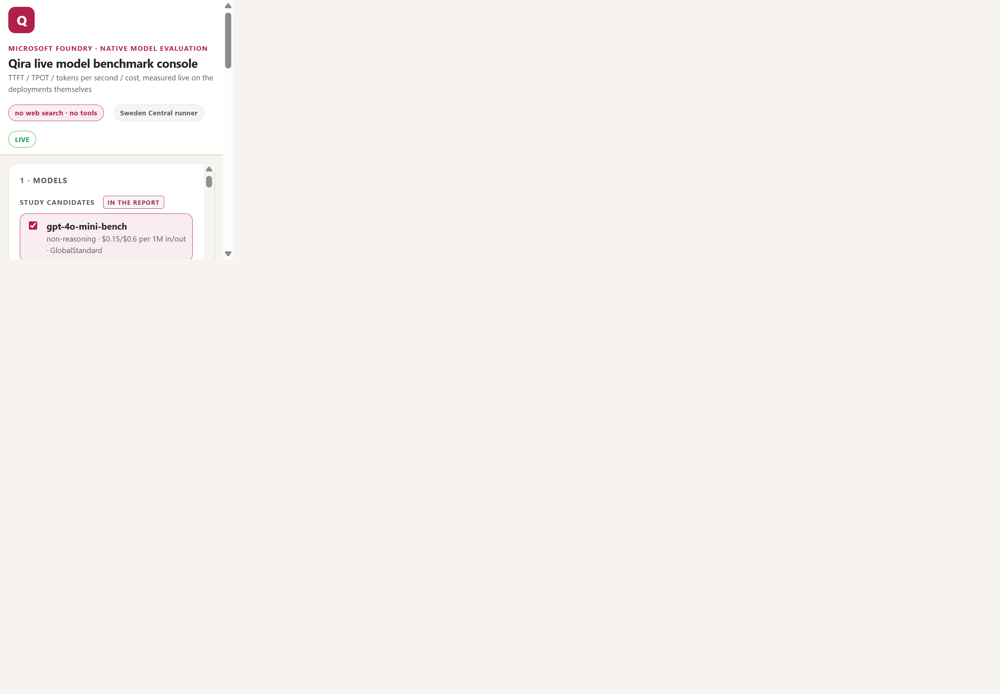

# Lenovo Qira Model & Model Router Benchmark: Chicago Workshop

[](https://github.com/david-xinyuwei/david-share/actions/workflows/model-and-router-benchmark-ci.yml)
[](requirements.txt)
[](qira-scenario-model-benchmark/README.md)
[](#protocol-and-fairness-boundary)
[](../../LICENSE)

Azure provides direct model deployments and Model Router; this repository
brings 17 synthetic Qira prompts, the measurement harness and the retained
evidence. The 4 studies compare 11 direct model/effort arms, 3 Router modes,
multi-turn sessions and sustained load. In the primary direct matrix,
GPT-4o mini reached 0.367 s TTFT P50 while GPT-5.6 Luna `none` reached the
highest low-effort blind score, 4.92/5.

> Author: **Xinyu Wei (魏新宇)**

[English](README.md) | [中文](README-CN.md)

[Use it now](#use-it-now) · [Measured results](#measured-results) ·
[Protocol deep dive](#protocol-and-fairness-boundary) ·
[Evidence](#evidence-and-executable-assets) ·
[Official Model Router guide](https://learn.microsoft.com/azure/foundry/openai/how-to/model-router)

---

<a id="use-it-now"></a>
## Use it now

| Goal | Go here | Subscription / side effects |
|---|---|---|
| Read the decision | [Measured results](#measured-results) | None |
| Rebuild every historical claim | Run the offline acceptance path below | Local files only; no model calls |
| Re-run or present the benchmark | [Live portal](http://linuxworkvm1-work.eastasia.cloudapp.azure.com/qira-benchmark/) or [self-hosted console](qira-live-benchmark-console/README.md#2-quick-start) | Viewing saved runs makes no model call; a new live run uses Azure PAYGO |

### Live portal

| Field | Value |
|---|---|
| URL | http://linuxworkvm1-work.eastasia.cloudapp.azure.com/qira-benchmark/ |
| Username | `lenovo-qira` |
| Password | `qira2026` |
| Measurement runner | Linux VM in Sweden Central |

This is a shared demo login, not an Azure credential. The UI and durable
history run on the East Asia Work VM; request timing runs on the Sweden Central
VM beside the Azure AI resource. If the runner has been deallocated, saved runs
remain readable but a new live run cannot start.

### Offline acceptance — Linux Bash

```bash
git lfs version
git clone --filter=blob:none --sparse https://github.com/david-xinyuwei/david-share.git
git -C david-share sparse-checkout set Agents/Model-And-Router-Benchmark .github/workflows
git -C david-share lfs pull --include="Agents/Model-And-Router-Benchmark/**"
cd david-share/Agents/Model-And-Router-Benchmark
python3 -m venv .venv
source .venv/bin/activate
python -m pip install --no-input -r requirements.txt
python scripts/validate_repo.py
```

### Offline acceptance — Windows PowerShell

```powershell
git lfs version
git clone --filter=blob:none --sparse https://github.com/david-xinyuwei/david-share.git
git -C david-share sparse-checkout set Agents/Model-And-Router-Benchmark .github/workflows
git -C david-share lfs pull --include="Agents/Model-And-Router-Benchmark/**"
Set-Location david-share\Agents\Model-And-Router-Benchmark
python -m venv .venv
.\.venv\Scripts\python.exe -m pip install --no-input -r requirements.txt
.\.venv\Scripts\python.exe scripts\validate_repo.py
```

**Done-When:** the final line is
`PASS: 15/15 repository rules and all executable gates`. This path performs no
Azure/model call. To clean up the offline path, deactivate and delete `.venv`;
it creates no cloud resource.

### State and configuration contract

| State | Owner and persistence | Operator action |
|---|---|---|
| Recorded study evidence | Committed per-study `outputs/`; immutable under the split manifest | Rebuild with the offline gate |
| Active live run | Same-region Runner owns execution; browser retains the run ID and reconnects; Portal mirrors completion | Use **Stop** to cancel explicitly; a lost tab does not cancel |
| Past runs | One JSON record per run in the Portal history store | Open/export/delete in the UI; a deleted run is tombstoned and does not reappear |

For a new deployment, copy
[`qira-live-benchmark-console/.env.example`](qira-live-benchmark-console/.env.example).
Set either `AZURE_OPENAI_ENDPOINT` for a same-region local runner or
`QIRA_RUNNER_URL` for a remote same-region Runner. Do not expose the console
directly; bind loopback and place authentication/reverse proxying in front.

## What Azure provides, and what this repository owns

| Azure / Model Router provides | This repository and its operator provide |
|---|---|
| Direct model and Router inference endpoints | Identical prompts, model/effort matrix and request collector |
| Streaming response events and usage | TTFT/E2E/TPOT definitions, failure accounting and token/cost arithmetic |
| Router-selected served-model metadata | Request-level traces, direct baselines and offline aggregation |
| Azure identity, quota and deployment capacity | Same-region Runner, explicit configuration and PAYGO authorization |
| Service lifecycle and model versions | Retained evidence, public redaction, tests, report builders and CI |

The benefit is repeatability: the same retained rows feed the written reports
and the console replay. The cost is that the operator still owns capacity,
identity, pricing updates and whether synthetic prompts represent production
traffic.

## What was validated — and what is demo

| Capability | What was actually validated | Evidence | Does not prove |
|---|---|---|---|
| Direct model matrix | 11 model/effort arms on the same 17 prompts | [Scenario evidence](qira-scenario-model-benchmark/outputs/) | A universal model winner |
| Model Router behavior | 3 modes against direct Sol/Luna baselines, with served-model traces | [Router report](qira-model-router-validation/README.md#results) | A stable internal routing rule |
| Production paths | Multi-turn sessions, sustained 4/8/16 concurrency, rate-limit fallback and lifecycle | [Readiness report](qira-production-readiness/README.md) | An Azure SLA or every capacity setting |
| Recorded console replay | Charts rebuilt from retained rows with the live summarizer | [Replay pack](qira-live-benchmark-console/replay/replay_pack.json) | A request executed at viewing time |
| Live portal | Real in-page login, deployed UI, Runner label, history and live execution when the Runner is online | [UI evidence](evidence/ui-evidence.json) | Numerical correctness by screenshot alone |

Recorded runs are measured evidence, not fixtures pretending to be live. The
prompts are synthetic and the portal is a presentation/control plane. A green
`LIVE` badge proves that the portal reached the Runner; report correctness is
proved separately by raw records, hashes, builders and tests.

## Live console walkthrough



The top bar answers the two workshop questions before a run starts: the
measurement path is the **Sweden Central Runner**, and requests have
**no web search · no tools**. The left pane selects direct models, Router modes,
prompts and run parameters; the right pane plots progress, TTFT, TPOT,
tokens/sec and cost. The screenshot proves the deployed product surface, not
the benchmark numbers. Desktop and mobile captures, hashes and non-claims are
recorded in [UI evidence](evidence/ui-evidence.json).

<a id="evidence-and-executable-assets"></a>
## Evidence and executable assets

| Path | Contract |
|---|---|
| [`qira-scenario-model-benchmark/`](qira-scenario-model-benchmark/) | Direct matrix, raw/full-text evidence, blind judge and deterministic result builder |
| [`qira-model-router-validation/`](qira-model-router-validation/) | Router dataset, served-model traces, direct baselines and bilingual documentation gate |
| [`qira-followup-throughput-recalibration/`](qira-followup-throughput-recalibration/) | API-path comparison, closed-batch concurrency and judge-v2 evidence |
| [`qira-production-readiness/`](qira-production-readiness/) | Session, sustained-load, fallback and lifecycle evidence |
| [`qira-live-benchmark-console/`](qira-live-benchmark-console/) | Replay/live UI, durable history, login gate, remote Runner and 8513/8514/8515 loopback services |
| [`scripts/build_split_manifest.py`](scripts/build_split_manifest.py) | Compares the immutable source tree with the new index; undeclared byte drift fails |
| [`scripts/validate_repo.py`](scripts/validate_repo.py) | One offline gate for layout, links, bilingual facts, public boundary, reports and tests |
| [`evidence/`](evidence/) | Split manifest, executable rule results, UI evidence and SOP-68 structure mapping |

<a id="measured-results"></a>
## Measured results

### Run inventory

| Study | Actual run IDs | Measured scope / terminal evidence |
|---|---|---|
| Direct scenario matrix | `20260909_120534` | 561 measured requests; 748/748 including warm-ups completed; whole-run wall time not retained |
| Model Router | `20260909_223737` | 1,410 measured requests and 470 blind scores; complete request-level evidence |
| Follow-up | `direct_20260910_074346`, `loadtest_20260910_085128` | 564 direct and 768 stepped-load measured requests; 0 errors in the reported load matrix |
| Production readiness | `sessions_20260911_015218`, `sustained_20260911_020626`, `resilience_20260911_024156` | 360 session turns and 3,770 sustained numeric records; terminal summaries retained per run |

### One complete request trace

| Field | Retained value |
|---|---|
| Work identity | Run `20260909_120534`, prompt `NM01`, arm `gpt-4o-mini-bench`, measured iteration 2 |
| Request path | Sweden Central Linux VM → direct Responses API stream; tools `false`; effort not sent |
| Terminal state | `completed`; not truncated; full business output retained |
| Metrics | TTFT 358.8 ms; E2E 2811.0 ms; TPOT 22.81 ms; 43.84 visible tokens/s |
| Usage / cost | 121 prompt + 108 completion + 0 reasoning tokens; USD 0.00008295 at recorded list rates |
| Source | [Dataset row](qira-scenario-model-benchmark/datasets/qira_scenarios.jsonl) · [full-text run](qira-scenario-model-benchmark/outputs/raw_fulltext/direct_20260909_120534.jsonl) |

Actual input:

```text
Current activity context: the user has a spreadsheet named Q3-Forecast.xlsx open with unsaved edits to the revenue tab, an unread email from the finance lead titled 'Forecast sign-off needed by Thursday', and a calendar block tomorrow at 10am called 'Q3 Planning'. Propose the three most useful next actions, ordered by urgency. For each, give a one-line rationale. Do not ask questions.
```

Complete retained output:

```text
1. **Save edits to the Q3-Forecast.xlsx spreadsheet.**
   This ensures that all your current work is preserved before making further changes or addressing other tasks.

2. **Respond to the unread email from the finance lead.**
   Since it requests a sign-off by Thursday, addressing it promptly is crucial to meet the deadline.

3. **Prepare for the Q3 Planning meeting tomorrow at 10am.**
   Reviewing relevant materials and planning discussion points will enhance your contribution during the meeting.
```

The trace connects owned input, current harness path, request identity, terminal
output and client-observed metrics. It is one measured cell, not a replacement
for the 561-request aggregate.

### Direct candidates on Qira prompts

| Candidate | TTFT P50 | E2E P50 | Tokens / turn | USD / 1,000 requests | Blind judge / 5 |
|---|---:|---:|---:|---:|---:|
| GPT-4o mini | **0.367 s** | 2.26 s | 243 | **0.094** | 4.53 |
| GPT-5 mini, `minimal` | 0.567 s | 2.20 s | 402 | 0.603 | 4.55 |
| GPT-5.6 Luna, `none` | 1.074 s | **1.95 s** | 366 | 0.324 | **4.92** |

Source: [scenario benchmark, Executive Summary](qira-scenario-model-benchmark/README.md#executive-summary).
The full matrix covers Luna `none` through `max`, GPT-5 mini `minimal`
through `high`, and GPT-4o mini with no reasoning parameter.

### Model Router observations

| Router mode | Sol share, effort not sent | Sol share, `low` | Interpretation for this sample |
|---|---:|---:|---|
| `balanced` | 4.3% | 4.3% | Mostly Luna; Sol appeared on 2 controlled complex prompts |
| `cost` | 0.0% | 0.0% | Luna on every measured request |
| `quality` | 48.9% | 48.9% | Mixed Sol/Luna; complexity labels did not define a threshold |

Source: [Model Router decision brief](qira-model-router-validation/README.md#findings).
These are observed counts from repeated synthetic prompts, not production
routing probabilities or a reverse-engineered routing rule.

### Production findings

- Under continuously refilled load, the 3 direct candidates completed all
  requests at 4/8/16 in flight. The balanced Router at capacity 300 returned
  237 in-stream rate-limit failures at 16 in flight.
- Every observed rate-limit rejection in the fallback experiment arrived
  inside an HTTP 200 stream, not as HTTP 429. A status-code-only retry did not
  activate; stream-aware reactive and proactive fallback both reached 100%
  success in the measured windows.
- Router `quality` changed served model inside 18/18 measured 4-turn
  conversations; `balanced` changed inside 0/18.

Source: [production-readiness decision summary](qira-production-readiness/README.md#decision-summary).

<a id="protocol-and-fairness-boundary"></a>
## Protocol and fairness boundary

| Control | What was done | What it does **not** prove |
|---|---|---|
| Native capability | No web search and no tools on any compared arm | Search/tool quality was not tested |
| Client location | Linux Benchmark VM and Azure AI resource in Sweden Central | Global/DataZone serving does not expose the physical GPU region |
| Comparable prompts | Identical synthetic English prompts per matrix cell | Customer production or multilingual quality |
| Streaming timing | TTFT at first non-empty text delta; E2E at stream completion | Pure server compute, Prefill or GPU Decode time |
| Failure accounting | `max_retries=0`; missing usage and stream errors fail closed | Availability outside the measured windows |
| Cost | Usage multiplied by documented model list rates | Azure invoice, Router fees, VM, Judge or regional premiums |

The 6 Qira product surfaces are Next Move, Write For Me, Catch Me Up,
Pay Attention, Live Interaction and Creator Zone. The retained dataset contains
17 prompt cases across those surfaces. Live Interaction and Creator Zone are
text proxies; speech, video and image-generation quality are outside scope.

## Tests and refusal paths

The single acceptance command in [Use it now](#use-it-now) runs these gates:

| Gate | Happy path | Rejected mutation / failure |
|---|---|---|
| Split provenance | 198 source files map to 198 destination files | Missing/extra file or undeclared byte change |
| Scientific payload | 93 `config/datasets/outputs/replay` files are byte-identical | Modified evidence blob or stale manifest |
| Reports | Raw rows regenerate Router/follow-up/readiness reports and console replay | Hash mismatch, missing row, duplicate cell or stale README |
| Public boundary | `PA01`/`PA03` redaction contracts and safe placeholders remain | Missing redaction record or obvious real credential |
| Console | Live/replay, auth, history, reconnect and responsive layout | Cross-site mutation, path escape, duplicate history, stream loss or desktop-only chart minimum |
| Bilingual/docs | Heading/table/code/numeric parity and every local link | Numeric drift, missing link, stale old-root path or broken evidence target |

The project gate also parses every Python source and emits exactly one
result for each `RUN-001` through `RUN-015`. The negative tests mutate
the contract rather than merely rerunning the happy path.

## Compatibility, public boundary and evidence

| Surface | Validated | Boundary |
|---|---|---|
| Offline gate | Python 3.10+; pinned `openai==3.10.0`, `azure-identity==1.25.3` | Clean Linux CI and Windows validation; live Windows inference is not claimed |
| Browser UI | Current Chromium desktop and 390×844 mobile viewport | Screenshot does not prove request correctness |
| Azure auth | Entra ID on the measured VM; API-key field remains optional | Offline verification needs no Azure identity |
| Public data | Synthetic prompts; 2 internal-meeting-transcript cells withheld with hashes retained | Not customer production traffic |
| License | Repository-level [MIT License](../../LICENSE) | Azure services, model terms and customer data remain separately governed |

The split source is immutable commit
`af65768bf2ddc88f7c45432598848cd233fc4aa3`. The
[split manifest](evidence/split-manifest.json) proves the complete move and
byte identity. [Rule results](evidence/rule-results.json) map each gate to its
evidence. 2 cells (`PA01`, `PA03`) are withheld; all numerical fields, scores
and `response_sha256` values remain in the aggregates.

## Repository layout

```text
Model-And-Router-Benchmark/
├── qira-scenario-model-benchmark/
├── qira-model-router-validation/
├── qira-followup-throughput-recalibration/
├── qira-production-readiness/
├── qira-live-benchmark-console/
├── scripts/
├── tests/
├── evidence/
└── images/
```
