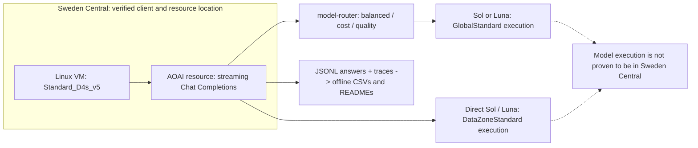

# 任务 B：Foundry Model Router 何时选择 Sol 或 Luna？

这份私有仓库中的可复现简报验证 **两模型子集** 的路由行为，不提供生产路由规则。平台逐请求选择模型，使用方提供部署和提示词。本轮对比三种路由模式与两个直连基线。

> 作者: **Xinyu Wei (魏新宇)** · 2026-09-10 · Run `20260909_223737`

[English](README.md) | [中文](README-CN.md)

[从这里开始](#start) · [实测结论](#findings) · [复现](#reproduce) · [证据](#evidence) · [官方指南](https://learn.microsoft.com/en-us/azure/foundry/openai/how-to/model-router)

<a id="start"></a>
## 从这里开始
| 目标 | 入口 | 订阅与副作用 |
| --- | --- | --- |
| 了解决策依据 | [结果](#results)与[具体题目](#cases) | 无需订阅 |
| 离线重建历史结果 | [离线命令](#reproduce) | 只处理本地文件，不调用模型 |
| 重新运行对比 | [在线步骤](#live) | 需要 Azure 订阅、推理权限和配额；按量计费 |

<a id="findings"></a>
## 结论先行
- **Sol 请求占比（- / low）：balanced 4.3% / 4.3%; cost 0.0% / 0.0%; quality 48.9% / 48.9%。** balanced 与 quality 都会选择 Sol；下表题号直接来自最终 CSV。
- **人工复杂度标签不等于路由阈值。** quality 也会为简单题选择 Sol。成本优先时，可先比较 cost 模式与直连 Luna；最终选择仍须通过实际业务数据的质量验收。
- **这是观测结果，不是质量冠军榜，也不是生产选择概率。** 盲评分数接近量表上限，微小分差不能证明人类用户感知的质量优势。

<a id="architecture"></a>
## 架构与测试边界

- IMDS 确认客户端 VM 位于 Sweden Central，AOAI 资源也在同一区域。测试前 TCP 建连耗时中位数为 **4.26 ms**，不是逐请求推理往返时延。**这不能证明 GPU 或模型执行位置相同。** Global 与 DataZone 的服务范围不同。
- 固定矩阵：47 条合成英文提示词，其中 30 条受控题（S/M/C 各 10 条）、17 条覆盖 助手六场景；合并后简单/中等/复杂为 15/18/14。五个部署 × 两种 effort ×（1 次预热 + 3 次测量）= **1,880 条性能记录、1,410 条测量记录、470 条 Terra 盲评分数**。
- 每个案例均为单轮请求：**先发送统一的系统消息，再发送一条用户消息，不携带历史对话**。单轮不等于没有系统提示词。输入均为纯文本，不启用网络搜索或工具。Live Interaction 与 Creator Zone 只验证文本代理任务，不是语音或图像端到端测试。“切换”指逐请求选择，不是生成中途交接。
- `-` 表示 **不发送 reasoning_effort**，不等于显式 `none`；五个部署均另测显式 `low`。本轮只覆盖这两种设置，**不是 effort 全覆盖**。同题输出上限相同，不代表实际输出长度相同。

<a id="results"></a>
## 十组实测结果
仅统计测量期请求；每组 141 次请求、47 条被评分回答。模式简称对应在线命令中的部署名称。
| 实验组 | Effort | N | Sol % | TTFT P50 / P90 / P95 ms | E2E P50 / P90 / P95 ms | 客户端 TPOT P50 / P90 ms | 首末<50 ms | 输出 token（推理） | 美元 / 1,000 次 | 盲评 / 5 |
| --- | --- | --- | --- | --- | --- | --- | --- | --- | --- | --- |
| balanced | - | 141 | 4.3% | 1429.9 / 4050.7 / 9288.6 | 2015.9 / 13044.1 / 18039.4 | 3.65 / 7.85 | 29/141 | 397 (99) | 1.955 | 4.915 |
| balanced | low | 141 | 4.3% | 1234.6 / 2977.0 / 4020.5 | 1777.7 / 8029.2 / 15064.4 | 3.21 / 8.04 | 34/141 | 325 (40) | 1.285 | 4.906 |
| cost | - | 141 | 0.0% | 1500.9 / 3876.9 / 6938.9 | 2188.3 / 8812.1 / 15696.0 | 3.24 / 7.77 | 29/141 | 399 (105) | 0.496 | 4.911 |
| cost | low | 141 | 0.0% | 1210.3 / 2413.1 / 3631.3 | 1855.4 / 7292.9 / 13866.7 | 3.17 / 7.79 | 33/141 | 327 (46) | 0.409 | 4.915 |
| quality | - | 141 | 48.9% | 1917.1 / 4300.1 / 11452.7 | 2586.5 / 13831.0 / 20123.5 | 4.22 / 12.00 | 36/141 | 375 (100) | 7.533 | 4.906 |
| quality | low | 141 | 48.9% | 1794.4 / 2991.6 / 4864.0 | 2442.5 / 8880.1 / 14555.5 | 3.66 / 12.07 | 34/141 | 309 (42) | 5.927 | 4.962 |
| gpt-5.6-sol-dz | - | 141 | 100.0% | 2075.3 / 7675.7 / 12143.7 | 2090.2 / 11577.5 / 21814.1 | 0.09 / 0.11 | 127/141 | 360 (106) | 11.239 | 4.877 |
| gpt-5.6-sol-dz | low | 141 | 100.0% | 1782.0 / 6818.8 / 7997.7 | 1798.6 / 9565.6 / 21947.5 | 0.09 / 0.40 | 125/141 | 312 (48) | 9.777 | 4.902 |
| gpt-5.6-luna-dz | - | 141 | 0.0% | 1572.0 / 5291.7 / 8313.9 | 1574.6 / 8669.8 / 12626.5 | 0.09 / 1.82 | 126/141 | 372 (98) | 0.463 | 4.855 |
| gpt-5.6-luna-dz | low | 141 | 0.0% | 1273.9 / 4323.3 / 5440.0 | 1284.9 / 6544.0 / 12945.6 | 0.09 / 1.47 | 119/141 | 343 (52) | 0.428 | 4.932 |
TTFT 是客户端到首个非空文本增量的耗时；E2E 是到流式响应结束的总耗时。客户端 TPOT = 首个到最后一个文本增量的跨度 ÷（可见输出 token − 1），只有在逐 token 到达时才近似生成速度，因此要对照 **首末<50 ms** 列一起读：多数回答一次性到达的行，其 TPOT 描述的是交付节奏而不是解码。以上都是客户端观测值，包含网络、排队及响应交付行为，不是纯模型耗时，也不能单独代表 prefill 计算。P50/P90/P95 沿用报告生成器的最近秩分位数算法。
**观测到成批交付：**497/564 次直连测量请求的首个至最后一个文本增量间隔（`decode_ms`）**<50 ms**。直连各组的间隔中位数：gpt-5.6-sol-dz (-): 9.9 ms; gpt-5.6-sol-dz (low): 9.2 ms; gpt-5.6-luna-dz (-): 10.8 ms; gpt-5.6-luna-dz (low): 10.3 ms。路由与直连使用同一采集器及流式 Chat Completions API。**造成该现象的层级与原因尚未诊断。** 表观 `decode_tps` 不是模型或 GPU 的生成速率，不能据此将直连基线排为解码更快的模型。
成本按**实际服务模型**计算，统一使用 Global 标价，单位为美元/每 1M 输入、缓存输入、输出 token：**Sol 5 / 0.5 / 30；Luna 0.2 / 0.02 / 1.2**。公式：`((input-cached)*input_rate + cached*cached_rate + output*output_rate)/1e6`；输出含推理 token。每 1,000 次成本 = 单次平均成本 × 1,000。
按同一 Global 标价归一化计算，**全部 1,880 次请求（含预热）的模型 token 成本合计为 $7.4057616**；费用排除项与仅统计测量期的表格相同。
这**不是 Azure 实际账单**：未计入 DataZone 溢价、路由费用（尚未核验）、盲评、VM 与探测费用；表格不含预热。盲评对每组每题最早的有效测量回答评分，隐藏候选模型身份，包含五个 1–5 分维度。评分可能存在天花板偏差，不能代替人工质量结论。

<a id="cases"></a>
## 哪些请求选择 Sol？
单元格为 Sol 命中次数/测量请求数（占比）。每题 N=3，不是生产选择概率。
| 模式 | Effort | 简单 | 中等 | 复杂 | 全部 |
| --- | --- | --- | --- | --- | --- |
| balanced | - | 0/45 (0.0%) | 0/54 (0.0%) | 6/42 (14.3%) | 6/141 (4.3%) |
| balanced | low | 0/45 (0.0%) | 0/54 (0.0%) | 6/42 (14.3%) | 6/141 (4.3%) |
| cost | - | 0/45 (0.0%) | 0/54 (0.0%) | 0/42 (0.0%) | 0/141 (0.0%) |
| cost | low | 0/45 (0.0%) | 0/54 (0.0%) | 0/42 (0.0%) | 0/141 (0.0%) |
| quality | - | 27/45 (60.0%) | 21/54 (38.9%) | 21/42 (50.0%) | 69/141 (48.9%) |
| quality | low | 27/45 (60.0%) | 21/54 (38.9%) | 21/42 (50.0%) | 69/141 (48.9%) |

| 模式 | Effort | 至少命中 1 次 Sol 的题号 |
| --- | --- | --- |
| balanced | - | C04, C06 |
| balanced | low | C04, C06 |
| cost | - | 无 |
| cost | low | 无 |
| quality | - | C01, C02, C04, C06, C09, C10, CZ01, LI02, M02, M04, M05, M08, NM02, NM03, PA03, S01, S02, S05, S08, S09, S10, WFM01, WFM04 |
| quality | low | C01, C02, C04, C06, C09, C10, CZ01, LI02, M02, M04, M05, M08, NM02, NM03, PA03, S01, S02, S05, S08, S09, S10, WFM01, WFM04 |
在 282 个路由实验组/题目组合中，**0** 个在三次测量间出现服务模型变化。[逐题 CSV](outputs/router_question_hits.csv)保留全部选择顺序及预热选择；重复结果一致也不能保证未来路由确定不变。

### 仅助手子集的场景覆盖
这里仅统计 **17 条 助手提示词子集**，不是全部 47 个案例；其余 30 条是受控题。每个模式单元格依次列出 `- / low` 的 Sol 命中次数，分别除以 N 即为占比。[助手专属场景 CSV](outputs/router_assistant_scenarios.csv)包含 **60 行 = 10 组 × 6 场景**，提供题数、请求数、Sol 命中次数与占比、TTFT P50、归一化成本和盲评质量。
| 助手场景 | 题号 | 每组 N | Balanced 命中 Sol (- / low) | Cost 命中 Sol (- / low) | Quality 命中 Sol (- / low) |
| --- | --- | --- | --- | --- | --- |
| CatchMeUp | CMU01, CMU02, CMU03 | 9 | 0 / 0 | 0 / 0 | 0 / 0 |
| CreatorZone | CZ01, CZ02 | 6 | 0 / 0 | 0 / 0 | 3 / 3 |
| LiveInteraction | LI01, LI02 | 6 | 0 / 0 | 0 / 0 | 3 / 3 |
| NextMove | NM01, NM02, NM03 | 9 | 0 / 0 | 0 / 0 | 6 / 6 |
| PayAttention | PA01, PA02, PA03 | 9 | 0 / 0 | 0 / 0 | 3 / 3 |
| WriteForMe | WFM01, WFM02, WFM03, WFM04 | 12 | 0 / 0 | 0 / 0 | 6 / 6 |

<a id="example"></a>
## 一条完整输入及其观测路径：C06
每个 Chat 请求都先以 `role: system` 发送以下统一的 `SYSTEM_MSG`，所有路由组与直连组均相同；见 [harness](harness.py)：
```text
You are a system-level cross-device AI assistant. Answer the user directly and concisely. Do not ask clarifying questions.
```
第二条消息为 `role: user`。C06 属于 `complex / code_reasoning` 合成题，以下内容逐字取自[仓库内数据集](datasets/router_taskb.jsonl)，未翻译或缩短：
```text
Given a function that deduplicates a list of records by a composite key but produces nondeterministic output across runs, identify the three most likely causes and write a corrected implementation that is stable and order-preserving.
```
| 模式 | Effort | C06 测量期选择顺序 | Sol 命中次数 |
| --- | --- | --- | --- |
| balanced | - | sol>sol>sol | 3/3 |
| balanced | low | sol>sol>sol | 3/3 |
| cost | - | luna>luna>luna | 0/3 |
| cost | low | luna>luna>luna | 0/3 |
| quality | - | sol>sol>sol | 3/3 |
| quality | low | sol>sol>sol | 3/3 |
运行链：统一系统消息 + 数据集 C06 用户消息 → 使用指定部署和 effort 发起流式请求 → 响应 `model` 与 `model_selection_details.model_router_details` → 本地回答及 trace JSONL → 以 SHA256 关联的数值归档 → CSV → 本表。这里记录的是请求级路径，不是对内部决策规则的逆向推断。

<a id="reproduce"></a>
## 复现：先离线，按需在线付费运行
### 1. 获取代码并准备 Python
离线路径只需 **Python 3.10+ 及标准库**，无需 pip 包、Azure 凭据或 GPU。以下命令为 Linux Bash，不是 PowerShell；参考 VM 使用 Python 3.12.3。
```bash
git clone https://github.com/david-xinyuwei/david-share.git
cd david-share/Agents/Model-And-Router-Benchmark/model-router-validation
python3 -m venv --without-pip .venv-offline
source .venv-offline/bin/activate
```
### 2. 重建并核验历史运行（不调用 Azure 或模型）
```bash
python scripts/build_router_report.py
python scripts/verify_router_fulltext.py
python scripts/build_router_readme.py
python scripts/validate_router_readme.py
python -m unittest discover -s tests
```
验收条件：报告确认 1,880/1,410/470 条记录，全文校验器确认全部 1,880 条回答的 SHA256 与数值字段一致，文档及测试通过。缺少留存文件是真实阻塞，不能用模拟回答补齐。报告与全文校验器**只针对 `20260909_223737`**，不会自动选择新运行。

<a id="live"></a>
### 3. 配置并执行新实验（PAYGO）
**仅在线运行需要：**在独立环境中安装[记录的 SDK 依赖](requirements.txt)：`openai==3.10.0` 和 `azure-identity==1.25.3`；使用 CLI 登录时还需 Azure CLI。这些版本已在基准 VM 上留存。此次本地 Windows SDK 恢复受过期企业包镜像及官方下载 wheel 的 TLS 握手失败阻塞，**Windows 在线安装尚未核验（NOT VERIFIED）**。未绕过 TLS 校验。
```bash
deactivate
python3 -m venv .venv-live
source .venv-live/bin/activate
python -m pip install -r requirements.txt
```
1. 按[官方部署指南](https://learn.microsoft.com/en-us/azure/foundry/openai/how-to/model-router)创建 Sweden Central 资源及同区域 Linux VM（参考运行使用 `Standard_D4s_v5`）。核验资源位置与 VM IMDS；单凭 CLI 区域标签不能证明同区域。需要部署管理权限和足够配额；本仓库未提供一键创建路由部署的工具。
2. 创建三个 `model-router` **2025-11-18** 部署，均为 `GlobalStandard`、capacity **300**，名称分别为 `router-sol-luna-balanced`、`router-sol-luna-cost`、`router-sol-luna-quality`。在 Custom settings 中设置对应模式，启用 **Route to a subset of models**，只选择 `gpt-5.6-sol` 与 `gpt-5.6-luna`，版本均为 **2026-07-09**。不要保留默认全模型集合。修改模式后等待**五分钟**，再核验保存的配置。
3. 单独创建 `gpt-5.6-sol-dz` 与 `gpt-5.6-luna-dz`，分别部署对应 **2026-07-09** 模型，均为 `DataZoneStandard`、capacity **300**。它们是对比基线，不是路由所需前置部署。本轮 Sol Global 配额不可用；capacity 是部署配置，不是实测并发数。如需在线盲评，另建 Terra 部署 `judge-terra`。
4. 为调用方 Entra 身份授予资源级 **Cognitive Services OpenAI User** 推理角色（只有管理权限不够）。未设置密钥时，[客户端](harness.py)通过 `DefaultAzureCredential` 使用 Azure CLI 登录身份或已配置的 VM 托管身份。无需 API key，不要将令牌或密钥写入仓库。
```bash
az login
unset AZURE_OPENAI_API_KEY
export AZURE_OPENAI_ENDPOINT="https://<RESOURCE_NAME>.openai.azure.com/"
export AZURE_OPENAI_API_VERSION="2025-04-01-preview"
```
5. Preflight 在不调用推理接口的情况下检查 10 组矩阵；设置 endpoint 时仍会建立 TCP 连接测 RTT，因此并非完全无网络。它不能证明部署可用或授权成功。使用托管身份时可跳过交互式 `az login`，但须预先配置身份与 RBAC。
```bash
python harness.py --mode router --api chat --dataset datasets/router_taskb.jsonl --deployments router-sol-luna-balanced,router-sol-luna-cost,router-sol-luna-quality,gpt-5.6-sol-dz,gpt-5.6-luna-dz --region swedencentral --client-location swedencentral-linux-vm --efforts=-,low --iterations 3 --warmup 1 --preflight
```
6. 以下命令发送 **1,880 次付费请求**。全部使用流式 Chat Completions，并带 `Foundry-Features: ModelRouterControls=V1Preview`；[harness](harness.py)负责添加请求头并记录实际模型。保留其打印的输出路径和 run ID。
```bash
python harness.py --mode router --api chat --dataset datasets/router_taskb.jsonl --deployments router-sol-luna-balanced,router-sol-luna-cost,router-sol-luna-quality,gpt-5.6-sol-dz,gpt-5.6-luna-dz --region swedencentral --client-location swedencentral-linux-vm --efforts=-,low --iterations 3 --warmup 1
```
7. 将 `RUN_ID` 替换为上一步打印的**新** ID。盲评是性能测试结束后的独立付费操作；默认 `--max-chars 0` 保留完整提示词和回答，不裁剪。分析命令离线运行。
```bash
RUN_ID="YYYYMMDD_HHMMSS"
python judge.py "outputs/router_${RUN_ID}.jsonl" --dataset datasets/router_taskb.jsonl --judge-deployment judge-terra --max-chars 0
python analyze.py "outputs/router_${RUN_ID}.jsonl" --mode router --quality "outputs/quality_${RUN_ID}.jsonl"
```
验收条件：新 JSONL 包含全部 1,880 条完成且未截断的回答、1,410 条测量记录、实际模型身份和 470 条有效盲评分数。保留原始回答及哈希；新运行使用上述通用分析命令，不使用固定历史报告生成器。重跑会创建新的时间戳文件并再次计费，不提供断点续跑契约。保存证据后停止或释放资源，并记录收尾状态。

<a id="limits"></a>
## 解释边界与尚未测试的后续方案
- PR 复核后，新收集器会拒绝被过滤或缺失终止事件的 Chat 响应，评分也会排除未完成的回答。第二轮复核又补上了可运行代码中的三个缺口：Router 分析器现在与直连分析器使用同一套“已完成 / 未截断 / 有 usage”过滤，遇到混合环境直接拒绝而不是照常输出表格；没有 usage 块的流记为 `missing_usage`（不再算零成本成功），报告校验器同样拒绝；校验器还要求路由 trace 中唯一成功的 attempt 与实际服务模型一致；并关闭了 SDK 的两次静默重试（`max_retries=0`），每次 429/5xx 都会成为可见错误而不是被藏进 TTFT。历史运行未保留 `finish_reason`，完成数依据已记录的状态、错误与截断标志，无法追溯排除未记录的终止事件。历史回答未改写；[原运行代码快照](outputs/source_snapshot/manifest.json)保留原始哈希，与加固后的可运行代码分开。
- 测量期路由请求的 `model_selection_details.model_router_details` trace 自报决策耗时为**中位数 20 ms / P95 24 ms**。这是服务自报的组成部分，不是独立隔离测得、包含网络的总开销。
- 路由 Global SKU 与直连 DataZone SKU 不同，且实验组按固定顺序串行运行，TTFT 差值存在混杂。沿用历史文件名的 [router_overhead.csv](outputs/router_overhead.csv)保存的是配对 TTFT **差值**，不是路由开销估计或上界。本轮运行未控制运行时段、流缓冲和服务范围等因素。后续一次配对运行——Router 与直连 Luna 使用同一 GlobalStandard SKU、同一 Chat 接口、同一题集，背靠背成对测量并轮换先后顺序——隔离出了这项开销；见 [`scripts/paired_overhead.py`](scripts/paired_overhead.py)、[`router_overhead_paired_summary.csv`](outputs/router_overhead_paired_summary.csv) 与项目 README 第 3.2 节。
- 本轮被拒绝的是 **AOAI 资源级 Responses 路径**。官方另有 [Foundry 项目级 Responses 路径](https://learn.microsoft.com/en-us/azure/foundry/openai/how-to/model-router#use-model-router)，本轮未测；不能概括为 Responses 一律不支持路由。
- **尚未测试（NOT TESTED）：**3–4 档候选模型、APIM 策略路由、确定性升级规则、多轮状态传递、并发与负载上限、生产 SLA。未来的 APIM 对照组应记录策略决策，并在同一自有题集上比较时延、质量与成本；这不是本轮实验结果。

<a id="evidence"></a>
## 证据索引与资源生命周期
| 证据 | 可核验内容 |
| --- | --- |
| [Archive](outputs/evidence_router_20260909_223737.json.xz) · [provenance](outputs/provenance_router_20260909_223737.json) | 数值归档 SHA256、确切的 7 个运行源码哈希、IMDS 与包版本；区分原始文件和脱敏文件哈希 |
| [Deployment verification](outputs/deployment_verification_router.json) | 留存的区域、版本、模式、子集与 SKU，不代表实时状态 |
| [Arm summary](outputs/router_arm_summary.csv) · [tier](outputs/router_routing_by_tier.csv) · [category](outputs/router_routing_by_category.csv) | 测量期汇总；[逐请求记录](outputs/router_single_turn_sessions.csv)保留实际模型及回答 SHA256 |
| [Metrics JSONL](outputs/router_20260909_223737.metrics.jsonl) · [blind scores](outputs/quality_router_20260909_223737.jsonl) | 1,880 条数值记录，以及由测试后 Terra 调用生成、可离线检查的 470 条评分 |
| [1,880 条完整回答](outputs/raw_fulltext/router_20260909_223737.jsonl) · [原始盲评输出](outputs/raw_fulltext/quality_20260909_223737.jsonl) | [全文校验器](scripts/verify_router_fulltext.py)比对回答哈希与数值字段，不使用伪造替代数据 |
| [Detailed Chinese report](outputs/router-results-20260910.md) | 同一报告生成器输出的类别、场景、成本、trace 与质量详细分析 |
| [资源收尾记录](outputs/resource_closeout_router.json) | 宣称资源停止前须核验此记录；本文不宣称已关机或已完成 PR 审查 |
两份 README 由[同一生成器](scripts/build_router_readme.py)生成，数字与归档及 CSV 交叉核验。修改生成器后同时重建两份文件，再运行[文档校验器](scripts/validate_router_readme.py)。全文或收尾链接存在，本身不代表哈希校验成功或资源已经关闭。

<a id="sources"></a>
## 相关工作与官方参考
- [场景模型基准](../scenario-model-benchmark/README-CN.md)：配套直连模型工作，不代表本研究覆盖所有 effort。
- [方法来源](../README-CN.md)：基准方法沿革；本目录自带输入与可执行路径。
- [Model Router deployment, modes, subset and API guide](https://learn.microsoft.com/en-us/azure/foundry/openai/how-to/model-router) · [Deployment types and serving scope](https://learn.microsoft.com/en-us/azure/foundry/foundry-models/concepts/deployment-types) · [Entra authentication](https://learn.microsoft.com/en-us/azure/foundry/foundry-models/how-to/configure-entra-id).
