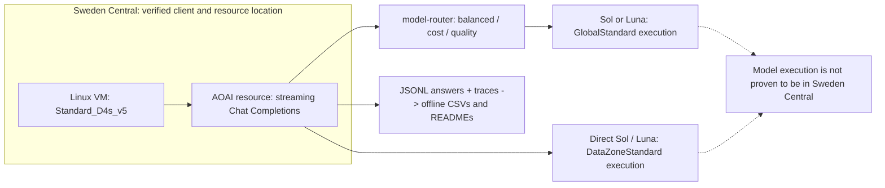

# Qira Task B: when does Foundry Model Router choose Sol or Luna?

A private, reproducible decision brief for a **two-model subset**, not a production routing policy. The platform selects a model per request; you supply deployments and prompts. This run compares three routing modes with two direct baselines.

> Author: **Xinyu Wei (魏新宇)** · 2026-09-10 · Run `20260909_223737`

[English](README.md) | [中文](README-CN.md)

[Start here](#start) · [Findings](#findings) · [Reproduce](#reproduce) · [Evidence](#evidence) · [Official guide](https://learn.microsoft.com/en-us/azure/foundry/openai/how-to/model-router)

<a id="start"></a>
## Start here
| Goal | Path | Subscription / side effects |
| --- | --- | --- |
| Read the decision | [Results](#results) and [cases](#cases) | None |
| Rebuild historical evidence | [Offline commands](#reproduce) | Local files only; no model calls |
| Run a new comparison | [Live steps](#live) | Azure subscription, inference RBAC, quota; PAYGO charges |

<a id="findings"></a>
## Decision brief
- **Observed Sol request shares (- / low): balanced 4.3% / 4.3%; cost 0.0% / 0.0%; quality 48.9% / 48.9%.** Both balanced and quality can select Sol; the exact IDs below come from final CSVs.
- **Do not equate an author-assigned complexity tier with a router threshold.** Quality mode can select Sol for simple prompts too. Compare cost mode and direct Luna for a budget-oriented starting point; validate quality on your own traffic before choosing.
- **This is descriptive evidence, not a quality winner or a production probability.** The blind judge scores are near the ceiling; small score differences do not establish human-perceived superiority.

<a id="architecture"></a>
## Architecture and test boundary

- IMDS confirms the Sweden Central client VM; the AOAI resource is in the same region. The pre-run median TCP-connect baseline was **4.26 ms**, not a per-request inference RTT. **This does not prove the GPU/model execution region.** Global and DataZone serving scopes differ.
- Fixed matrix: 47 synthetic English prompts = 30 controlled (10 each S/M/C) + 17 across six Qira scenarios; combined simple/moderate/complex = 15/18/14. Five deployments × two efforts × (1 warmup + 3 measured) = **1,880 performance rows; 1,410 measured; 470 blind Terra scores**.
- Each case is single-turn: **a common system message followed by one user message, with no conversation history**. It is not a system-prompt-free request. Inputs are text-only, without web search or tools. Live Interaction and Creator Zone are text proxies, not voice/image end-to-end tests. “Switch” means selection for a request, not mid-generation handoff.
- `-` means **reasoning_effort NOT SENT**, not explicit `none`; `low` is sent explicitly on all five deployments. These are two sampled settings, **not exhaustive effort coverage**. Equal output caps per question do not imply equal output lengths.

<a id="results"></a>
## Ten-arm results
Measured requests only; each arm has 141 requests and 47 judged answers. Short mode labels map to the deployment names in the live command.
| Arm | Effort | N | Sol % | TTFT P50 / P90 / P95 ms | E2E P50 / P90 / P95 ms | Client TPOT P50 / P90 ms | Bursts <50 ms | Output tok (reasoning) | USD / 1,000 | Judge / 5 |
| --- | --- | --- | --- | --- | --- | --- | --- | --- | --- | --- |
| balanced | - | 141 | 4.3% | 1429.9 / 4050.7 / 9288.6 | 2015.9 / 13044.1 / 18039.4 | 3.65 / 7.85 | 29/141 | 397 (99) | 1.955 | 4.915 |
| balanced | low | 141 | 4.3% | 1234.6 / 2977.0 / 4020.5 | 1777.7 / 8029.2 / 15064.4 | 3.21 / 8.04 | 34/141 | 325 (40) | 1.285 | 4.906 |
| cost | - | 141 | 0.0% | 1500.9 / 3876.9 / 6938.9 | 2188.3 / 8812.1 / 15696.0 | 3.24 / 7.77 | 29/141 | 399 (105) | 0.496 | 4.911 |
| cost | low | 141 | 0.0% | 1210.3 / 2413.1 / 3631.3 | 1855.4 / 7292.9 / 13866.7 | 3.17 / 7.79 | 33/141 | 327 (46) | 0.409 | 4.915 |
| quality | - | 141 | 48.9% | 1917.1 / 4300.1 / 11452.7 | 2586.5 / 13831.0 / 20123.5 | 4.22 / 12.00 | 36/141 | 375 (100) | 7.533 | 4.906 |
| quality | low | 141 | 48.9% | 1794.4 / 2991.6 / 4864.0 | 2442.5 / 8880.1 / 14555.5 | 3.66 / 12.07 | 34/141 | 309 (42) | 5.927 | 4.962 |
| gpt-5.6-sol-dz | - | 141 | 100.0% | 2075.3 / 7675.7 / 12143.7 | 2090.2 / 11577.5 / 21814.1 | 0.09 / 0.11 | 127/141 | 360 (106) | 11.239 | 4.877 |
| gpt-5.6-sol-dz | low | 141 | 100.0% | 1782.0 / 6818.8 / 7997.7 | 1798.6 / 9565.6 / 21947.5 | 0.09 / 0.40 | 125/141 | 312 (48) | 9.777 | 4.902 |
| gpt-5.6-luna-dz | - | 141 | 0.0% | 1572.0 / 5291.7 / 8313.9 | 1574.6 / 8669.8 / 12626.5 | 0.09 / 1.82 | 126/141 | 372 (98) | 0.463 | 4.855 |
| gpt-5.6-luna-dz | low | 141 | 0.0% | 1273.9 / 4323.3 / 5440.0 | 1284.9 / 6544.0 / 12945.6 | 0.09 / 1.47 | 119/141 | 343 (52) | 0.428 | 4.932 |
TTFT is client elapsed time to the first non-empty text delta; E2E is elapsed time to stream completion. Client TPOT is the first-to-last text-delta span divided by (visible output tokens − 1); it approximates generation speed only when deltas arrive token by token, so read it next to the **Bursts <50 ms** column: rows where most answers arrived in one burst carry TPOT values that describe delivery, not decoding. All are observed client times, including network/queueing and delivery behavior, not pure model time or isolated prefill compute. P50/P90/P95 use the report builder's nearest-rank percentile method.
**Observed burst delivery:** 497/564 measured direct requests had a first-to-last text-delta span (`decode_ms`) **<50 ms**. Direct-arm median spans: gpt-5.6-sol-dz (-): 9.9 ms; gpt-5.6-sol-dz (low): 9.2 ms; gpt-5.6-luna-dz (-): 10.8 ms; gpt-5.6-luna-dz (low): 10.3 ms. Router and direct paths used the same collector and streaming Chat Completions API. **The responsible layer/cause was not diagnosed.** Apparent `decode_tps` is not a model/GPU generation rate and must not be used to rank direct baselines as faster decoders.
Costs use the **actual served model**, normalized to Global list rates in USD per 1M input/cached/output tokens: **Sol 5 / 0.5 / 30; Luna 0.2 / 0.02 / 1.2**. Formula: `((input-cached)*input_rate + cached*cached_rate + output*output_rate)/1e6`; output includes reasoning tokens. USD/1,000 = mean request cost × 1,000.
The derived Global-normalized model-token total across **all 1,880 requests, including warmups, is $7.4057616**; it uses the same exclusions as the measured-only table.
This is **not an Azure bill**: it excludes DataZone premiums, any router fee (not verified), judge, VM and probes; the table excludes warmups. The judge scores one earliest valid measured answer per arm/question, blinded to candidate identity, across five 1–5 dimensions. It may have ceiling bias and is not a human quality verdict.

<a id="cases"></a>
## Which requests choose Sol?
Cells are Sol hits / measured requests (share). Each question contributes N=3, not a production probability.
| Mode | Effort | Simple | Moderate | Complex | All |
| --- | --- | --- | --- | --- | --- |
| balanced | - | 0/45 (0.0%) | 0/54 (0.0%) | 6/42 (14.3%) | 6/141 (4.3%) |
| balanced | low | 0/45 (0.0%) | 0/54 (0.0%) | 6/42 (14.3%) | 6/141 (4.3%) |
| cost | - | 0/45 (0.0%) | 0/54 (0.0%) | 0/42 (0.0%) | 0/141 (0.0%) |
| cost | low | 0/45 (0.0%) | 0/54 (0.0%) | 0/42 (0.0%) | 0/141 (0.0%) |
| quality | - | 27/45 (60.0%) | 21/54 (38.9%) | 21/42 (50.0%) | 69/141 (48.9%) |
| quality | low | 27/45 (60.0%) | 21/54 (38.9%) | 21/42 (50.0%) | 69/141 (48.9%) |

| Mode | Effort | Question IDs with ≥1 Sol hit |
| --- | --- | --- |
| balanced | - | C04, C06 |
| balanced | low | C04, C06 |
| cost | - | None |
| cost | low | None |
| quality | - | C01, C02, C04, C06, C09, C10, CZ01, LI02, M02, M04, M05, M08, NM02, NM03, PA03, S01, S02, S05, S08, S09, S10, WFM01, WFM04 |
| quality | low | C01, C02, C04, C06, C09, C10, CZ01, LI02, M02, M04, M05, M08, NM02, NM03, PA03, S01, S02, S05, S08, S09, S10, WFM01, WFM04 |
Across 282 router arm/question cells, **0** changed served model between the three measured repetitions. The [per-question CSV](outputs/router_question_hits.csv) retains every sequence and warmup decision; repeated agreement does not guarantee deterministic future routing.

### Qira-only scenario coverage
This is the **17-prompt Qira subset**, not all 47 cases: the other 30 are controlled prompts. Each mode cell lists Sol counts for `- / low`; divide either count by N for its share. The [Qira-only scenario CSV](outputs/router_qira_scenarios.csv) contains **60 rows = 10 arms × 6 scenarios**, including question/request counts, Sol hits/share, TTFT P50, normalized cost and judge quality.
| Qira scenario | Question IDs | N per arm | Balanced Sol (- / low) | Cost Sol (- / low) | Quality Sol (- / low) |
| --- | --- | --- | --- | --- | --- |
| CatchMeUp | CMU01, CMU02, CMU03 | 9 | 0 / 0 | 0 / 0 | 0 / 0 |
| CreatorZone | CZ01, CZ02 | 6 | 0 / 0 | 0 / 0 | 3 / 3 |
| LiveInteraction | LI01, LI02 | 6 | 0 / 0 | 0 / 0 | 3 / 3 |
| NextMove | NM01, NM02, NM03 | 9 | 0 / 0 | 0 / 0 | 6 / 6 |
| PayAttention | PA01, PA02, PA03 | 9 | 0 / 0 | 0 / 0 | 3 / 3 |
| WriteForMe | WFM01, WFM02, WFM03, WFM04 | 12 | 0 / 0 | 0 / 0 | 6 / 6 |

<a id="example"></a>
## One exact input and its observed path: C06
Every Chat request first sends this exact shared `SYSTEM_MSG` as `role: system`, including all router and direct arms; see [the harness](harness.py):
```text
You are a system-level cross-device AI assistant. Answer the user directly and concisely. Do not ask clarifying questions.
```
The second message is `role: user`. For C06, the synthetic `complex / code_reasoning` prompt is copied verbatim from the [owned dataset](datasets/router_taskb.jsonl), not translated or shortened:
```text
Given a function that deduplicates a list of records by a composite key but produces nondeterministic output across runs, identify the three most likely causes and write a corrected implementation that is stable and order-preserving.
```
| Mode | Effort | C06 measured decisions | Sol hits |
| --- | --- | --- | --- |
| balanced | - | sol>sol>sol | 3/3 |
| balanced | low | sol>sol>sol | 3/3 |
| cost | - | luna>luna>luna | 0/3 |
| cost | low | luna>luna>luna | 0/3 |
| quality | - | sol>sol>sol | 3/3 |
| quality | low | sol>sol>sol | 3/3 |
Run chain: shared system message + dataset C06 user message → streaming request with the selected deployment/effort → response `model` plus `model_selection_details.model_router_details` → local answer and trace JSONL → SHA256-linked numerical archive → CSVs → this table. The full sequence is request-level, not a reconstructed internal decision rule.

<a id="reproduce"></a>
## Reproduce: offline first, then optional paid live run
### 1. Get the code and prepare Python
The offline path needs **Python 3.10+ and the standard library only**; no pip packages, Azure credentials or GPU. Commands below are Linux Bash, not PowerShell; the reference VM used Python 3.12.3.
```bash
git clone https://github.com/david-xinyuwei/david-share.git
cd david-share/Agents/Model-And-Router-Benchmark/qira-model-router-validation
python3 -m venv --without-pip .venv-offline
source .venv-offline/bin/activate
```
### 2. Rebuild and verify the historical run (no Azure/model calls)
```bash
python scripts/build_router_report.py
python scripts/verify_router_fulltext.py
python scripts/build_router_readme.py
python scripts/validate_router_readme.py
python -m unittest discover -s tests
```
Done when the report verifies 1,880/1,410/470 rows, the full-text verifier matches all 1,880 answers to SHA256 and numerical fields, and documentation/tests pass. Missing retained files are a real blocker, not a reason to create mock answers. The report/full-text builders target **only `20260909_223737`**; they do not auto-select a new run.

<a id="live"></a>
### 3. Provision and run a new experiment (PAYGO)
**Live only:** install [the recorded SDK requirements](requirements.txt), `openai==3.10.0` and `azure-identity==1.25.3`, in a separate environment; Azure CLI is also needed for CLI login. These versions were recorded on the benchmark VM. Local Windows SDK restoration was blocked by a stale corporate package mirror and TLS handshake failures against official wheel downloads: **Windows live installation is NOT VERIFIED**. TLS verification was not bypassed.
```bash
deactivate
python3 -m venv .venv-live
source .venv-live/bin/activate
python -m pip install -r requirements.txt
```
1. In the [official deployment guide](https://learn.microsoft.com/en-us/azure/foundry/openai/how-to/model-router), create a Sweden Central resource and a same-region Linux VM (`Standard_D4s_v5` for the reference run). Verify both resource location and VM IMDS; a CLI region label alone is not proof. You need deployment-management permission and sufficient quota; no turnkey router provisioning helper is supplied.
2. Create three `model-router` **2025-11-18**, `GlobalStandard`, capacity **300** deployments named `router-sol-luna-balanced`, `router-sol-luna-cost`, `router-sol-luna-quality`. In Custom settings set the corresponding routing mode; enable **Route to a subset of models**, selecting only `gpt-5.6-sol` and `gpt-5.6-luna`, both **2026-07-09**. Do not leave the default full model set. Wait **five minutes** after mode changes, then verify the saved settings.
3. Separately deploy `gpt-5.6-sol-dz` and `gpt-5.6-luna-dz` as the corresponding **2026-07-09** models, `DataZoneStandard`, capacity **300**. These are comparison baselines, not router prerequisites. Sol Global quota was unavailable in this run; capacity is a deployment setting, not measured concurrency. For optional live scoring, create a separate Terra deployment named `judge-terra`.
4. Give the calling Entra identity the **Cognitive Services OpenAI User** inference role on the resource (management permission alone is insufficient). [The client](harness.py) uses `DefaultAzureCredential` when no key is set: Azure CLI login or a configured VM managed identity can supply credentials. No API key is required; do not store tokens or secrets in the repository.
```bash
az login
unset AZURE_OPENAI_API_KEY
export AZURE_OPENAI_ENDPOINT="https://<RESOURCE_NAME>.openai.azure.com/"
export AZURE_OPENAI_API_VERSION="2025-04-01-preview"
```
5. Preflight checks the 10-arm matrix without inference calls. With an endpoint set it also opens TCP connections for RTT, so it is not strictly network-free; it does not prove deployment availability or authorization. For managed identity, skip interactive `az login` and configure identity/RBAC before this step.
```bash
python harness.py --mode router --api chat --dataset datasets/router_taskb.jsonl --deployments router-sol-luna-balanced,router-sol-luna-cost,router-sol-luna-quality,gpt-5.6-sol-dz,gpt-5.6-luna-dz --region swedencentral --client-location swedencentral-linux-vm --efforts=-,low --iterations 3 --warmup 1 --preflight
```
6. The following command sends **1,880 paid requests**. All use streaming Chat Completions with `Foundry-Features: ModelRouterControls=V1Preview`; [the harness](harness.py) adds the header and records the actual model. Preserve its printed output path and run ID.
```bash
python harness.py --mode router --api chat --dataset datasets/router_taskb.jsonl --deployments router-sol-luna-balanced,router-sol-luna-cost,router-sol-luna-quality,gpt-5.6-sol-dz,gpt-5.6-luna-dz --region swedencentral --client-location swedencentral-linux-vm --efforts=-,low --iterations 3 --warmup 1
```
7. Set `RUN_ID` to the **new** ID printed above. Scoring is a separate, paid, post-run operation; the default `--max-chars 0` preserves the full prompt and answer (no clipping). The analysis command is offline.
```bash
RUN_ID="YYYYMMDD_HHMMSS"
python judge.py "outputs/router_${RUN_ID}.jsonl" --dataset datasets/router_taskb.jsonl --judge-deployment judge-terra --max-chars 0
python analyze.py "outputs/router_${RUN_ID}.jsonl" --mode router --quality "outputs/quality_${RUN_ID}.jsonl"
```
Done when the new JSONL contains all 1,880 completed, nontruncated answers, 1,410 measured rows, actual model identities and 470 valid judge scores. Keep the raw answers and hashes; use the generic analysis above for new runs, not the fixed historical builder. Re-running creates another timestamped file and incurs charges; there is no resume/checkpoint contract. Stop/deallocate resources after preserving evidence and record closeout.

<a id="limits"></a>
## Interpretation limits and untested next steps
- Post-PR fixes reject filtered/unterminated Chat streams and exclude incomplete answers from scoring. A second review pass then closed three more gaps in the runnable code: the router analyzer now applies the same completed/non-truncated/usage-present filter as the direct analyzer and refuses mixed environments instead of printing tables; a stream that ends without a usage chunk is recorded as `missing_usage` (not a zero-cost success) and rejected by the report validator; the validator also requires the routing trace's single successful attempt to name the served model; and the SDK's two silent retries are disabled (`max_retries=0`) so every 429/5xx becomes a recorded error rather than hidden TTFT. The historical run did not retain `finish_reason`: its completion counts rely on the recorded status/error/truncation flags, so unrecorded terminal events cannot be ruled out retrospectively. Historical answers are unchanged; [executed source snapshots](outputs/source_snapshot/manifest.json) preserve the original hashes separately from the hardened runnable code.
- Router traces self-report decision time of **20 ms median / 24 ms P95** across measured router requests at `model_selection_details.model_router_details`. This is a service-reported component, not an independently isolated network-inclusive cost.
- Global router vs DataZone direct SKU and fixed serial arm ordering confound TTFT differences. The legacy-named [router_overhead.csv](outputs/router_overhead.csv) contains paired TTFT **differences**, not router overhead estimates or upper bounds. Time-of-run effects, stream buffering and serving scope remain uncontrolled.
- The tested **AOAI resource-level Responses path** rejected the router. The [official Foundry project-level Responses path](https://learn.microsoft.com/en-us/azure/foundry/openai/how-to/model-router#use-model-router) exists and was not tested here; this is not a claim that Responses is universally unsupported.
- **NOT TESTED:** a 3–4-tier candidate set, APIM policy routing, deterministic escalation rules, multi-turn state transfer, concurrency/load limits, or production SLAs. A future APIM comparator should log policy decisions and test latency/quality/cost against the same owned prompts; it is not a result of this experiment.

<a id="evidence"></a>
## Evidence map and lifecycle
| Evidence | What it establishes |
| --- | --- |
| [Archive](outputs/evidence_router_20260909_223737.json.xz) · [provenance](outputs/provenance_router_20260909_223737.json) | Numerical archive SHA256, exactly 7 executed-source hashes, IMDS and package versions; original vs sanitized hashes are distinguished |
| [Deployment verification](outputs/deployment_verification_router.json) | Captured region, versions, modes, subset and SKUs; not current live status |
| [Arm summary](outputs/router_arm_summary.csv) · [tier](outputs/router_routing_by_tier.csv) · [category](outputs/router_routing_by_category.csv) | Measured aggregates; [individual requests](outputs/router_single_turn_sessions.csv) retain actual model and response SHA256 |
| [Metrics JSONL](outputs/router_20260909_223737.metrics.jsonl) · [blind scores](outputs/quality_router_20260909_223737.jsonl) | 1,880 numerical rows and 470 offline-inspectable scores from post-run Terra calls |
| [1,880 full answers](outputs/raw_fulltext/router_20260909_223737.jsonl) · [Original judge output](outputs/raw_fulltext/quality_20260909_223737.jsonl) | [Full-text verifier](scripts/verify_router_fulltext.py) checks answer hashes and numerical fields; no fabricated replacements |
| [Detailed Chinese report](outputs/Qira-Router-实测结果-20260910.md) | Deep per-category/scenario, cost, trace and quality analysis from the same report builder |
| [Resource closeout record](outputs/resource_closeout_router.json) | Check this record before asserting resources are stopped; no shutdown or PR-review completion is claimed here |
Both READMEs are generated by [one renderer](scripts/build_router_readme.py), with numbers cross-checked against the archive and CSVs. Edit that renderer, regenerate both files, then run the [documentation validator](scripts/validate_router_readme.py). Presence of a full-text/closeout link alone is not proof of a successful hash check or shutdown.

<a id="sources"></a>
## Related work and official references
- [Scenario model benchmark](../qira-scenario-model-benchmark/README.md): companion direct-model work, not evidence that this study covers every effort.
- [Source methodology](../README.md): benchmark lineage; this folder contains its own input and executable path.
- [Model Router deployment, modes, subset and API guide](https://learn.microsoft.com/en-us/azure/foundry/openai/how-to/model-router) · [Deployment types and serving scope](https://learn.microsoft.com/en-us/azure/foundry/foundry-models/concepts/deployment-types) · [Entra authentication](https://learn.microsoft.com/en-us/azure/foundry/foundry-models/how-to/configure-entra-id).
