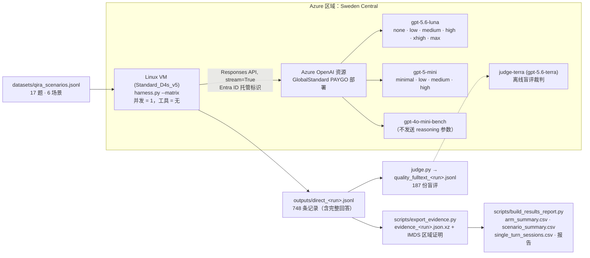

# 联想 Qira — 场景化模型基准测试
## GPT-5.6 Luna vs GPT-5 mini vs GPT-4o mini：Qira 6 大场景 × 全部 reasoning effort 组合

**Author**: Xinyu Wei (魏新宇) | **Date**: 2026-09-09

[English](README.md) | [中文](README-CN.md)

针对三个候选模型，在**同区域、不挂载任何工具、按量付费（PAYGO）**条件下，按 Qira 六个产品场景做可行性基准测试。每个模型支持的全部 `reasoning_effort` 取值都测了（11 个模型×effort 组合），并逐请求记录 Token 用量和公开标价成本，从而在完全相同的提示词上比较性价比。

## 结论先行

**没有单一赢家。应按场景、按绝对质量门槛、首字延迟预算和真实请求量来选，而不是"effort 越高性价比越好"。**

| 候选配置 | TTFT P50 | E2E P50 | Token/单轮 | $/千次 | 质量/5 | 适用位置（仅对本轮样例成立） |
|---|---:|---:|---:|---:|---:|---|
| **GPT-4o mini** | **0.367 s** | 2.26 s | 243 | **$0.094** | 4.53 | 首字最快、成本最低；写作与创作意图评分最低。适合短建议、摘要等低成本路径。 |
| **GPT-5 mini @ `minimal`** | 0.567 s | 2.20 s | 402 | $0.603 | 4.55 | 首字快，但同质量档位下成本是 4o mini 的 6.4 倍。 |
| **GPT-5.6 Luna @ `none`** | 1.074 s | **1.95 s** | 366 | $0.324 | **4.92** | 低 effort 组合中质量最高，比 GPT-5 mini `minimal` 便宜 46%，但首字慢约 0.5 s。综合默认候选。 |
| GPT-5.6 Luna @ `high` | 1.918 s | 3.08 s | 468 | $0.447 | 4.95 | 相比 `none` 成本 +38%，质量仅约 +0.04，不值得默认开启。 |
| GPT-5 mini @ `high` | 15.47 s | 17.5 s | 2 383 | $4.564 | 4.79 | 成本是 `minimal` 的 7.6 倍、TTFT 27 倍。不适合 Qira 交互路径。 |

> 每组合 51 次测量请求（17 题 × 3 次测量，另有 1 次预热不计入）。TTFT/E2E 为中位数；Token 与成本为按 Azure 标价计算的单请求均值。质量为盲评 LLM-as-a-judge 5 维均分（187 份评分）。11 组合完整表见第 5 节。

**各 Qira 场景下一轮优先验证的配置**（须用客户真实提示词验证，不能直接照搬本轮构造样例的结论）：

| Qira 场景 | 优先验证的配置 | 原因 |
|---|---|---|
| Next Move | GPT-4o mini；Luna `none` 作质量对照 | 短建议：先保证首字与成本 |
| Write For Me | Luna `none` | 写作评分 4.90，对比 4o mini 4.20 / 5 mini `minimal` 4.30 |
| Catch Me Up | GPT-4o mini | 3 道摘要题得 5.00；长上下文摘要未测 |
| Pay Attention（文本侧） | Luna `none`；GPT-5 mini `minimal` 作低首字对照 | STT 与实时语音链路未测 |
| Live Interaction（文本代理） | 先用 4o mini / 5 mini `minimal` 验证实时约束 | Luna 文本评分高不代表语音回路更快 |
| Creator Zone（提示词/编辑意图） | Luna `none` | 得 5.00；图片生成质量本身未测 |

复现数字无需调用模型：`python scripts/build_results_report.py` 会从已提交的证据包重新生成全部 CSV 和报告（见第 8 节）。

---

## 1. 背景

Qira 是联想的跨设备 AI 助手（ThinkPad、平板、Motorola 手机）。其六个面向用户的功能——**Next Move、Write For Me、Catch Me Up、Pay Attention、Live Interaction、Creator Zone**——都是对延迟敏感、以非推理为主的文本任务。本[芝加哥 Benchmark 项目](../README-CN.md)把问题收窄为一次公平的模型原生能力对比：

1. 只测 **GPT-5.6 Luna、GPT-5 mini、GPT-4o mini**。
2. 提示词按 **Qira 六个场景**构造，而不是通用问答。
3. **不带 web search、不挂任何工具**——只测模型原生能力。
4. 客户端与模型**同区域**，从 Linux VM 发起，把网络延迟从对比中排除。
5. **所有 reasoning effort 排列组合**都测，并按会话单轮记录 Token 与成本。

本仓库是这次测试的 harness、数据集、原始证据和结果。方法沿用 [AOAI-Model-Migration-Benchmark](https://github.com/david-xinyuwei/david-share/tree/master/Agents/AOAI-Model-Migration-Benchmark) 的 S1 "Direct AOAI" 场景：Responses API、`stream=True`、在首个输出文本增量处记 TTFT、从 `response.completed` 事件读取 usage。

## 2. 架构



## 3. 测试矩阵

| 模型 | 部署（版本） | 探活并实测的 `reasoning_effort` | 组合数 |
|---|---|---|---:|
| GPT-5.6 Luna | `gpt-5.6-luna`（2026-07-09） | `none`、`low`、`medium`、`high`、`xhigh`、`max` | 6 |
| GPT-5 mini | `gpt-5-mini`（2025-08-07） | `minimal`、`low`、`medium`、`high` | 4 |
| GPT-4o mini | `gpt-4o-mini-bench`（2024-07-18） | 不发送该参数（非推理模型） | 1 |

- 支持的 effort 取值由 `probe_efforts.py` 逐个真实调用探活后写入 `config/models.json`，矩阵以服务实际接受的取值为准，不靠假设。注意两家的下限不对称：Luna 最低为 `none`，GPT-5 mini 最低为 `minimal`。
- 17 题 × 11 组合 ×（1 次预热 + 3 次测量）= **748 次请求**；预热记录保留但不计入统计 → **561 次测量单轮会话**，每组合 51 次。
- 748 / 748 `completed`；0 次 API 错误、0 次截断、0 次空回答。
- 三个部署均为 GlobalStandard、按量付费、容量 1000、同一资源。见 `outputs/deployment_verification.json`。

### 场景覆盖

| Qira 场景 | 题数 | 本轮测量的任务类型 | 明确未测 |
|---|---:|---|---|
| Next Move | 3 | 主动建议、跨设备接续、短建议 | 实际执行跨设备操作 |
| Write For Me | 4 | 长文起草、语气续写、语气转换改写、短文起草 | 生成真实 Office 文件 |
| Catch Me Up | 3 | 积压摘要、决策抽取、高管一句话浓缩 | 长上下文检索 |
| Pay Attention | 3 | 要点捕获、翻译并摘要、即时召回——**基于已转写文本** | 语音转写、实时音频 |
| Live Interaction | 2 | 对话轮次、有依据的追问——屏幕共享会话的文本代理 | 真实视频/语音回路 |
| Creator Zone | 2 | 图像提示词扩写、修图意图解析 | 图像生成或编辑质量 |

提示词为英文构造样例，不是客户生产数据。每题都是独立单轮请求（LI02 没有拿到 LI01 的实际回答），因此单轮 Token 均值不能当作多轮会话成本来呈现。

## 4. 环境与公平性控制

| 控制项 | 实现方式 | 证据 |
|---|---|---|
| 同区域 | 客户端 VM 与 AOAI 资源都在 Sweden Central；导出时从 Azure IMDS 再读一次 VM 区域，报告生成器强制校验 | `provenance_*.json → vm_metadata.location` |
| 网络基线 | 运行前测到 endpoint 的 TCP 连接耗时：**7.74 ms** | 每条记录的 `network_rtt_ms` |
| 不挂工具 | harness 从不附加工具；每条记录带 `tools_enabled=false`，生成器拒绝任何其他值 | `direct_*.metrics.jsonl` |
| 单一环境 | 生成器断言 748 行只存在一个（区域、endpoint、部署类型、客户端位置）组合 | `build_results_report.py` |
| 输出上限一致 | 同一题所有组合的 `max_output_tokens` 相同（题目原上限 + 8192）；未发生截断 | `max_output_tokens`、`truncated` |
| 无密钥认证 | 通过 VM 托管标识使用 Entra ID `DefaultAzureCredential`；资源已禁用本地密钥认证 | `harness.py` |
| 串行执行 | 并发 1，组合顺序固定，每题先预热 | `warmup` 标记、`iteration` |

限制解读的注意事项：

- **GlobalStandard 可能在其他区域执行推理。** 资源同区只能消除客户端网络延迟，不保证 GPU 物理位于 Sweden Central。
- TCP 连接耗时不是完整 RTT，也不能从 TTFT 中减掉来得到"纯模型耗时"。TTFT 仍包含排队、prefill、首 token，推理模型还包含答前 reasoning。
- `decode_tps` / `tpot_ms` 是按流式 chunk 估算的客户端指标；一个 chunk 不保证等于一个 token。本轮 561 次测量全部逐块到达（0 次整段一次性到达），与后续 Router 研究中 Chat Completions 直连基线的表现不同。
- 固定顺序串行意味着各组合在不同时段测量；P95 是小样本描述值，不是 SLA。做生产决策应交错随机化组合并增加重复次数。

## 5. 结果——全部 11 组合

Token、成本为单请求均值，延迟为中位数；每组合 51 次测量；所有组合使用相同 17 题。

| 模型 @ effort | TTFT P50 (s) | TTFT P95 (s) | E2E P50 (s) | 输入 Token | 输出 Token | 其中推理 | Token/单轮 | $/千次 | 质量/5 |
|---|---:|---:|---:|---:|---:|---:|---:|---:|---:|
| gpt-4o-mini-bench | 0.367 | 2.096 | 2.262 | 116 | 127.2 | 0.0 | 243.2 | 0.0937 | 4.53 |
| gpt-5-mini@minimal | 0.567 | 1.261 | 2.198 | 115 | 287.3 | 0.0 | 402.3 | 0.6033 | 4.55 |
| gpt-5-mini@low | 1.969 | 3.808 | 3.966 | 115 | 449.5 | 133.0 | 564.5 | 0.9277 | 4.64 |
| gpt-5-mini@medium | 5.302 | 15.345 | 7.380 | 115 | 852.4 | 549.6 | 967.4 | 1.7335 | 4.76 |
| gpt-5-mini@high | 15.472 | 35.856 | 17.548 | 115 | 2267.8 | 1950.1 | 2382.8 | 4.5644 | 4.79 |
| gpt-5.6-luna@none | 1.074 | 1.303 | 1.953 | 115 | 251.1 | 0.0 | 366.1 | 0.3243 | 4.92 |
| gpt-5.6-luna@low | 1.171 | 1.825 | 2.422 | 115 | 272.4 | 15.0 | 387.4 | 0.3499 | 4.82 |
| gpt-5.6-luna@medium | 1.408 | 3.548 | 3.141 | 115 | 297.6 | 36.0 | 412.6 | 0.3802 | 4.92 |
| gpt-5.6-luna@high | 1.918 | 4.493 | 3.079 | 115 | 353.2 | 92.5 | 468.2 | 0.4468 | 4.95 |
| gpt-5.6-luna@xhigh | 2.590 | 8.304 | 3.673 | 115 | 455.9 | 187.0 | 570.9 | 0.5701 | 4.94 |
| gpt-5.6-luna@max | 3.414 | 8.748 | 4.373 | 115 | 582.5 | 328.6 | 697.5 | 0.7220 | 4.88 |

观察：

- **推理 Token 同时推高成本和 TTFT。** GPT-5 mini `high` 每轮消耗 1 950 个推理 Token（占其输出的 86%），TTFT 中位数 15.5 s；Luna `max` 消耗 329 个推理 Token，TTFT 仍在 3.4 s。
- **Luna 的 effort 阶梯在质量上是平的。** `none` → `high` 质量均分约 +0.04、成本 +38%；`max` 得分反而低于 `none`。在本题集上没有证据支持为更高的 Luna effort 付费。
- **GPT-5 mini `minimal` 首字比 Luna `none` 快（0.57 s vs 1.07 s），但成本高 1.9 倍、质量低约 0.36 分。**
- **GPT-4o mini 成本最低（便宜 3.5 倍）、首字最快**，代价是 Write For Me（4.20）与 Creator Zone（4.30）评分最低。

### 分位数与流式解码（客户端观测）

客户端 TPOT = 首个文本块到最后一个文本块的跨度 ÷（可见输出 Token − 1）；tok/s 为其倒数。561 次测量全部逐块到达（0 次整段一次性到达），因此这里的 TPOT 反映观测到的生成节奏；但一个 chunk 不保证等于一个 Token，且并发=1，不是 GPU 解码能力或系统吞吐。P50/P90/P95 为每组 51 次的最近秩分位数；表行由 `outputs/arm_summary.csv` 生成。

| 模型 @ effort | TTFT P50 / P90 / P95 (s) | E2E P50 / P90 / P95 (s) | TPOT P50 / P90 (ms) | tok/s P50 | 首末<50 ms |
|---|---:|---:|---:|---:|---:|
| gpt-4o-mini-bench | 0.367 / 0.849 / 2.096 | 2.262 / 6.319 / 11.631 | 18.13 / 25.17 | 55 | 0/51 |
| gpt-5-mini@minimal | 0.567 / 1.148 / 1.261 | 2.198 / 4.375 / 14.211 | 7.68 / 9.91 | 130 | 0/51 |
| gpt-5-mini@low | 1.969 / 3.143 / 3.808 | 3.966 / 6.722 / 13.371 | 7.62 / 10.44 | 131 | 0/51 |
| gpt-5-mini@medium | 5.302 / 9.275 / 15.345 | 7.380 / 17.108 / 20.995 | 6.85 / 12.62 | 146 | 0/51 |
| gpt-5-mini@high | 15.472 / 30.125 / 35.856 | 17.548 / 35.030 / 38.583 | 7.82 / 12.55 | 128 | 0/51 |
| gpt-5.6-luna@none | 1.074 / 1.267 / 1.303 | 1.953 / 3.357 / 21.991 | 8.36 / 12.77 | 120 | 0/51 |
| gpt-5.6-luna@low | 1.171 / 1.794 / 1.825 | 2.422 / 4.410 / 19.427 | 8.22 / 12.24 | 122 | 0/51 |
| gpt-5.6-luna@medium | 1.408 / 2.944 / 3.548 | 3.141 / 5.160 / 21.684 | 8.49 / 14.51 | 118 | 0/51 |
| gpt-5.6-luna@high | 1.918 / 4.399 / 4.493 | 3.079 / 6.210 / 22.270 | 8.15 / 13.84 | 123 | 0/51 |
| gpt-5.6-luna@xhigh | 2.590 / 7.567 / 8.304 | 3.673 / 9.791 / 24.148 | 8.47 / 14.51 | 118 | 0/51 |
| gpt-5.6-luna@max | 3.414 / 5.905 / 8.748 | 4.373 / 8.146 / 28.213 | 8.20 / 13.13 | 122 | 0/51 |

- **同一家族内的逐 Token 节奏基本持平。** GPT-5 mini 约 7–8 ms/Token，Luna 约 8–8.5 ms/Token，与 effort 无关；高 effort 端到端更慢，是因为首字前多产生了推理 Token，不是解码变慢。
- **GPT-4o mini 首字最快、但逐 Token 节奏最慢**（18 ms，55 tok/s）；靠短回答（127 Token）把端到端拉回来。
- 各组 E2E P95 达 12–28 s，几乎全部来自一道长文题（各组最慢 3 次共 33 个名额中 WFM01 占 30 个，其余为 PA01），属小样本尾部，不是 SLA。

### 分场景视图（TTFT P50 / $ 每千次 / 质量）

| 场景 | gpt-4o-mini | gpt-5-mini@minimal | gpt-5.6-luna@none | gpt-5.6-luna@high |
|---|---|---|---|---|
| Next Move | 0.38 s / $0.058 / 4.67 | 0.48 s / $0.388 / 4.27 | 1.08 s / $0.111 / 4.80 | 2.01 s / $0.189 / 4.93 |
| Write For Me | 0.36 s / $0.161 / 4.20 | 0.50 s / $1.260 / 4.30 | 1.11 s / $0.857 / 4.90 | 1.89 s / $1.019 / 4.95 |
| Catch Me Up | 0.37 s / $0.083 / 5.00 | 0.50 s / $0.428 / 4.67 | 1.04 s / $0.159 / 4.93 | 2.45 s / $0.351 / 4.87 |
| Pay Attention | 0.33 s / $0.102 / 4.47 | 0.50 s / $0.442 / 4.80 | 1.09 s / $0.259 / 4.93 | 1.74 s / $0.399 / 5.00 |
| Live Interaction | 0.36 s / $0.042 / 4.60 | 0.53 s / $0.181 / 4.70 | 1.02 s / $0.071 / 5.00 | 1.97 s / $0.136 / 5.00 |
| Creator Zone | 0.37 s / $0.068 / 4.30 | 0.77 s / $0.540 / 4.80 | 1.12 s / $0.179 / 5.00 | 1.68 s / $0.217 / 5.00 |

全部 66 个场景 × 组合行见 `outputs/scenario_summary.csv`；由同一数据生成的中文叙述报告为 `outputs/Qira-实测结果-20260909.md`。

## 6. Token 与成本

单轮 Token 取自 API 的 `usage` 对象：`input_tokens` 已包含缓存读取，`output_tokens` 已包含推理 Token，不会重复相加。

```text
单轮 Token = input_tokens + output_tokens
成本 = ((input_tokens - cached_tokens) × 输入价
        + cached_tokens × 缓存价
        + output_tokens × 输出价) / 1,000,000
```

使用的标价（`config/pricing.json`，Global 部署，USD / 1M Token，2026-09-09 在渲染后的 [Azure OpenAI 定价页](https://azure.microsoft.com/en-us/pricing/details/azure-openai/) 核对）：

| 模型 | 输入 | 缓存读取 | 输出 |
|---|---:|---:|---:|
| GPT-5.6 Luna（短上下文） | $0.20 | $0.02 | $1.20 |
| GPT-5 mini | $0.25 | $0.03 | $2.00 |
| GPT-4o mini | $0.15 | $0.075 | $0.60 |

整轮消耗（748 次含预热）：**输入 86 088 Token，输出 423 417 Token（其中推理 227 074），按标价约 $0.733**。未观察到提示词缓存（所有记录 `cached_tokens` = 0；提示词 64–250 Token，均值 115）。Luna 另列 $0.25 / 1M 的缓存写入价，采集器未记录，因此以上是按已记录 usage 的标价估算，不是账单，也不含废弃首轮、effort 探活、judge 调用和 VM/网络费用。

Qira 的多轮会话成本必须按轮累加 API usage（每轮会重新送入历史）；本轮未测量这一增量。

## 7. 质量评分

`judge.py` 使用独立部署（`judge-terra`，gpt-5.6-terra）离线、盲评（隐藏模型名）每份记录的回答，五个维度各 1–5 分：指令遵循、正确性、完整性、可用性、语气匹配。每个组合 × 题只评一份回答（第一次测量迭代）→ 187 份评分。

- 首轮评分曾在 6 000 字符处静默截断输入，影响了 WFM01 的长文（最长 16 624 字符）。WFM01 的全部 11 份回答已按完整文本重评（`evaluation_revision = fulltext-v2`），生成器对每份超限回答都强制校验这一点。首轮评分保留在 `outputs/raw_fulltext/quality_20260909_120534.jsonl`。
- 隐藏模型名能减少显性偏差，但不能消除同家族偏好和裁判自身的随机性。每格只评一份回答，没有质量方差估计。评分应作为初筛信号、需经人工校准，不是验收结论。分差小不代表每个模型都达标。

## 8. 快速开始

```bash
# 在与 Azure OpenAI 资源同区域的 Linux VM 上
pip install -r requirements.txt
export AZURE_OPENAI_ENDPOINT="https://YOUR-ENDPOINT.cognitiveservices.azure.com/"

# 1. 探活每个部署接受哪些 reasoning_effort 取值
python probe_efforts.py --deployments gpt-5.6-luna,gpt-5-mini,gpt-4o-mini-bench --write

# 2. 不调用模型，先确认网络基线
python harness.py --mode direct --dataset datasets/qira_scenarios.jsonl \
  --deployments gpt-4o-mini-bench --region swedencentral \
  --client-location swedencentral-linux-vm --preflight

# 3. 跑完整 effort 矩阵（全部支持的 effort × 全部题目）
python harness.py --mode direct --matrix --dataset datasets/qira_scenarios.jsonl \
  --deployments gpt-5.6-luna,gpt-5-mini,gpt-4o-mini-bench \
  --region swedencentral --client-location swedencentral-linux-vm \
  --iterations 3 --warmup 1

# 4. 盲评与汇总
python judge.py outputs/direct_<run>.jsonl --judge-deployment <judge-deployment>
python analyze.py outputs/direct_<run>.jsonl --quality outputs/quality_<run>.jsonl
```

未设置 `AZURE_OPENAI_API_KEY` 时，harness 使用 Entra ID `DefaultAzureCredential`（VM 托管标识，磁盘上没有密钥）。`--region` / `--client-location` 只是打在每条记录上的标签；云区域本身由 `scripts/export_evidence.py` 通过 IMDS 单独核验。

从已提交的证据重新生成本轮结果（不调用模型，约 2 秒）：

```text
$ python scripts/build_results_report.py
evidence archive: redacted (committed)
{
  "arms": [ ... 11 arms ... ],
  "all_requests": 748,
  "measured_requests": 561,
  "all_input_tokens": 86088,
  "all_output_tokens": 423417,
  "all_reasoning_tokens": 227074,
  "all_cost_usd": 0.7332986
}
VERIFIED: 748 performance rows, 561 measured single-turn sessions, 187 quality rows, 66 scenario-arm rows.

$ python scripts/verify_fulltext.py
VERIFIED: 748 answers match their SHA256 and numerical fields; 954,738 characters of model output retained.
```

`scripts/provision-benchmark-vm.sh <rg> <region>` 创建同区域 VM；`scripts/remote_evidence.ps1` 通过 Azure Run Command 执行命令和传输小文件，不开放任何入站端口。

## 9. 仓库结构

| 路径 | 用途 |
|---|---|
| `harness.py` | 流式 Responses API harness；`--matrix` 为每个部署展开全部支持的 effort |
| `probe_efforts.py` | 探活可接受的 `reasoning_effort` 取值并写入 `config/models.json` |
| `judge.py` | 盲评 LLM-as-a-judge，五维度，每组合 × 题评一份 |
| `analyze.py` | 汇总、计价、环境一致性检查 |
| `config/models.json`、`config/pricing.json` | 模型注册表（已探活的 effort）和已核对的标价 |
| `datasets/qira_scenarios.jsonl` | 覆盖 Qira 六场景的 17 题 |
| `outputs/arm_summary.csv` | 11 组合——延迟分位数、Token 均值、成本、质量 |
| `outputs/scenario_summary.csv` | 66 个场景 × 组合行 |
| `outputs/single_turn_sessions.csv` | 561 次测量请求，含 Token、成本、延迟、回答 SHA256 |
| `outputs/direct_20260909_120534.metrics.jsonl` | 748 条数值记录（回答以 SHA256 代替） |
| `outputs/quality_fulltext_20260909_120534.jsonl` | 187 份裁判评分，含理由 |
| `outputs/raw_fulltext/direct_20260909_120534.jsonl` | 748 条**含完整模型回答**的记录（954 738 字符） |
| `outputs/evidence_20260909_120534.json.xz` | 带校验和的证据包，含 IMDS VM 元数据——生成器的输入 |
| `outputs/provenance_20260909_120534.json` | 文件哈希、库版本、实际运行的 harness/数据集源码哈希 |
| `outputs/deployment_verification.json`、`outputs/resource_closeout.json` | 部署 SKU/版本；VM 关机与清理记录 |
| `outputs/Qira-实测结果-20260909.md` | 生成的中文结果报告 |
| `scripts/build_results_report.py` | 校验证据包（748 格、单一环境、无错误）并重新生成全部 CSV/报告 |
| `scripts/export_evidence.py` | 在 VM 上运行：剥离回答、加入 IMDS 元数据、压缩并哈希 |
| `scripts/verify_fulltext.py` | 证明已提交的完整回答与数值记录的 SHA256 逐条一致 |
| `scripts/redact_endpoint.py` | 提交前把真实 endpoint 主机名替换为占位符 |
| `scripts/repair_quality.py` | 对超长回答按完整文本重评 |
| `scripts/provision-benchmark-vm.sh`、`scripts/remote_evidence.ps1` | 同区域 VM 创建；Run Command 通道 |

## 10. 踩过的坑

| # | 现象 | 根因 | 修复 / 规则 |
|:-:|---|---|---|
| 1 | 首轮部分回答丢失 `usage` | `max_output_tokens` 上限过小导致 `response.incomplete`，采集器只从 `response.completed` 读 usage | 上限提高到题目上限 + 8192，记录 `incomplete_reason`；首轮整体废弃，从未与正式轮混合 |
| 2 | 质量文件 SHA256 在 VM 与笔记本上不一致 | Windows 复制时的 CRLF 转换 | 所有写入统一 `newline="\n"`；哈希按字节校验 |
| 3 | 长回答只评了前缀 | 裁判在 6 000 字符处静默截断 | 超长输入现在直接报错；11 份回答按全文重评并标记 `evaluation_revision=fulltext-v2`，生成器强制校验 |
| 4 | 各家族 effort 下限不同 | Luna 接受 `none`；GPT-5 mini 最低为 `minimal`；GPT-4o mini 拒绝该参数 | 先探活（`probe_efforts.py`），不做假设；`null` 表示"不发送" |
| 5 | "同区域"表述过强 | GlobalStandard 可能把推理路由到其他区域；TCP connect ≠ RTT | 报告明确写出两点；IMDS 只能证明客户端区域 |
| 6 | 已提交证据每行都带真实 endpoint 主机名 | 单一环境校验需要 `endpoint_host` 字段 | 替换为占位符；记录两个版本的证据包 SHA，单条回答哈希不受影响 |

## 11. 局限

- 串行、并发 1：未测 QPS / 吞吐 / 限流行为；P95 只是描述值。
- 17 道构造题、每组合 51 次测量、一个裁判模型、每格一份评分——足以做可行性排序，不足以支撑生产 SLA 或有统计效力的质量结论。
- 只测文本：语音转写、实时语音、屏幕/视频理解、图像生成均不在范围内。
- 成本是按记录 usage 的标价估算；未建模缓存写入价格和 PTU 经济性。

## 12. 证据完整性

- 生成器只有在以下条件全部满足时才运行：证据包 SHA256 与已知值匹配、IMDS 区域为 Sweden Central、748 个矩阵格各恰好出现一次、每条记录为 `completed` 且 `tools_enabled=false`、187 条质量记录全部有效。
- 已提交的证据包是**脱敏版本**（`764f5a42…df5476`）；VM 上导出的原始版本为 `7ec39559…890c3b`。两者仅 `endpoint_host` 取值和仓库相对路径不同——见 `outputs/provenance_20260909_120534.json`。
- 完整回答：VM 原始文件 SHA256 `77c04776…3059888`；已提交脱敏副本 `02ab135f…5a14d`。`scripts/verify_fulltext.py` 证明 748 条 `response_sha256` 仍全部匹配。
- 资源：基准测试 VM 已 **deallocated（关机，未删除）**；临时 SSH 规则已移除；四个部署（三个候选 + 裁判）保留供复核。

---

**Verified**: 2026-09-09 | Sweden Central | Standard_D4s_v5 Ubuntu Linux VM | Python 3.12.3 | openai 3.10.0 | azure-identity 1.25.3
