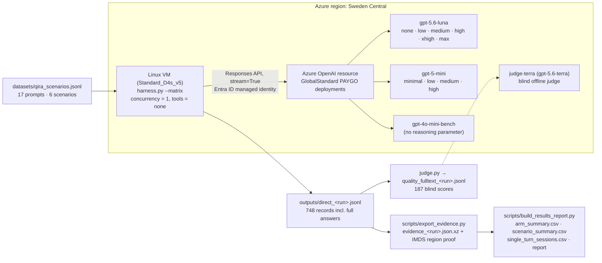

# Lenovo Qira — Scenario Model Benchmark
## GPT-5.6 Luna vs GPT-5 mini vs GPT-4o mini across the 6 Qira scenarios × every reasoning effort

**Author**: Xinyu Wei (魏新宇) | **Date**: 2026-09-09

[English](README.md) | [中文](README-CN.md)

Same-region, no-tools, pay-as-you-go feasibility benchmark of three candidate models, scored against Qira's six product scenarios. Every supported `reasoning_effort` value was measured (11 model×effort arms), and token usage / list-price cost was recorded per request so that price-performance can be compared on identical prompts.

## Executive Summary

**There is no single winner. Pick per scenario using an absolute quality bar, a TTFT budget and real request volume — not "higher effort = better value".**

| Candidate | TTFT P50 | E2E P50 | Tokens / turn | $ / 1k requests | Judge quality / 5 | Where it fits (this sample only) |
|---|---:|---:|---:|---:|---:|---|
| **GPT-4o mini** | **0.367 s** | 2.26 s | 243 | **$0.094** | 4.53 | Lowest TTFT and cost; lowest writing / creator-intent scores. Cheap path for short suggestions and digests. |
| **GPT-5 mini @ `minimal`** | 0.567 s | 2.20 s | 402 | $0.603 | 4.55 | Fast TTFT, but 6.4× the cost of 4o mini for the same quality band. |
| **GPT-5.6 Luna @ `none`** | 1.074 s | **1.95 s** | 366 | $0.324 | **4.92** | Highest quality of the low-effort arms, 46 % cheaper than GPT-5 mini `minimal`, but ~0.5 s slower first token. Balanced default candidate. |
| GPT-5.6 Luna @ `high` | 1.918 s | 3.08 s | 468 | $0.447 | 4.95 | +38 % cost over `none` for ≈ +0.04 quality — not worth enabling by default. |
| GPT-5 mini @ `high` | 15.47 s | 17.5 s | 2 383 | $4.564 | 4.79 | 7.6× cost and 27× TTFT of `minimal`. Unsuitable for interactive Qira paths. |

> 51 measured requests per arm (17 prompts × 3 iterations after 1 discarded warm-up). TTFT/E2E are medians; tokens and cost are per-request means at Azure list price. Quality is a blind LLM-as-a-judge mean over 5 dimensions (187 evaluations). Full 11-arm table in Section 5.

**Suggested next-round configuration per Qira scenario** (to be validated with the customer's real prompts, not adopted from this synthetic set):

| Qira scenario | Configuration to validate first | Why |
|---|---|---|
| Next Move | GPT-4o mini; Luna `none` as quality control | Short suggestions: protect TTFT and cost first |
| Write For Me | Luna `none` | Writing scored 4.90 vs 4.20 (4o mini) / 4.30 (5 mini `minimal`) |
| Catch Me Up | GPT-4o mini | Scored 5.00 on the 3 digest prompts; long-context digests untested |
| Pay Attention (text side) | Luna `none`; GPT-5 mini `minimal` as low-TTFT control | STT and the realtime voice path were not tested |
| Live Interaction (text proxy) | 4o mini / 5 mini `minimal` first for realtime constraints | Luna's higher text score does not mean a faster voice loop |
| Creator Zone (prompt / edit intent) | Luna `none` | Scored 5.00; image generation quality itself not tested |

Reproducing the numbers needs no model calls: `python scripts/build_results_report.py` rebuilds every CSV and the report from the committed evidence archive (Section 8).

---

## 1. Background

Qira is Lenovo's cross-device AI assistant (ThinkPad, tablets, Motorola phones). Its six user-facing features — **Next Move, Write For Me, Catch Me Up, Pay Attention, Live Interaction, Creator Zone** — are latency-sensitive, mostly non-reasoning text tasks. This [Chicago benchmark project](../README.md) narrows the question to a fair native-capability comparison:

1. Only **GPT-5.6 Luna, GPT-5 mini and GPT-4o mini**.
2. Prompts modelled on the **six Qira scenarios**, not generic Q&A.
3. **No web search or tools** — native model capability only.
4. **Same region** for client and model, from a Linux VM, to remove network latency from the comparison.
5. Every **reasoning-effort permutation**, with token and cost accounting per conversation turn.

This repository is the harness, the dataset, the raw evidence and the results of that run. Methodology is inherited from [AOAI-Model-Migration-Benchmark](https://github.com/david-xinyuwei/david-share/tree/master/Agents/AOAI-Model-Migration-Benchmark) scenario S1 "Direct AOAI": Responses API, `stream=True`, TTFT at the first output-text delta, usage read from `response.completed`.

## 2. Architecture



## 3. Test Matrix

| Model | Deployment (version) | `reasoning_effort` values probed and run | Arms |
|---|---|---|---:|
| GPT-5.6 Luna | `gpt-5.6-luna` (2026-07-09) | `none`, `low`, `medium`, `high`, `xhigh`, `max` | 6 |
| GPT-5 mini | `gpt-5-mini` (2025-08-07) | `minimal`, `low`, `medium`, `high` | 4 |
| GPT-4o mini | `gpt-4o-mini-bench` (2024-07-18) | parameter not sent (non-reasoning model) | 1 |

- Supported effort values were discovered with `probe_efforts.py` (one live call per candidate value) and written into `config/models.json`, so the matrix is what the service accepts, not an assumption. Note the asymmetry: Luna's floor is `none`, GPT-5 mini's floor is `minimal`.
- 17 prompts × 11 arms × (1 warm-up + 3 measured) = **748 requests**; warm-ups are stored but excluded from statistics → **561 measured single-turn sessions**, 51 per arm.
- 748 / 748 `completed`; 0 API errors, 0 truncated answers, 0 empty answers.
- All three deployments: GlobalStandard, pay-as-you-go, capacity 1000, same resource. Verified in `outputs/deployment_verification.json`.

### Scenario coverage

| Qira scenario | Prompts | Task types measured | Explicitly not measured |
|---|---:|---|---|
| Next Move | 3 | proactive suggestion, cross-device continuity, short suggestion | executing cross-device actions |
| Write For Me | 4 | long-form draft, tone continuation, tone-shift rewrite, short draft | producing real Office files |
| Catch Me Up | 3 | backlog digest, decision extraction, executive condense | long-context retrieval |
| Pay Attention | 3 | key-point capture, translate-and-summarize, instant recall — **from an already transcribed text** | speech-to-text, realtime audio |
| Live Interaction | 2 | conversational turn, grounded follow-up — text proxy for a screen-share session | real video / voice loop |
| Creator Zone | 2 | image-prompt expansion, edit-intent parsing | image generation or edit quality |

Prompts are synthetic and in English; they are not customer production data. Each prompt is an independent single-turn request (LI02 does not receive LI01's actual answer), so per-turn token means must not be presented as multi-turn session cost.

## 4. Environment and Fairness Controls

| Control | Implementation | Evidence |
|---|---|---|
| Same region | Client VM and AOAI resource both in Sweden Central; VM region re-read from Azure IMDS at export time and asserted by the report builder | `provenance_*.json → vm_metadata.location` |
| Network floor | TCP connect to the endpoint measured before the run: **7.74 ms** | `network_rtt_ms` on every record |
| No tools | Harness never attaches tools; every record carries `tools_enabled=false` and the builder rejects anything else | `direct_*.metrics.jsonl` |
| Single environment | Builder asserts exactly one (region, endpoint, deployment type, client location) tuple across 748 rows | `build_results_report.py` |
| Equal output cap | Same `max_output_tokens` per prompt for all arms (prompt's own cap + 8192); no truncation occurred | `max_output_tokens`, `truncated` |
| Auth without secrets | Entra ID `DefaultAzureCredential` via VM managed identity; resource has local key auth disabled | `harness.py` |
| Serial execution | Concurrency 1, fixed arm order, warm-up per prompt | `warmup` flag, `iteration` |

Caveats that limit the interpretation:

- **GlobalStandard may execute inference in another region.** Same-region resource placement removes client network latency but does not guarantee the GPU is physically in Sweden Central.
- TCP connect time is not the full RTT and cannot be subtracted from TTFT to obtain "pure model time". TTFT still includes queueing, prefill, first token and — for reasoning models — any pre-answer reasoning.
- `decode_tps` / `tpot_ms` are client-side estimates from stream chunks; a chunk is not guaranteed to be one token. In this run every measured request streamed delta by delta (0/561 whole-answer bursts), unlike the Chat Completions direct baselines in the follow-up router study.
- Fixed serial ordering means arms were measured at different times of day; P95 values are small-sample descriptors, not SLAs. For a production decision, interleave and randomise arms and increase repetitions.

## 5. Results — all 11 arms

Per-request means for tokens and cost, medians for latency; 51 measured requests per arm; identical 17 prompts for every arm.

| Model @ effort | TTFT P50 (s) | TTFT P95 (s) | E2E P50 (s) | Input tok | Output tok | of which reasoning | Tokens / turn | $ / 1k requests | Quality / 5 |
|---|---:|---:|---:|---:|---:|---:|---:|---:|---:|
| gpt-4o-mini-bench | 0.367 | 2.096 | 2.262 | 116 | 127.2 | 0.0 | 243.2 | 0.0937 | 4.53 |
| gpt-5-mini@minimal | 0.567 | 1.261 | 2.198 | 115 | 287.3 | 0.0 | 402.3 | 0.6033 | 4.55 |
| gpt-5-mini@low | 1.969 | 3.808 | 3.966 | 115 | 449.5 | 133.0 | 564.5 | 0.9277 | 4.64 |
| gpt-5-mini@medium | 5.302 | 15.345 | 7.380 | 115 | 852.4 | 549.6 | 967.4 | 1.7335 | 4.76 |
| gpt-5-mini@high | 15.472 | 35.856 | 17.548 | 115 | 2267.8 | 1950.1 | 2382.8 | 4.5644 | 4.79 |
| gpt-5.6-luna@none | 1.074 | 1.303 | 1.953 | 115 | 251.1 | 0.0 | 366.1 | 0.3243 | 4.92 |
| gpt-5.6-luna@low | 1.171 | 1.825 | 2.422 | 115 | 272.4 | 15.0 | 387.4 | 0.3499 | 4.82 |
| gpt-5.6-luna@medium | 1.408 | 3.548 | 3.141 | 115 | 297.6 | 36.0 | 412.6 | 0.3802 | 4.92 |
| gpt-5.6-luna@high | 1.918 | 4.493 | 3.079 | 115 | 353.2 | 92.5 | 468.2 | 0.4468 | 4.95 |
| gpt-5.6-luna@xhigh | 2.590 | 8.304 | 3.673 | 115 | 455.9 | 187.0 | 570.9 | 0.5701 | 4.94 |
| gpt-5.6-luna@max | 3.414 | 8.748 | 4.373 | 115 | 582.5 | 328.6 | 697.5 | 0.7220 | 4.88 |

Observations:

- **Reasoning tokens drive both cost and TTFT.** GPT-5 mini at `high` spends 1 950 reasoning tokens per turn (86 % of its output) and its TTFT median is 15.5 s. Luna at `max` spends 329 reasoning tokens and stays at 3.4 s.
- **Luna's effort ladder is flat in quality.** `none` → `high` raises the judge mean by ≈ 0.04 and cost by 38 %; `max` scores lower than `none`. On this prompt set there is no evidence that higher Luna effort is worth paying for.
- **GPT-5 mini `minimal` is faster to first token than Luna `none` (0.57 s vs 1.07 s) but costs 1.9× more and scores ≈ 0.36 lower.**
- **GPT-4o mini is the cheapest by 3.5× and fastest to first token**, at the price of the lowest scores in Write For Me (4.20) and Creator Zone (4.30).

### Percentiles and streaming decode (client-observed)

Client TPOT = first-to-last text-delta span ÷ (visible output tokens − 1); tok/s is its reciprocal. All 561 measured requests streamed delta by delta (0 requests delivered their whole answer in one burst), so TPOT here reflects the observed generation pace — but a chunk is not guaranteed to be one token, and at concurrency 1 this is not GPU decode capacity or system throughput. P50/P90/P95 are nearest-rank percentiles over 51 requests per arm; the rows are generated from `outputs/arm_summary.csv`.

| Model @ effort | TTFT P50 / P90 / P95 (s) | E2E P50 / P90 / P95 (s) | TPOT P50 / P90 (ms) | tok/s P50 | Bursts <50 ms |
|---|---:|---:|---:|---:|---:|
| gpt-4o-mini-bench | 0.367 / 0.849 / 2.096 | 2.262 / 6.319 / 11.631 | 18.13 / 25.17 | 55 | 0/51 |
| gpt-5-mini@minimal | 0.567 / 1.148 / 1.261 | 2.198 / 4.375 / 14.211 | 7.68 / 9.91 | 130 | 0/51 |
| gpt-5-mini@low | 1.969 / 3.143 / 3.808 | 3.966 / 6.722 / 13.371 | 7.62 / 10.44 | 131 | 0/51 |
| gpt-5-mini@medium | 5.302 / 9.275 / 15.345 | 7.380 / 17.108 / 20.995 | 6.85 / 12.62 | 146 | 0/51 |
| gpt-5-mini@high | 15.472 / 30.125 / 35.856 | 17.548 / 35.030 / 38.583 | 7.82 / 12.55 | 128 | 0/51 |
| gpt-5.6-luna@none | 1.074 / 1.267 / 1.303 | 1.953 / 3.357 / 21.991 | 8.36 / 12.77 | 120 | 0/51 |
| gpt-5.6-luna@low | 1.171 / 1.794 / 1.825 | 2.422 / 4.410 / 19.427 | 8.22 / 12.24 | 122 | 0/51 |
| gpt-5.6-luna@medium | 1.408 / 2.944 / 3.548 | 3.141 / 5.160 / 21.684 | 8.49 / 14.51 | 118 | 0/51 |
| gpt-5.6-luna@high | 1.918 / 4.399 / 4.493 | 3.079 / 6.210 / 22.270 | 8.15 / 13.84 | 123 | 0/51 |
| gpt-5.6-luna@xhigh | 2.590 / 7.567 / 8.304 | 3.673 / 9.791 / 24.148 | 8.47 / 14.51 | 118 | 0/51 |
| gpt-5.6-luna@max | 3.414 / 5.905 / 8.748 | 4.373 / 8.146 / 28.213 | 8.20 / 13.13 | 122 | 0/51 |

- **Per-token pace is nearly flat within a family.** GPT-5 mini streams at ≈ 7–8 ms/token and Luna at ≈ 8–8.5 ms/token regardless of effort; higher effort is slower end-to-end because it emits more reasoning tokens before the first visible token, not because it decodes slower.
- **GPT-4o mini has the fastest first token but the slowest per-token pace** (18 ms, 55 tok/s); its short answers (127 tokens) are what keep its E2E competitive.
- E2E P95 values of 12–28 s across arms come almost entirely from one long-form prompt (WFM01 holds 30 of the 33 slowest-3-per-arm slots; PA01 the rest) and are small-sample tails, not SLAs.

### Per-scenario view (TTFT P50 / $ per 1k requests / quality)

| Scenario | gpt-4o-mini | gpt-5-mini@minimal | gpt-5.6-luna@none | gpt-5.6-luna@high |
|---|---|---|---|---|
| Next Move | 0.38 s / $0.058 / 4.67 | 0.48 s / $0.388 / 4.27 | 1.08 s / $0.111 / 4.80 | 2.01 s / $0.189 / 4.93 |
| Write For Me | 0.36 s / $0.161 / 4.20 | 0.50 s / $1.260 / 4.30 | 1.11 s / $0.857 / 4.90 | 1.89 s / $1.019 / 4.95 |
| Catch Me Up | 0.37 s / $0.083 / 5.00 | 0.50 s / $0.428 / 4.67 | 1.04 s / $0.159 / 4.93 | 2.45 s / $0.351 / 4.87 |
| Pay Attention | 0.33 s / $0.102 / 4.47 | 0.50 s / $0.442 / 4.80 | 1.09 s / $0.259 / 4.93 | 1.74 s / $0.399 / 5.00 |
| Live Interaction | 0.36 s / $0.042 / 4.60 | 0.53 s / $0.181 / 4.70 | 1.02 s / $0.071 / 5.00 | 1.97 s / $0.136 / 5.00 |
| Creator Zone | 0.37 s / $0.068 / 4.30 | 0.77 s / $0.540 / 4.80 | 1.12 s / $0.179 / 5.00 | 1.68 s / $0.217 / 5.00 |

All 66 scenario × arm rows are in `outputs/scenario_summary.csv`; the Chinese narrative report generated from the same data is `outputs/Qira-实测结果-20260909.md`.

## 6. Tokens and Cost

Per-turn tokens are taken from the API `usage` object: `input_tokens` already includes cached input; `output_tokens` already includes reasoning tokens. They are never double-counted.

```text
tokens_per_turn = input_tokens + output_tokens
cost_usd = ((input_tokens - cached_tokens) * input_price
            + cached_tokens * cached_price
            + output_tokens * output_price) / 1_000_000
```

List prices used (`config/pricing.json`, Global deployment, USD per 1M tokens, verified on the rendered [Azure OpenAI pricing page](https://azure.microsoft.com/en-us/pricing/details/azure-openai/) on 2026-09-09):

| Model | Input | Cached input | Output |
|---|---:|---:|---:|
| GPT-5.6 Luna (short context) | $0.20 | $0.02 | $1.20 |
| GPT-5 mini | $0.25 | $0.03 | $2.00 |
| GPT-4o mini | $0.15 | $0.075 | $0.60 |

Whole-run consumption (748 requests incl. warm-ups): **86 088 input tokens, 423 417 output tokens (227 074 of them reasoning), ≈ $0.733** at list price. No prompt caching was observed (`cached_tokens` = 0 everywhere; prompts are 64–250 tokens, mean 115). Luna also lists a $0.25 / 1M cache-write price that the collector does not capture, so figures are list-price estimates, not invoices, and exclude the discarded first run, effort probes, judge calls and VM/network costs.

Multi-turn Qira sessions must be costed by summing API usage turn by turn (history is re-sent each turn); this run did not measure that increment.

## 7. Quality Scoring

`judge.py` scores each recorded answer offline and blind (model names hidden) with a separate deployment (`judge-terra`, gpt-5.6-terra) on five 1–5 dimensions: instruction following, accuracy, completeness, usefulness, tone fit. One answer per arm × prompt (the first measured iteration) is scored → 187 evaluations.

- The first pass silently truncated inputs at 6 000 characters, which affected the long WFM01 drafts (up to 16 624 characters). All 11 WFM01 answers were re-scored on the full text (`evaluation_revision = fulltext-v2`), and the builder asserts this for every answer above the limit. The first-pass scores are retained in `outputs/raw_fulltext/quality_20260909_120534.jsonl`.
- Hiding model names reduces overt bias but cannot remove same-family preference or the judge's own variance. One scored answer per cell gives no quality-variance estimate. Treat the scores as a screening signal to be calibrated by human review, not as acceptance results. Small spreads do not mean every model meets the bar.

## 8. Quick Start

```bash
# On a Linux VM in the same region as your Azure OpenAI resource
pip install -r requirements.txt
export AZURE_OPENAI_ENDPOINT="https://YOUR-ENDPOINT.cognitiveservices.azure.com/"

# 1. Discover which reasoning_effort values each deployment accepts
python probe_efforts.py --deployments gpt-5.6-luna,gpt-5-mini,gpt-4o-mini-bench --write

# 2. Confirm the network floor without calling any model
python harness.py --mode direct --dataset datasets/qira_scenarios.jsonl \
  --deployments gpt-4o-mini-bench --region swedencentral \
  --client-location swedencentral-linux-vm --preflight

# 3. Run the full effort matrix (all supported efforts × all prompts)
python harness.py --mode direct --matrix --dataset datasets/qira_scenarios.jsonl \
  --deployments gpt-5.6-luna,gpt-5-mini,gpt-4o-mini-bench \
  --region swedencentral --client-location swedencentral-linux-vm \
  --iterations 3 --warmup 1

# 4. Blind quality scoring and aggregation
python judge.py outputs/direct_<run>.jsonl --judge-deployment <judge-deployment>
python analyze.py outputs/direct_<run>.jsonl --quality outputs/quality_<run>.jsonl
```

Without `AZURE_OPENAI_API_KEY` the harness uses Entra ID `DefaultAzureCredential` (managed identity on the VM, no key on disk). `--region` / `--client-location` are labels stamped on every record; the cloud region itself is verified separately from IMDS by `scripts/export_evidence.py`.

Rebuild this run's results from the committed evidence (no model calls, ~2 s):

```text
$ python scripts/build_results_report.py
evidence archive: redacted (committed)
{
  "arms": [ ... 11 arms ... ],
  "all_requests": 748,
  "measured_requests": 561,
  "all_input_tokens": 86088,
  "all_output_tokens": 423417,
  "all_reasoning_tokens": 227074,
  "all_cost_usd": 0.7332986
}
VERIFIED: 748 performance rows, 561 measured single-turn sessions, 187 quality rows, 66 scenario-arm rows.

$ python scripts/verify_fulltext.py
VERIFIED: 748 answers match their SHA256 and numerical fields; 954,738 characters of model output retained.
```

`scripts/provision-benchmark-vm.sh <rg> <region>` creates the same-region VM; `scripts/remote_evidence.ps1` runs commands and moves small files through Azure Run Command without opening any inbound port.

## 9. Repository Layout

| Path | Purpose |
|---|---|
| `harness.py` | Streaming Responses API harness; `--matrix` expands every supported effort per deployment |
| `probe_efforts.py` | Discovers accepted `reasoning_effort` values and writes them to `config/models.json` |
| `judge.py` | Blind LLM-as-a-judge, five dimensions, one answer per arm × prompt |
| `analyze.py` | Aggregation, pricing, environment-consistency checks |
| `config/models.json`, `config/pricing.json` | Model registry (probed efforts) and verified list prices |
| `datasets/qira_scenarios.jsonl` | 17 prompts across the six Qira scenarios |
| `outputs/arm_summary.csv` | 11 arms — latency percentiles, token means, cost, quality |
| `outputs/scenario_summary.csv` | 66 scenario × arm rows |
| `outputs/single_turn_sessions.csv` | 561 measured requests with tokens, cost, latency, answer SHA256 |
| `outputs/direct_20260909_120534.metrics.jsonl` | 748 numerical records (answers replaced by SHA256) |
| `outputs/quality_fulltext_20260909_120534.jsonl` | 187 judge scores incl. justifications |
| `outputs/raw_fulltext/direct_20260909_120534.jsonl` | 748 records **with full model answers** (954 738 characters) |
| `outputs/evidence_20260909_120534.json.xz` | Checksummed evidence archive incl. IMDS VM metadata — input to the builder |
| `outputs/provenance_20260909_120534.json` | File hashes, library versions, source hashes of the exact harness/dataset that ran |
| `outputs/deployment_verification.json`, `outputs/resource_closeout.json` | Deployment SKUs/versions; VM power-off and clean-up record |
| `outputs/Qira-实测结果-20260909.md` | Generated Chinese results report |
| `scripts/build_results_report.py` | Validates the archive (748 cells, single environment, no errors) and regenerates all CSVs/report |
| `scripts/export_evidence.py` | Ran on the VM: strips answers, adds IMDS metadata, compresses and hashes |
| `scripts/verify_fulltext.py` | Proves the committed full answers match the numerical records' SHA256 |
| `scripts/redact_endpoint.py` | Replaced the real endpoint host with a placeholder before committing |
| `scripts/repair_quality.py` | Re-scored over-long answers on the full text |
| `scripts/provision-benchmark-vm.sh`, `scripts/remote_evidence.ps1` | Same-region VM provisioning; Run Command channel |

## 10. Pitfalls Encountered

| # | Symptom | Root cause | Fix / rule |
|:-:|---|---|---|
| 1 | First run lost `usage` for some answers | Small `max_output_tokens` cap produced `response.incomplete`; the collector only read usage from `response.completed` | Cap raised to prompt cap + 8192, `incomplete_reason` recorded; the first run was discarded and never mixed with the final one |
| 2 | Quality file SHA256 differed between VM and laptop | Windows CRLF conversion on copy | All writers use `newline="\n"`; hashes are checked on bytes |
| 3 | Long answers scored on a prefix | Judge silently truncated at 6 000 characters | Over-long inputs now raise; 11 answers re-scored on full text with `evaluation_revision=fulltext-v2` and asserted by the builder |
| 4 | Effort floor differs by family | Luna accepts `none`; GPT-5 mini's minimum is `minimal`; GPT-4o mini rejects the parameter | Probe first (`probe_efforts.py`), never assume; `null` means "do not send" |
| 5 | "Same region" over-claimed | GlobalStandard can route inference elsewhere; TCP connect ≠ RTT | Report states both explicitly; IMDS proves the client region only |
| 6 | Committed evidence contained the real endpoint host on every row | `endpoint_host` is needed for the single-environment check | Replaced by a placeholder; archive SHA recorded for both variants, per-answer hashes unaffected |

## 11. Limitations

- Serial, concurrency 1: no QPS / throughput / rate-limit behaviour was measured; P95 values are descriptive.
- 17 synthetic prompts, 51 measurements per arm, one judge model, one scored answer per cell — enough for a feasibility ranking, not for a production SLA or a statistically powered quality claim.
- Text only: speech-to-text, realtime voice, screen/video understanding and image generation were out of scope.
- Costs are list-price estimates from recorded usage; cache-write pricing and PTU economics were not modelled.

## 12. Evidence Integrity

- The builder refuses to run unless the archive's SHA256 matches a known value, the IMDS region is Sweden Central, all 748 matrix cells exist exactly once, every record is `completed` with `tools_enabled=false`, and all 187 quality rows are valid.
- The committed archive is the **redacted** variant (`764f5a42…df5476`); the original exported on the VM was `7ec39559…890c3b`. The only difference is the `endpoint_host` value and repo-relative file paths — see `outputs/provenance_20260909_120534.json`.
- Full answers: original VM file SHA256 `77c04776…3059888`; committed redacted copy `02ab135f…5a14d`. `scripts/verify_fulltext.py` proves all 748 `response_sha256` values still match.
- Resources: the benchmark VM is **deallocated (stopped, not deleted)**; temporary SSH rules were removed; the four deployments (three candidates + judge) are retained for re-verification.

---

**Verified**: 2026-09-09 | Sweden Central | Standard_D4s_v5 Ubuntu Linux VM | Python 3.12.3 | openai 3.10.0 | azure-identity 1.25.3
